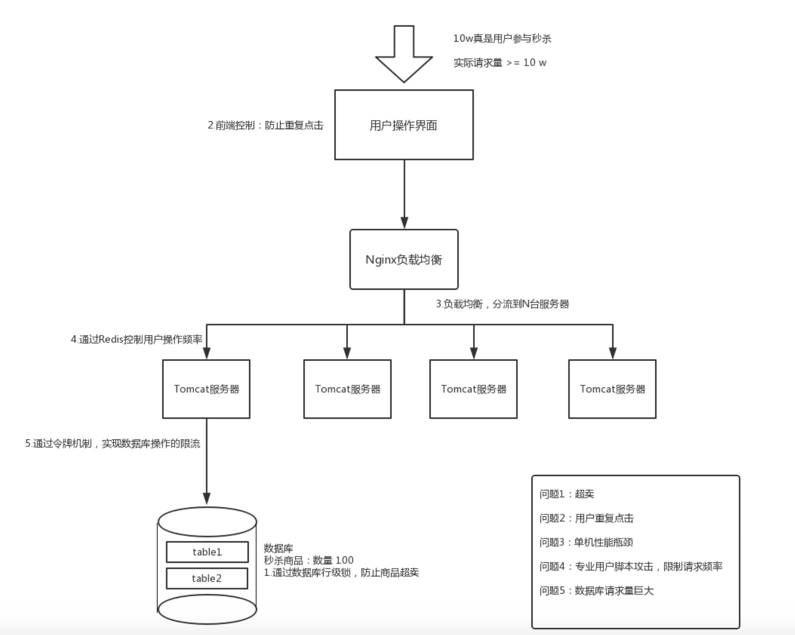

## 高并发秒杀系统设计与实现

开发环境

eclipse + tomcat8 + jdk8

使用技术

Spring + Spring MVC + Redis + MySQL

技术选型：为什么选择Redis？

数据类型丰富（string,hash,list,set,sorted list），可根据业务选择不同的数据类型；
单线程，不存在锁竞争现象，实现相对容易，代码简洁，可读性强；
可持久化，redis提供了两种持久化方式RDB,AOF,可防止数据丢失
高可用（从后期业务扩展角度考虑），redis支持集群功能，可以实现主从复制，读写分离，提供哨兵机制等等
详细可参考这篇文章：技术选型：redis与memcache

内容概述

对高并发业务场景进行分析，以解决秒杀系统核心问题为目的，设计一个秒杀系统，分析秒杀业务场景，提供一种可行的解决方案，达到限流、分流效果，进而提升系统性能：

问题1：系统超卖，导致亏本，解决策略为：使用数据库行级锁，实现同步执行效果。
问题2：用户重复点击，请求量大于用户量，解决策略为：通过前端控制（按钮禁用，button.disabled），防止重复点击。
问题3：单机性能瓶颈：单机服务器处理能力有限，解决策略为：使用Nginx负载均衡，通过upstream模块实现多个Tomcat的负载均衡。
问题4：非普通用户（程序员）使用脚本工具进行抢购，解决策略为：使用Redis中的key的有效期（EX）和NX机制，限制单个用户的操作频率。
问题5：数据库连接请求量巨大，存在性能瓶颈，解决策略为：使用Redis的队列实现令牌池，令牌数量有限，先到先得，成功获取令牌的允许请求数据库连接。
扩展（未实现）：

单台Redis性能问题：用户量多时，并发量会更高，超出单台Redis吞吐量，解决方法是使用Redis集群，实现高可用
数据库性能瓶颈：当商品库存很多，采取上述多策略后，数据库请求依然多，压力依然大，解决方法是数据库分库分表、通过消息队列（如：Kafka、RabbitMQ等）异步执行SQL。
系统架构问题：秒杀系统与业务系统混叠，互相影响导致不可用，秒杀场景流量突发，需要支持快速扩容，解决方法是使用微服务架构（Spring cloud、dubbo），独立秒杀系统；docker容器，实现快速扩容。
业务场景
1、用户界面：用户点击秒杀按钮
2、Web程序服务器：服务器收到http请求，修改数据
3、数据库：修改商品余量，添加秒杀成功记录
系统设计
数据库表设计
设计两个简单的表：秒杀记录表和秒杀商品表，sql实现如下：

create table 'tb_records' (
'records_id' int(11) not null auto_increment,
'goods_code' varchar(11) default null comment '商品唯一编码',
'user_id' varchar(255) default null comment '用户唯一ID',
primary key ('records_id')
)engine = InnoDB auto_increment = 1031 default charset = latinl comment = '秒杀记录表';
create table 'tb_seckil(
'goods_code' varchar(11) not null comment '商品唯一编码',
'goods_nums' int(255) default null comment '商品余量',
primary key ('goods_code')
)engine = InnoDB default charset = latinl comment = '秒杀商品表';
核心类设计

业务处理接口：
/**
* description:业务层,处理秒杀业务逻辑处理
* @author vechace
* date 2018/6/15
  */
  @Service
  public class SeckillService {
  private final Logger logger = Logger.getLogger(SeckillService.class);
  @Autowired
  RedisCacheUtils redisPool;
  @Autowired
  SeckillDao seckillDao;
  /**
  * 秒杀业务层接口
  * @param goodsCode
  * @param userId
  * @return
    */
    public boolean seckill(String goodsCode,String userId){
    /**
    * 限制用户的操作频率，10s操作一次
    * 使用组合指令：SET key value EX 5 NX
    * 细节：不能拆分成两条指令: SET key EX ;SET key NX,会导致性能下降一半
      */
      Jedis jedis = redisPool.getJedis();
      String value = jedis.set(userId, "","NX","EX",10);
      if(!"OK".equals(value)){
      logger.warn("被限制操作频率，用户： " +userId);
      return false;
      }
      /**
    * token令牌机制：采用Redis的列表类型实现令牌队列，
    * lpop指令从队列左边弹出一个令牌，先到先得，拿到令牌的可以请求数据库
      */
      String token = jedis.lpop("token_list");
      if(token == null){
      logger.warn("没有抢到token令牌，不参与秒杀，用户: " + userId);
      return false;
      }
      boolean result = seckillDao.buy(goodsCode, userId);
      logger.warn("秒杀结果: " +result);
      return result;
      }
      }
      数据更新接口：

/**
* description:数据层,请求数据库并更新记录
* @author vechace
* date 2018/6/15
  */
  @Repository
  public class SeckillDao {
  //使用Spring jdbc模板
  @Autowired
  JdbcTemplate jdbcTemplate;
  //事务回滚则抛出异常
  @Transactional(rollbackFor = Exception.class)
  public boolean buy(String goodsCode,String userId){
  //商品数量减1
  String sql = "update tb_seckill set goods_nums = goods_nums-1 where goods_code = '"+ goodsCode +"' and goods_nums-1 >=0 ";
  int count = jdbcTemplate.update(sql);
  if(count !=1){
  return false;
  }
  //秒杀成功则，添加购买记录
  String insertSql = "insert into tb_records(goods_code,user_id) value('" + goodsCode +"','" + userId + "')";
  int insertCount = jdbcTemplate.update(insertSql);
  if(insertCount !=1){
  return false;
  }
  return true;
  }
  }
系统整体架构

架构

系统分析

问题1（核心问题）：超卖问题，导致亏本

解决策略：借助数据库锁机制，防止超卖：多个请求并发操作同一行记录时，数据库会锁住该行记录（行级锁），实现同步执行的效果。需要注意的是：MySQL存在各种锁（行级锁、表级锁、页级锁等），各个存储引擎的支持不同，如下：

MyISAM仅支持表级锁
BDB支持表级锁和页级锁
InnoDB支持行级锁和表级锁
其他可行策略：

MySQL添加字段version（版本号），实现MVCC乐观锁
基于AtomicInteger的CAS机制，即使用JVM锁机制
使用Redis作为原子计数器（watch事务，decr操作），kafka作为消息队列记录用户抢购行为
问题2：用户重复点击，请求量大于用户量

解决策略：针对普通用户，可以通过前端控制（按钮置灰，butter.disable），防止重复点击，可减少90%的重复请求。

//控制访问频率，disable按钮置灰，禁用
$("#test").attr('disabled',true);
//5秒后自动启用
setTimeout(function(){
$("#test").removeAttr("disabled");
},5000);
问题3：单机性能瓶颈：单机服务器能处理的并发量有限

解决策略：负载均衡（软件方式），使用Nginx是最常用的高性能web服务器，通过upstream模块实现多个Tomcat的负载均衡。

其他实现方式：LVS（第四层负载均衡）、F5、Radware（硬件负载均衡）

架构

Nginx配置

events{
#并发连接数
worker_connections 1024;
}
http{
#Tomcat服务器集群，这里假设有两个tomcat服务器实现分流
upstream tomcat_servers{
server 127.0.0.1:8081;
server 127.0.0.1:8080;
}
server{
#监听80端口
listen 80;
#将所有请求交给Tomcat集群去处理
location / {
proxy_pass http://tomcat_servers;
}
}
}
集群存在问题：

分布式session：使用Redis缓存用户session，实现分布式session一致性
分布式事务：分布式锁
问题4：非普通用户（程序员）使用脚本工具进行抢购

解决策略：针对非普通用户，限制单个用户的操作频率，通过Redis中的key的有效期（EX）和NX机制实现，组合命令：

set key value EX 5 NX
原理：如果Redis中没有这个key，则设置成功，过期时间10秒，如果Redis已经有这个key，代表10秒内已经操作过1次

java实现：

/**
* 限制用户的操作频率，10s操作一次
* 使用组合指令：SET key value EX 5 NX
* 细节：不能拆分成两条指令: SET key EX ;SET key NX,会导致性能下降一半
  */
  Jedis jedis = redisPool.getJedis();
  String value = jedis.set(userId, "","NX","EX",10);
  if(!"OK".equals(value)){
  logger.warn("被限制操作频率，用户： " +userId);
  return false;
  }
  细节分析：推荐使用组合指令，而不使用两条指令，因为根据Redis压力测试报告可知，当使用2条set指令时，系统性能可能会下降一半（高并发场景下）。

$ redis-benchmark -t set,lpush -n 100000 -q
SET: 74239.05 requests per second
LPUSH: 79239.30 requests per second
redis压力测试报告：how fast is redis?

问题5：数据库请求量巨大

解决策略：数据库操作成功的量大于或等于商品数量：用户请求量大于等于用户数，而数据库操作成功次数小于等于秒杀商品数量。商品数量有限，能秒杀成功的请求极少。可采用令牌机制解决问题

令牌机制：通过预先（异步）初始化一个和商品数量相当的令牌池放在内存中，用户请求到来时，去内存中取令牌，令牌数量有限，先到先得，拿到令牌的可以请求数据库，从而减少数据库的压力。先到先得，拿到令牌的去秒杀，没拿到的回绝。

使用Redis实现令牌池

@Before
public void start(){
System.out.println("开始测试");
//初始化token令牌池，使用lpush指令，从token_list左边push，队列值为0-100
Jedis jedis = new Jedis();
jedis.del("token_list");
for(int i = 0;i<100;i++){
jedis.lpush("token_list", String.valueOf(i));
}
jedis.close();
System.out.println("100个令牌池初始化完成");
System.out.println("继续测试");
}
秒杀方法：

/**
* token令牌机制：采用Redis的列表类型实现令牌队列，
* lpop指令从队列左边弹出一个令牌，先到先得，拿到令牌的可以请求数据库
  */
  String token = jedis.lpop("token_list");
  if(token == null){
  logger.warn("没有抢到token令牌，不参与秒杀，用户: " + userId);
  return false;
  }
  高并发系统

限流：前端限制（按钮置灰）、服务端限流（限制用户请求次数）、令牌池
分流：负载均衡、分表、分库、消息队列
方案总结

策略思路：分析业务场景，从业务角度去解决存在问题或提升系统性能，可以适当跳出常规的思维（从技术角度去想），实际过程中，通过分析秒杀系统可能存在的场景，得出方案，从前端控制，到服务端限流分流，再到数据库限流，逐步设计出具体方案，总结如下：

策略1：数据库乐观锁机制，防止超卖（核心问题）
策略2：前端防止重复提交
策略3：服务端做负载均衡
策略4：后台限制用户操作频率
策略5：令牌发放机制
拓展策略：当业务量持续增大时，可采用如下方案：

单台Redis不够用：用户量多，并发量更高，超出单台Redis吞吐量，解决方法是使用Redis集群、高可用。
数据库压力大：当商品库存很多，采取上述多策略后，数据库请求依然多，压力依然大，解决方法是数据库分库分表、通过消息队列异步执行SQL。
系统架构：与业务系统混合在一起，互相影响，导致不可用，而秒杀场景的突发流量，要支持快速扩容，解决方法是微服务架构，独立秒杀系统；docker容器化技术，快速扩容。


---
秒杀是电子商务网站常见的一种营销手段：将少量商品（通常只有一件）以极低的价格，在特定的时间点开始出售。比如一元钱的手机，五元钱的电脑，十元钱的汽车等。因 为商品价格诱人，而且数量有限，所以很多人趋之若鹜，在秒杀活动开始前涌入网站，等到秒杀活动开始的一瞬间，点下购买按钮（在此之前购买按钮为灰色，不可以点击），抢 购商品。这些商品因为在活动开始的一秒内就被卖光了，所以被称作秒杀。

## 1. 秒杀架构设计理念

### 1. 限流

鉴于只有少部分用户能秒杀成功，所以要限制大部分流量，只允许少部分流量进入服务后端。

### 2. 削峰

对于秒杀系统瞬时会有大量用户涌入，所以在抢购一开始会有很高的瞬间峰值。

高峰值是压垮系统很重要的原因，所以如何把瞬间的高流量编程一段时间平稳的流量也是设计秒杀系统很重要的思路。实现削峰的常用方法有利用**缓存**和**消息中间件**等技术。

### 3. 异步处理

秒杀系统是一个高并发系统，采用异步处理模式可以极大地提高系统并发量，其实异步处理就是削峰的一种实现方式。

### 4. 内存缓存

秒杀系统最大的瓶颈一般是数据库读写，由于数据库读写属于磁盘 IO，性能很低，如果能够把部分数据或逻辑业务转到内存缓存，效率会有极大提高。

### 5. 可拓展

如果我们想支持更多用户，更大的并发，最好将系统设计成弹性可扩展的，如果流量来了，拓展机器就好了。

## 2. 设计思路

- **将请求拦截在系统上游，降低下游压力**

  秒杀系统特点是并发量极大，但实际秒杀成功的请求数量却很少，所以如果不在前端拦截很可能造成数据库读写锁冲突，甚至导致死锁，最终请求超时。

- **充分利用缓存**

  利用缓存可极大提高系统读写速度。

- **消息队列**

  消息队列可以削峰，将拦截大量并发请求，这也是一个异步处理过程，后台业务根据自己的处理能力，从消息队列中主动拉取请求消息进行业务处理。

## 3. 前端方案

- **页面静态化**

  将页面上的所有可静态的元素全部静态化，并尽量减少动态元素。通过 CDN 来抗峰值。

- **禁止重复提交**

  用户提交后按钮置灰，禁止重复提交。

- **用户限流**

  在某一时间段内只允许用户提交一次请求，比如可以采取 IP 限流。

## 4. 后端方案

### 服务器控制层（网关层）

前端方案只拦截了浏览器访问的请求，但针对某些恶意攻击或其他插件，在服务器控制层需要针对同一个访问 uid，限制访问频率。

### 服务层

- **采用消息队列缓存请求**

  先将请求都写到消息队列中都缓存一下，数据库层订阅消息减库存，减库存成功的请求返回秒杀成功，失败的返回秒杀失败。

- **采用缓存应对读请求**

  如果是多读写少业务，大部分请求时查询请求，所以可以充分利用缓存分担数据库压力。

- **采用缓存应对写请求**

  缓存也可以应对写请求的，比如我们可以把数据库中的库存数据转移到 Redis 缓存中，所有减库存操作都在 Redis 中进行，然后再通过后台进程把 Redis 中的用户秒杀请求同步到数据库中。 

## 5. 数据库

数据库是最脆弱的一层，一般在应用设计时在上游就需要把请求拦截掉，数据库层承担“能力范围内”的访问请求。所以通过服务层引入队列和缓存，让最底层的数据库高枕无忧。


## 6. 问题

#### 1. 如何解决卖超问题

```
--在sql加上判断防止数据边为负数 
--数据库加唯一索引防止用户重复购买
--redis预减库存减少数据库访问　内存标记减少redis访问　请求先入队列缓冲，异步下单，增强用户体验
```


#### 2. 对象级缓存redis

```
 redis永久缓存对象减少压力
 redis预减库存减少数据库访
 内存标记方法减少redis访问
```

#### 3. 订单处理队列rabbitmq

```
 请求先入队缓冲，异步下单，增强用户体验
 请求出队，生成订单，减少库存
 客户端定时轮询检查是否秒杀成功 
```

#### 4. 解决分布式session

```
--生成随机的uuid作为cookie返回并redis内存写入 
--拦截器每次拦截方法，来重新获根据cookie获取对象
--下一个页面拿到key重新获取对象
--HandlerMethodArgumentResolver 方法 supportsParameter 如果为true 执行 resolveArgument 方法获取miaoshauser对象
--如果有缓存的话 这个功能实现起来就和简单，在一个用户访问接口的时候我们把访问次数写到缓存中，在加上一个有效期。
   通过拦截器. 做一个注解 @AccessLimit 然后封装这个注解，可以有效的设置每次访问多少次，有效时间是否需要登录！
```

#### 5. 秒杀安全 -- 安全性设计

```
 秒杀接口隐藏
 数字公式验证码
 接口防刷限流(通用 注解，拦截器方式)
```

#### 6. 通用缓存key的封装采用什么设计模式

```
模板模式的优点
-具体细节步骤实现定义在子类中，子类定义详细处理算法是不会改变算法整体结构
-代码复用的基本技术，在数据库设计中尤为重要
-存在一种反向的控制结构，通过一个父类调用其子类的操作，通过子类对父类进行扩展增加新的行为，符合“开闭原则”
-缺点：　每个不同的实现都需要定义一个子类，会导致类的个数增加，系统更加庞大
```

#### 7. redis的库存如何与数据库的库存保持一致

```
redis的数量不是库存,他的作用仅仅只是为了阻挡多余的请求透穿到DB，起到一个保护的作用
因为秒杀的商品有限，比如10个，让1万个请求区访问DB是没有意义的，因为最多也就只能10个
请求下单成功，所有这个是一个伪命题，我们是不需要保持一致的
```

#### 8. redis 预减成功，DB扣减库存失败怎么办

```
-其实我们可以不用太在意，对用户而言，秒杀不中是正常现象，秒杀中才是意外，单个用户秒杀中
-1.本来就是小概率事件，出现这种情况对于用户而言没有任何影响
-2.对于商户而言，本来就是为了活动拉流量人气的，卖不完还可以省一部分费用，但是活动还参与了，也就没有了任何影响
-3.对网站而言，最重要的是体验，只要网站不崩溃，对用户而言没有任何影响
```

#### 9. 为什么redis数量会减少为负数

```
    //预见库存
    long stock = redisService.decr(GoodsKey.getMiaoshaGoodsStock,""+goodsId) ;
	if(stock <0){
    localOverMap.put(goodsId, true);
	return Result.error(CodeMsg.MIAO_SHA_OVER);
	}
	假如redis的数量为1,这个时候同时过来100个请求，大家一起执行decr数量就会减少成-99这个是正常的
	进行优化后改变了sql写法和内存写法则不会出现上述问题
```

#### 10. 为什么要单独维护一个秒杀结束标志

```
 -1.前提所有的秒杀相关的接口都要加上活动是否结束的标志，如果结束就直接返回，包括轮寻的接口防止一直轮寻
 -2.管理后台也可以手动的更改这个标志，防止出现活动开始以后就没办法结束这种意外的事件
```

#### 11. rabbitmq如何做到消息不重复不丢失即使服务器重启

```
 -1.exchange持久化
 -2.queue持久化
 -3.发送消息设置MessageDeliveryMode.persisent这个也是默认的行为
 -4.手动确认
```

#### 12. 为什么threadlocal存储user对象，原理

```
1.并发编程中重要的问题就是数据共享，当你在一个线程中改变任意属性时，所有的线程都会因此受到影响，同时会看到第一个线程修改后的值<br>
有时我们希望如此，比如：多个线程增大或减小同一个计数器变量<br>
但是，有时我们希望确保每个线程，只能工作在它自己 的线程实例的拷贝上，同时不会影响其他线程的数据<br>

举例： 举个例子，想象你在开发一个电子商务应用，你需要为每一个控制器处理的顾客请求，生成一个唯一的事务ID，同时将其传到管理器或DAO的业务方法中，
以便记录日志。一种方案是将事务ID作为一个参数，传到所有的业务方法中。但这并不是一个好的方案，它会使代码变得冗余。   
你可以使用ThreadLocal类型的变量解决这个问题。首先在控制器或者任意一个预处理器拦截器中生成一个事务ID
然后在ThreadLocal中 设置事务ID，最后，不论这个控制器调用什么方法，都能从threadlocal中获取事务ID
而且这个应用的控制器可以同时处理多个请求，
同时在框架 层面，因为每一个请求都是在一个单独的线程中处理的，所以事务ID对于每一个线程都是唯一的，而且可以从所有线程的执行路径获取
运行结果可以看出每个线程都在维护自己的变量：
 Starting Thread: 0 : Fri Sep 21 23:05:34 CST 2018<br>
 Starting Thread: 2 : Fri Sep 21 23:05:34 CST 2018<br>
 Starting Thread: 1 : Fri Jan 02 05:36:17 CST 1970<br>
 Thread Finished: 1 : Fri Jan 02 05:36:17 CST 1970<br>
 Thread Finished: 0 : Fri Sep 21 23:05:34 CST 2018<br>
 Thread Finished: 2 : Fri Sep 21 23:05:34 CST 2018<br>
 
 局部线程通常使用在这样的情况下，当你有一些对象并不满足线程安全，但是你想避免在使用synchronized关键字<br>
 块时产生的同步访问，那么，让每个线程拥有它自己的对象实例<br>
 注意：局部变量是同步或局部线程的一个好的替代，它总是能够保证线程安全。唯一可能限制你这样做的是你的应用设计约束<br>
 所以设计threadlocal存储user不会对对象产生影响，每次进来一个请求都会产生自身的线程变量来存储
```

#### 13. redis 分布式锁实现方法

```
我用了四种方法 ， 分别指出了不同版本的缺陷以及演进的过程 orderclosetask
V1---->>版本没有操作，在分布式系统中会造成同一时间，资源浪费而且很容易出现并发问题
V2--->>版本加了分布式redis锁，在访问核心方法前，加入redis锁可以阻塞其他线程访问,可以
很好的处理并发问题,但是缺陷就是如果机器突然宕机，或者线路波动等，就会造成死锁，一直
不释放等问题
V3版本-->>很好的解决了这个问题v2的问题，就是加入时间对比如果当前时间已经大与释放锁的时间
说明已经可以释放这个锁重新在获取锁，setget方法可以把之前的锁去掉在重新获取,旧值在于之前的
值比较，如果无变化说明这个期间没有人获取或者操作这个redis锁，则可以重新获取
V4---->>采用成熟的框架redisson,封装好的方法则可以直接处理，但是waittime记住要这只为0
```

#### 14. 服务降级--服务熔断(过载保护)

```
自动降级： 超时.失败次数,故障,限流
人工降级：秒杀，双11

9.所有秒杀相关的接口比如：秒杀，获取秒杀地址，获取秒杀结果，获取秒杀验证码都需要加上
秒杀是否开始结束的判断
```

#### 15. RPC事务补偿

```
当集中式进行服务化RPC演进成分布式的时候，事务则成为了进行分布式的一个痛点，本项目的做法为：
1.进行流程初始化，当分别调用不用服务化接口的时候，成功则进行流程，失败则返回并进行状态更新
将订单状态变为回滚
2.使用定时任务不断的进行处理rollback的订单进行回滚
```

#### 16. 秒杀类似场景sql的写法注意事项

```
1.在秒杀一类的场景里面，因为数据量亿万级所有即使有的有缓存有的时候也是扛不住的，不可避免的透穿到DB
 所有在写一些sql的时候就要注意：
 1.一定要避免全表扫描，如果扫一张大表的数据就会造成慢查询，导致数据的连接池直接塞满,导致事故
 首先考虑在where和order by 设计的列上建立索引
 例如： 1. where 子句中对字段进行 null 值判断 . 
       2. 应尽量避免在 where 子句中使用!=或<>操作符 
       3. 应尽量避免在 where 子句中使用 or 来连接条件
       4. in 和 not in 也要慎用，否则会导致全表扫描( 如果索引 会优先走索引 不会导致全表扫描 
        字段上建了索引后，使用in不会全表扫描，而用not in 会全表扫描 低版本的mysql是两种情况都会全表扫描。
        5.5版本后以修。而且在优化大表连接查询的时候，有一个方法就是将join操作拆分为in查询)
       5. select id from t where name like '%abc%' 或者
       6.select id from t where name like '%abc' 或者
       7. 若要提高效率，可以考虑全文检索。 
       8.而select id from t where name like 'abc%' 才用到索引 慢查询一般在测试环境不容易复现
       9.应尽量避免在 where 子句中对字段进行表达式操作 where num/2  num=100*2
 2.合理的使用索引  索引并不是越多越好，使用不当会造成性能开销
 3.尽量避免大事务操作，提高系统并发能力
 4.尽量避免象客户端返回大量数据，如果返回则要考虑是否需求合理，实在不得已则需要在设计一波了！！！！！
```