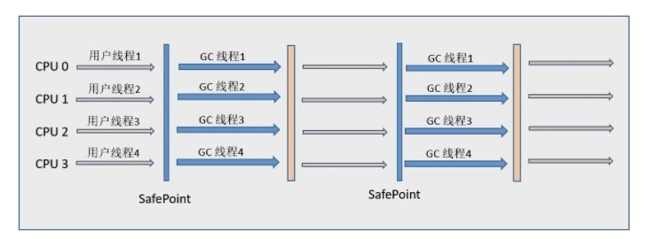

# 一、运行时数据区域

<div align="center">  </div><br>

### 1.1 程序计数器

程序计数器是一块较小的内存空间，可以看做是当前线程所执行的字节码的行号指示器，字节码解释器工作时通过改变这个计数器的值来选取下一条要执行的字节码指令，分支、循环、跳转、异常处理、线程恢复等功能都需要依赖这个计数器来完成。
另外，为了线程切换后能够恢复到正确的执行位置，每条线程都需要一个独立的程序计数器，所以程序计数器是线程私有的。
总之，程序计数器的作用就两个，一个是用于控制代码的流程，另一个作用是用于记录当前线程执行的位置，线程切换回来的时候就知道从哪继续执行了。
程序计数器是唯一一个不会出现OutOfMemoryError的内存区域，它的生命周期和线程是一样的。

### 1.2 Java 虚拟机栈

Java虚拟机栈跟程序计数器一样，都是线程私有的，它是Java方法执行的内存模型，方法调用的数据就是通过栈传递的。Java虚拟机栈是由一个个栈帧组成的，Java方法从方法调用到执行完成的过程就对应着一个栈帧的入栈和出栈过程。Java栈帧里面主要包含的就是与Java方法相关的信息，比如局部变量表、操作数栈、动态链接、方法出口等信息。局部变量表主要存放的就各种基本的数据类型和对象的引用。
Java虚拟机栈会出现两种异常，如果Java虚拟机栈内存的大小不允许动态扩展，当线程申请栈的深度超过允许的范围就会抛出StackOverFlowError的异常；如果Java虚拟机栈允许动态扩展，当请求栈时内存都用完了，无法动态扩展时就会抛出OOM。

<div align="center">  </div><br>

可以通过 -Xss 这个虚拟机参数来指定每个线程的 Java 虚拟机栈内存大小：

```java
java -Xss512M HackTheJava
```


### 1.3 本地方法栈

本地方法栈与 Java 虚拟机栈类似，它们之间的区别只不过是本地方法栈为本地方法服务。

本地方法一般是用其它语言（C、C++ 或汇编语言等）编写的，并且被编译为基于本机硬件和操作系统的程序，对待这些方法需要特别处理。

<div align="center">  </div><br>

### 1.4 堆

堆是JVM管理的内存中最大的一块，也是所有线程共享的一块内存区域，这个区域唯一的目的就是存放对象实例，几乎所有的对象实例以及数组都在这里进行内存分配，所以堆也是垃圾收集器管理的主要区域。从垃圾回收的角度上，因为现在垃圾收集器基本都采用分代垃圾回收算法，所以Java堆还可以细分为新生代和老年代，再细致一点，还可以将新生代划分成Eden区、FromSurvivor、ToSurvivor三个部分，其实不管怎么划分，主要目的是更好地进行垃圾回收或者更快的分配内存。

堆不需要连续内存，并且可以动态增加其内存，增加失败会抛出 OutOfMemoryError 异常。

可以通过 -Xms 和 -Xmx 这两个虚拟机参数来指定一个程序的堆内存大小，第一个参数设置初始值，第二个参数设置最大值。

```java
java -Xms1M -Xmx2M HackTheJava
```

### 1.5 方法区

方法区和Java堆一样，是各个线程共享的内存区域，它用于存储已经被虚拟机加载的类信息、常量、静态变量、即时编译器编译后的代码等数据。
**运行时常量池**是方法区的一部分，Class文件中除了包括类的版本、字段、方法、接口等描述信息，还有常量池信息，主要用于存放编译期生成的各种字面常量和符号引用。
字面常量：文本字符串、非声明为final的常量值、基本数据类型的值等
符号引用：类和结构的完全限定名、字段名称和描述符、方法名称和描述符

方法区和堆一样不需要连续的内存，并且可以动态扩展，动态扩展失败一样会抛出 OutOfMemoryError 异常。

HotSpot 虚拟机把它当成永久代来进行垃圾回收。但很难确定永久代的大小，因为它受到很多因素影响，并且每次 Full GC 之后永久代的大小都会改变，所以经常会抛出 OutOfMemoryError 异常。为了更容易管理方法区，从 JDK 1.8 开始，移除永久代，并把方法区移至元空间，它位于本地内存中，而不是虚拟机内存中。

### 1.6 直接内存

在 JDK 1.4 中新引入了 NIO 类，它可以使用 Native 函数库直接分配堆外内存，然后通过 Java 堆里的 DirectByteBuffer 对象作为这块内存的引用进行操作。这样能在一些场景中显著提高性能，因为避免了在堆内存和堆外内存来回拷贝数据。

# 二、Java对象的创建过程与对象的访问定位

### 2.1  类加载检查

虚拟机遇到一条new指令时，首先会去检查这个指令的参数是否能够在常量池中定位到这个类的符号引用，并且检查这个符号引用代表的类是否已经被加载、解析、初始化过，如果没有，那就必须先执行相应的类加载过程；

### 2.2 分配内存

在类加载检查通过后，接下来虚拟机将为新生的对象分配内存，对象所需的内存大小在类加载完成后便可确定，为对象分配空间等同于把一块确定大小的内存从Java堆中划分出来，分配方式有“指针碰撞”和“空闲链表”两种，选择哪种方式得看Java堆是否规整，而Java堆是否规整又由虚拟机的垃圾回收器决定的。

指针碰撞就是将用过的内存全都整合到一边，没有用过的内存放到另一边，中间有一个分界值指针，只需要想着没用过的内存方向移动对象所需的内存大小即可。
空闲列表，JVM会维护一个列表，该列表中会记录那些内存块是可用的，在分配的时候，找一块足够大的内存块来划分给对象实例，然后再更新列表记录。

除此之外，内存的分配还有一个很重要的问题，就是线程安全的问题。因为创建对象是很频繁的，所以虚拟机必须得保证对象的创建是线程安全的。虚拟机主要采用两种方式保证线程的安全：
一种是CAS+失败重试的方法，CAS是乐观锁的一种实现方式，就是每次都不加锁而是假设没有冲突去完成某项操作，如果因为冲突失败了就重试，知道成功为止，虚拟机采用CAS配上重试的方式保证更新操作分原子性。
另外一种方式是TLAB，它的原理就是为每一个线程预先在Eden区域分配一块内存，JVM在给线程中的对象分配内存时，首先在TLAB分配，当对象大于TLAB中的剩余内存或TLAB的内存用尽时在采用前面说的CAS进行内存分配。

### 2.3 初始化零值

内存分配完成后，虚拟机需要将分配到的内存空间都初始化为零值（不包括对象头），这一步的操作可以保证对象的实例字段在代码中可以不赋初始值就可以直接使用，程序能够访问到这些字段的数据类型所对应的零值。

### 2.4 设置对象头

初始化零值完成后，虚拟机需要对对象进行必要的设置，例如这个对象的是哪个类的实例、如何找到类的元数据信息、对象的哈希吗、对象的GC分代年龄等，还有锁等的信息。

### 2.5 执行init方法

从虚拟机的角度看，设置完对象头后一个新的对象就已经产生了，但从Java程序的角度来说，对象的创建才刚开始，现在全部的字段都还是零值，所以执行完new指令后会接着执行init方法，把对象按照程序员的意愿进行初始化，这样真正可用的对象才算完全产生出来。

### 2.6 对象的访问定位

Java程序通过栈上的reference数据来操作堆上的具体对象，目前主流的访问方式主要有两种，一种是使用句柄，另一种是直接指针。
使用句柄的话，会在堆上划分出一块内存作为句柄池，reference中存储的就是指向句柄池的对象句柄地址，句柄中包含了对象实例数据与类型数据各自的具体地址信息。
使用直接指针访问的话，reference中存储的直接就是对象的地址，而对象实例数据中有指向对象类型数据的指针。

这两种方式各有优势，使用句柄最大的好处是对象被移动时，reference本身不需要修改，因为句柄池是稳定的，只需要改变句柄中实例数据的指针。使用直接指针的话速度比较快，因为它可以节省一次指针定位的时间开销。

# 三、垃圾收集

垃圾收集主要是针对堆和方法区进行。

程序计数器、虚拟机栈和本地方法栈这三个区域属于线程私有的，只存在于线程的生命周期内，线程结束之后也会消失，因此不需要对这三个区域进行垃圾回收。

### 3.1 判断一个对象是否可被回收

判断对象是否可被回收，其实就是判断哪些对象已经死亡，即不能再被任何途径使用的对象。

##### 1. 引用计数算法

给对象添加一个引用计数器，每当有一个地方引用它，计数器就加1，当引用失效时，计数器就减一，任何时候计数器为零的对象就是不可能再被使用的。

在两个对象出现循环引用的情况下，此时引用计数器永远不为 0，导致无法对它们进行回收。正因为循环引用的存在，因此 Java 虚拟机不使用引用计数算法。

```java
public class Test {

    public Object instance = null;

    public static void main(String[] args) {
        Test a = new Test();
        Test b = new Test();
        a.instance = b;
        b.instance = a;
    }
}
```

##### 2. 可达性分析算法

这个算法的基本思想就是通过一系列称为GC Roots的对象作为起点，从这些节点开始向下搜索，节点锁走过的路径称为引用链，当对象到GC Roots没有任何引用链相连的话，则证明此对象是不可用的。

Java 虚拟机使用该算法来判断对象是否可被回收，在 Java 中 GC Roots 一般包含以下内容：

- 虚拟机栈中局部变量表中引用的对象
- 本地方法栈中 JNI 中引用的对象
- 方法区中类静态属性引用的对象
- 方法区中的常量引用的对象

<div align="center">  </div><br>

##### 3.引用类型

无论是通过引用计数算法判断对象的引用数量，还是通过可达性分析算法判断对象是否可达，判定对象是否可被回收都与引用有关。

Java 提供了四种强度不同的引用类型。

**强引用**

被强引用关联的对象不会被回收。

使用 new 一个新对象的方式来创建强引用。

```java
Object obj = new Object();
```

**软引用**

被软引用关联的对象只有在内存不够的情况下才会被回收。

使用 SoftReference 类来创建软引用。

```java
Object obj = new Object();
SoftReference<Object> sf = new SoftReference<Object>(obj);
obj = null;  // 使对象只被软引用关联
```

 **弱引用**

被弱引用关联的对象一定会被回收，也就是说它只能存活到下一次垃圾回收发生之前。

使用 WeakReference 类来创建弱引用。

```java
Object obj = new Object();
WeakReference<Object> wf = new WeakReference<Object>(obj);
obj = null;
```

**虚引用**

又称为幽灵引用或者幻影引用，一个对象是否有虚引用的存在，不会对其生存时间造成影响，也无法通过虚引用得到一个对象。

为一个对象设置虚引用的唯一目的是能在这个对象被回收时收到一个系统通知。

使用 PhantomReference 来创建虚引用。

```
Object obj = new Object();
PhantomReference<Object> pf = new PhantomReference<Object>(obj);
obj = null;
```


### 3. 2 方法区的回收

##### 如何判断一个常量是废弃常量

运行时常量池主要回收的是废弃的常量，如何判断一个常量是废弃常量，假设常量池中存在一个字符串"abc"，如果当前没有任何String对象引用该字符串常量的话，就说明常量“abc”就是废弃常量，如果这时发生内存回收而且有必要的话，“abc”就会被系统清理出常量池。

##### 如何判断一个类是无用的类

方法区主要回收的是无用的类，一个无用的类需要同时满足三个条件，第一，这个类的所有实例都已经被回收，也就是说Java堆中不存在该类的任何实例。第二，加载该类的ClassLoader已经被回收了，第三是该类对应的Class对象在任何地方都没有被引用，无法在任何地方通过反射访问该类的方法。满足这三个条件，那么这个无用的类就可以被会回收了，但是回收并不是必然的。

### 3.3  finalize()

类似 C++ 的析构函数，用于关闭外部资源。try-finally 等方式可以做的更好，并且该方法运行代价很高，不确定性大，无法保证各个对象的调用顺序，因此最好不要使用。

当一个对象可被回收时，如果需要执行该对象的 finalize() 方法，那么就有可能在该方法中让对象重新被引用，从而实现自救。自救只能进行一次，如果回收的对象之前调用了 finalize() 方法自救，后面回收时不会再调用该方法。

### 3.4 垃圾收集算法

##### 1. 标记 - 清除

<div align="center">  </div><br>

标记要回收的对象，然后清除。

不足：

- 标记和清除过程效率都不高；
- 会产生大量不连续的内存碎片，导致无法给大对象分配内存。

##### 2. 标记 - 整理

<div align="center">  </div><br>

让所有存活的对象都向一端移动，然后直接清理掉端边界以外的内存。

##### 3. 复制

<div align="center">  </div><br>

将内存划分为大小相等的两块，每次只使用其中一块，当这一块内存用完了就将还存活的对象复制到另一块上面，然后再把使用过的内存空间进行一次清理。

主要不足是只使用了内存的一半。

现在的商业虚拟机都采用这种收集算法回收新生代，但是并不是划分为大小相等的两块，而是一块较大的 Eden 空间和两块较小的 Survivor 空间，每次使用 Eden 和其中一块 Survivor。在回收时，将 Eden 和 Survivor 中还存活着的对象全部复制到另一块 Survivor 上，最后清理 Eden 和使用过的那一块 Survivor。

HotSpot 虚拟机的 Eden 和 Survivor 大小比例默认为 8:1，保证了内存的利用率达到 90%。如果每次回收有多于 10% 的对象存活，那么一块 Survivor 就不够用了，此时需要依赖于老年代进行空间分配担保，也就是借用老年代的空间存储放不下的对象。

##### 4. 分代收集

现在的商业虚拟机采用分代收集算法，它根据对象存活周期将内存划分为几块，不同块采用适当的收集算法。

一般将堆分为新生代和老年代。

- 新生代使用：复制算法
- 老年代使用：标记 - 清除 或者 标记 - 整理 算法

### 3.5 垃圾收集器

<div align="center">  </div><br>

以上是 HotSpot 虚拟机中的 7 个垃圾收集器，连线表示垃圾收集器可以配合使用。

- 单线程与多线程：单线程指的是垃圾收集器只使用一个线程，而多线程使用多个线程；
- 串行与并行：串行指的是垃圾收集器与用户程序交替执行，这意味着在执行垃圾收集的时候需要停顿用户程序；并行指的是垃圾收集器和用户程序同时执行。除了 CMS 和 G1 之外，其它垃圾收集器都是以串行的方式执行。

##### 1. Serial 收集器

<div align="center">  </div><br>

Serial 翻译为串行，也就是说它以串行的方式执行。

它是单线程的收集器，只会使用一个线程进行垃圾收集工作。

它的优点是简单高效，对于单个 CPU 环境来说，由于没有线程交互的开销，因此拥有最高的单线程收集效率。

它是 Client 模式下的默认新生代收集器，因为在该应用场景下内存一般来说不会很大。它收集几十兆甚至一两百兆的新生代停顿时间可以控制在一百多毫秒以内，只要不是太频繁，这点停顿时间是可以接受的。

##### 2. ParNew 收集器

<div align="center">  </div><br>

它是 Serial 收集器的多线程版本。

是 Server 模式下首选的新生代收集器，除了性能原因外，主要是因为除了 Serial 收集器，只有它能与 CMS 收集器配合工作。

##### 3. Parallel Scavenge 收集器

与 ParNew 一样是多线程收集器。

其它收集器目标是尽可能缩短垃圾收集时用户线程的停顿时间，而它的目标是达到一个可控制的吞吐量，因此它被称为“吞吐量优先”收集器。这里的吞吐量指 CPU 用于运行用户程序的时间占总时间的比值。

停顿时间越短就越适合需要与用户交互的程序，良好的响应速度能提升用户体验。而高吞吐量则可以高效率地利用 CPU 时间，尽快完成程序的运算任务，适合在后台运算而不需要太多交互的任务。

缩短停顿时间是以牺牲吞吐量和新生代空间来换取的：新生代空间变小，垃圾回收变得频繁，导致吞吐量下降。

可以通过一个开关参数打开 GC 自适应的调节策略（GC Ergonomics），就不需要手工指定新生代的大小（-Xmn）、Eden 和 Survivor 区的比例、晋升老年代对象年龄等细节参数了。虚拟机会根据当前系统的运行情况收集性能监控信息，动态调整这些参数以提供最合适的停顿时间或者最大的吞吐量。

##### 4. Serial Old 收集器

<div align="center">  </div><br>

是 Serial 收集器的老年代版本，也是给 Client 模式下的虚拟机使用。如果用在 Server 模式下，它有两大用途：

- 在 JDK 1.5 以及之前版本（Parallel Old 诞生以前）中与 Parallel Scavenge 收集器搭配使用。
- 作为 CMS 收集器的后备预案，在并发收集发生 Concurrent Mode Failure 时使用。

##### 5. Parallel Old 收集器

<div align="center">  </div><br>

是 Parallel Scavenge 收集器的老年代版本。

在注重吞吐量以及 CPU 资源敏感的场合，都可以优先考虑 Parallel Scavenge 加 Parallel Old 收集器。

##### 6. CMS 收集器

<div align="center">  </div><br>

CMS（Concurrent Mark Sweep），Mark Sweep 指的是标记 - 清除算法。

分为以下四个流程：

- 初始标记：仅仅只是标记一下 GC Roots 能直接关联到的对象，速度很快，需要停顿。
- 并发标记：进行 GC Roots Tracing 的过程，它在整个回收过程中耗时最长，不需要停顿。
- 重新标记：为了修正并发标记期间因用户程序继续运作而导致标记产生变动的那一部分对象的标记记录，需要停顿。
- 并发清除：不需要停顿。

在整个过程中耗时最长的并发标记和并发清除过程中，收集器线程都可以与用户线程一起工作，不需要进行停顿。

具有以下缺点：

- 吞吐量低：低停顿时间是以牺牲吞吐量为代价的，导致 CPU 利用率不够高。
- 无法处理浮动垃圾，可能出现 Concurrent Mode Failure。浮动垃圾是指并发清除阶段由于用户线程继续运行而产生的垃圾，这部分垃圾只能到下一次 GC 时才能进行回收。由于浮动垃圾的存在，因此需要预留出一部分内存，意味着 CMS 收集不能像其它收集器那样等待老年代快满的时候再回收。如果预留的内存不够存放浮动垃圾，就会出现 Concurrent Mode Failure，这时虚拟机将临时启用 Serial Old 来替代 CMS。
- 标记 - 清除算法导致的空间碎片，往往出现老年代空间剩余，但无法找到足够大连续空间来分配当前对象，不得不提前触发一次 Full GC。

##### 7. G1 收集器

G1（Garbage-First），它是一款面向服务端应用的垃圾收集器，在多 CPU 和大内存的场景下有很好的性能。HotSpot 开发团队赋予它的使命是未来可以替换掉 CMS 收集器。

堆被分为新生代和老年代，其它收集器进行收集的范围都是整个新生代或者老年代，而 G1 可以直接对新生代和老年代一起回收。

<div align="center">  </div><br>

G1 把堆划分成多个大小相等的独立区域（Region），新生代和老年代不再物理隔离。

<div align="center">  </div><br>

通过引入 Region 的概念，从而将原来的一整块内存空间划分成多个的小空间，使得每个小空间可以单独进行垃圾回收。这种划分方法带来了很大的灵活性，使得可预测的停顿时间模型成为可能。通过记录每个 Region 垃圾回收时间以及回收所获得的空间（这两个值是通过过去回收的经验获得），并维护一个优先列表，每次根据允许的收集时间，优先回收价值最大的 Region。

每个 Region 都有一个 Remembered Set，用来记录该 Region 对象的引用对象所在的 Region。通过使用 Remembered Set，在做可达性分析的时候就可以避免全堆扫描。

<div align="center">  </div><br>

如果不计算维护 Remembered Set 的操作，G1 收集器的运作大致可划分为以下几个步骤：

- 初始标记
- 并发标记
- 最终标记：为了修正在并发标记期间因用户程序继续运作而导致标记产生变动的那一部分标记记录，虚拟机将这段时间对象变化记录在线程的 Remembered Set Logs 里面，最终标记阶段需要把 Remembered Set Logs 的数据合并到 Remembered Set 中。这阶段需要停顿线程，但是可并行执行。
- 筛选回收：首先对各个 Region 中的回收价值和成本进行排序，根据用户所期望的 GC 停顿时间来制定回收计划。此阶段其实也可以做到与用户程序一起并发执行，但是因为只回收一部分 Region，时间是用户可控制的，而且停顿用户线程将大幅度提高收集效率。

具备如下特点：

- 空间整合：整体来看是基于“标记 - 整理”算法实现的收集器，从局部（两个 Region 之间）上来看是基于“复制”算法实现的，这意味着运行期间不会产生内存空间碎片。
- 可预测的停顿：能让使用者明确指定在一个长度为 M 毫秒的时间片段内，消耗在 GC 上的时间不得超过 N 毫秒。

# 四、内存分配与回收策略

### Minor GC 和 Full GC

- Minor GC：回收新生代上，因为新生代对象存活时间很短，因此 Minor GC 会频繁执行，执行的速度一般也会比较快。

- Full GC：回收老年代和新生代，老年代对象其存活时间长，因此 Full GC 很少执行，执行速度会比 Minor GC 慢很多。

### 内存分配策略

##### 1. 对象优先在 Eden 分配

大多数情况下，对象在新生代 Eden 区分配，当 Eden 区空间不够时，发起 Minor GC。

##### 2. 大对象直接进入老年代

大对象是指需要连续内存空间的对象，最典型的大对象是那种很长的字符串以及数组。

经常出现大对象会提前触发垃圾收集以获取足够的连续空间分配给大对象。

-XX:PretenureSizeThreshold，大于此值的对象直接在老年代分配，避免在 Eden 区和 Survivor 区之间的大量内存复制。

##### 3. 长期存活的对象进入老年代

为对象定义年龄计数器，对象在 Eden 出生并经过 Minor GC 依然存活，将移动到 Survivor 中，年龄就增加 1 岁，增加到一定年龄则移动到老年代中。

-XX:MaxTenuringThreshold 用来定义年龄的阈值。

##### 4. 动态对象年龄判定

虚拟机并不是永远地要求对象的年龄必须达到 MaxTenuringThreshold 才能晋升老年代，如果在 Survivor 中相同年龄所有对象大小的总和大于 Survivor 空间的一半，则年龄大于或等于该年龄的对象可以直接进入老年代，无需等到 MaxTenuringThreshold 中要求的年龄。

##### 5. 空间分配担保

在发生 Minor GC 之前，虚拟机先检查老年代最大可用的连续空间是否大于新生代所有对象总空间，如果条件成立的话，那么 Minor GC 可以确认是安全的。

如果不成立的话虚拟机会查看 HandlePromotionFailure 设置值是否允许担保失败，如果允许那么就会继续检查老年代最大可用的连续空间是否大于历次晋升到老年代对象的平均大小，如果大于，将尝试着进行一次 Minor GC；如果小于，或者 HandlePromotionFailure 设置不允许冒险，那么就要进行一次 Full GC。

### Full GC 的触发条件

对于 Minor GC，其触发条件非常简单，当 Eden 空间满时，就将触发一次 Minor GC。而 Full GC 则相对复杂，有以下条件：

##### 1. 调用 System.gc()

只是建议虚拟机执行 Full GC，但是虚拟机不一定真正去执行。不建议使用这种方式，而是让虚拟机管理内存。

##### 2. 老年代空间不足

老年代空间不足的常见场景为前文所讲的大对象直接进入老年代、长期存活的对象进入老年代等。

为了避免以上原因引起的 Full GC，应当尽量不要创建过大的对象以及数组。除此之外，可以通过 -Xmn 虚拟机参数调大新生代的大小，让对象尽量在新生代被回收掉，不进入老年代。还可以通过 -XX:MaxTenuringThreshold 调大对象进入老年代的年龄，让对象在新生代多存活一段时间。

##### 3. 空间分配担保失败

使用复制算法的 Minor GC 需要老年代的内存空间作担保，如果担保失败会执行一次 Full GC。具体内容请参考上面的第五小节。

##### 4. JDK 1.7 及以前的永久代空间不足

在 JDK 1.7 及以前，HotSpot 虚拟机中的方法区是用永久代实现的，永久代中存放的为一些 Class 的信息、常量、静态变量等数据。

当系统中要加载的类、反射的类和调用的方法较多时，永久代可能会被占满，在未配置为采用 CMS GC 的情况下也会执行 Full GC。如果经过 Full GC 仍然回收不了，那么虚拟机会抛出 java.lang.OutOfMemoryError。

为避免以上原因引起的 Full GC，可采用的方法为增大永久代空间或转为使用 CMS GC。

##### 5. Concurrent Mode Failure

执行 CMS GC 的过程中同时有对象要放入老年代，而此时老年代空间不足（可能是 GC 过程中浮动垃圾过多导致暂时性的空间不足），便会报 Concurrent Mode Failure 错误，并触发 Full GC。

# 五、类加载机制

类是在运行期间第一次使用时动态加载的，而不是一次性加载。因为如果一次性加载，那么会占用很多的内存。

### 类的生命周期

<div align="center">  </div><br>

包括以下 7 个阶段：

-  **加载（Loading）** 
-  **验证（Verification）** 
-  **准备（Preparation）** 
-  **解析（Resolution）** 
-  **初始化（Initialization）** 
- 使用（Using）
- 卸载（Unloading）

### 类加载过程

包含了加载、验证、准备、解析和初始化这 5 个阶段。

##### 1. 加载

加载是类加载的一个阶段，注意不要混淆。

加载过程完成以下三件事：

- 通过一个类的全限定名来获取定义此类的二进制字节流。
- 将这个字节流所代表的静态存储结构转化为方法区的运行时存储结构。
- 在内存中生成一个代表这个类的 Class 对象，作为方法区这个类的各种数据的访问入口。

其中二进制字节流可以从以下方式中获取：

- 从 ZIP 包读取，成为 JAR、EAR、WAR 格式的基础。
- 从网络中获取，最典型的应用是 Applet。
- 运行时计算生成，例如动态代理技术，在 java.lang.reflect.Proxy 使用 ProxyGenerator.generateProxyClass 的代理类的二进制字节流。
- 由其他文件生成，例如由 JSP 文件生成对应的 Class 类。

##### 2. 验证

确保 Class 文件的字节流中包含的信息符合当前虚拟机的要求，并且不会危害虚拟机自身的安全。

##### 3. 准备

类变量是被 static 修饰的变量，准备阶段为类变量分配内存并设置初始值，使用的是方法区的内存。

实例变量不会在这阶段分配内存，它将会在对象实例化时随着对象一起分配在堆中。

注意，实例化不是类加载的一个过程，类加载发生在所有实例化操作之前，并且类加载只进行一次，实例化可以进行多次。

初始值一般为 0 值，例如下面的类变量 value 被初始化为 0 而不是 123。

```java
public static int value = 123;
```

如果类变量是常量，那么会按照表达式来进行初始化，而不是赋值为 0。

```java
public static final int value = 123;
```

##### 4. 解析

将常量池的符号引用替换为直接引用的过程。

其中解析过程在某些情况下可以在初始化阶段之后再开始，这是为了支持 Java 的动态绑定。

##### 5. 初始化

初始化阶段才真正开始执行类中定义的 Java 程序代码。初始化阶段即虚拟机执行类构造器 &lt;clinit>() 方法的过程。在准备阶段，类变量已经赋过一次系统要求的初始值，而在初始化阶段，根据程序员通过程序制定的主观计划去初始化类变量和其它资源。

&lt;clinit>() 是由编译器自动收集类中所有类变量的赋值动作和静态语句块中的语句合并产生的，编译器收集的顺序由语句在源文件中出现的顺序决定。特别注意的是，静态语句块只能访问到定义在它之前的类变量，定义在它之后的类变量只能赋值，不能访问。例如以下代码：

```java
public class Test {
    static {
        i = 0;                // 给变量赋值可以正常编译通过
        System.out.print(i);  // 这句编译器会提示“非法向前引用”
    }
    static int i = 1;
}
```

由于父类的 &lt;clinit>() 方法先执行，也就意味着父类中定义的静态语句块的执行要优先于子类。例如以下代码：

```java
static class Parent {
    public static int A = 1;
    static {
        A = 2;
    }
}

static class Sub extends Parent {
    public static int B = A;
}

public static void main(String[] args) {
     System.out.println(Sub.B);  // 2
}
```

接口中不可以使用静态语句块，但仍然有类变量初始化的赋值操作，因此接口与类一样都会生成 &lt;clinit>() 方法。但接口与类不同的是，执行接口的 &lt;clinit>() 方法不需要先执行父接口的 &lt;clinit>() 方法。只有当父接口中定义的变量使用时，父接口才会初始化。另外，接口的实现类在初始化时也一样不会执行接口的 &lt;clinit>() 方法。

虚拟机会保证一个类的 &lt;clinit>() 方法在多线程环境下被正确的加锁和同步，如果多个线程同时初始化一个类，只会有一个线程执行这个类的 &lt;clinit>() 方法，其它线程都会阻塞等待，直到活动线程执行 &lt;clinit>() 方法完毕。如果在一个类的 &lt;clinit>() 方法中有耗时的操作，就可能造成多个线程阻塞，在实际过程中此种阻塞很隐蔽。

### 类初始化时机

##### 1. 主动引用

虚拟机规范中并没有强制约束何时进行加载，但是规范严格规定了有且只有下列五种情况必须对类进行初始化（加载、验证、准备都会随之发生）：

- 遇到 new、getstatic、putstatic、invokestatic 这四条字节码指令时，如果类没有进行过初始化，则必须先触发其初始化。最常见的生成这 4 条指令的场景是：使用 new 关键字实例化对象的时候；读取或设置一个类的静态字段（被 final 修饰、已在编译期把结果放入常量池的静态字段除外）的时候；以及调用一个类的静态方法的时候。

- 使用 java.lang.reflect 包的方法对类进行反射调用的时候，如果类没有进行初始化，则需要先触发其初始化。

- 当初始化一个类的时候，如果发现其父类还没有进行过初始化，则需要先触发其父类的初始化。

- 当虚拟机启动时，用户需要指定一个要执行的主类（包含 main() 方法的那个类），虚拟机会先初始化这个主类；

- 当使用 JDK 1.7 的动态语言支持时，如果一个 java.lang.invoke.MethodHandle 实例最后的解析结果为 REF_getStatic, REF_putStatic, REF_invokeStatic 的方法句柄，并且这个方法句柄所对应的类没有进行过初始化，则需要先触发其初始化；

##### 2. 被动引用

以上 5 种场景中的行为称为对一个类进行主动引用。除此之外，所有引用类的方式都不会触发初始化，称为被动引用。被动引用的常见例子包括：

- 通过子类引用父类的静态字段，不会导致子类初始化。

```java
System.out.println(SubClass.value);  // value 字段在 SuperClass 中定义
```

- 通过数组定义来引用类，不会触发此类的初始化。该过程会对数组类进行初始化，数组类是一个由虚拟机自动生成的、直接继承自 Object 的子类，其中包含了数组的属性和方法。

```java
SuperClass[] sca = new SuperClass[10];
```

- 常量在编译阶段会存入调用类的常量池中，本质上并没有直接引用到定义常量的类，因此不会触发定义常量的类的初始化。

```java
System.out.println(ConstClass.HELLOWORLD);
```

### 类与类加载器

两个类相等，需要类本身相等，并且使用同一个类加载器进行加载。这是因为每一个类加载器都拥有一个独立的类名称空间。

这里的相等，包括类的 Class 对象的 equals() 方法、isAssignableFrom() 方法、isInstance() 方法的返回结果为 true，也包括使用 instanceof 关键字做对象所属关系判定结果为 true。

### 类加载器分类

从 Java 虚拟机的角度来讲，只存在以下两种不同的类加载器：

- 启动类加载器（Bootstrap ClassLoader），使用 C++ 实现，是虚拟机自身的一部分；

- 所有其它类的加载器，使用 Java 实现，独立于虚拟机，继承自抽象类 java.lang.ClassLoader。

从 Java 开发人员的角度看，类加载器可以划分得更细致一些：

- 启动类加载器（Bootstrap ClassLoader）此类加载器负责将存放在 &lt;JRE_HOME>\lib 目录中的，或者被 -Xbootclasspath 参数所指定的路径中的，并且是虚拟机识别的（仅按照文件名识别，如 rt.jar，名字不符合的类库即使放在 lib 目录中也不会被加载）类库加载到虚拟机内存中。启动类加载器无法被 Java 程序直接引用，用户在编写自定义类加载器时，如果需要把加载请求委派给启动类加载器，直接使用 null 代替即可。

- 扩展类加载器（Extension ClassLoader）这个类加载器是由 ExtClassLoader（sun.misc.Launcher$ExtClassLoader）实现的。它负责将 &lt;JAVA_HOME>/lib/ext 或者被 java.ext.dir 系统变量所指定路径中的所有类库加载到内存中，开发者可以直接使用扩展类加载器。

- 应用程序类加载器（Application ClassLoader）这个类加载器是由 AppClassLoader（sun.misc.Launcher$AppClassLoader）实现的。由于这个类加载器是 ClassLoader 中的 getSystemClassLoader() 方法的返回值，因此一般称为系统类加载器。它负责加载用户类路径（ClassPath）上所指定的类库，开发者可以直接使用这个类加载器，如果应用程序中没有自定义过自己的类加载器，一般情况下这个就是程序中默认的类加载器。

### 双亲委派模型

应用程序都是由三种类加载器相互配合进行加载的，如果有必要，还可以加入自己定义的类加载器。

下图展示的类加载器之间的层次关系，称为类加载器的双亲委派模型（Parents Delegation Model）。该模型要求除了顶层的启动类加载器外，其余的类加载器都要有自己的父类加载器。这里类加载器之间的父子关系一般通过组合（Composition）关系来实现，而不是通过继承（Inheritance）的关系实现。

<div align="center">  </div><br>

##### 1. 工作过程

一个类加载器首先将类加载请求传送到父类加载器，只有当父类加载器无法完成类加载请求时才尝试自己加载。

##### 2. 好处

使得 Java 类随着它的类加载器一起具有一种带有优先级的层次关系，从而使得基础类得到统一。

例如 java.lang.Object 存放在 rt.jar 中，如果编写另外一个 java.lang.Object 的类并放到 ClassPath 中，程序可以编译通过。由于双亲委派模型的存在，所以在 rt.jar 中的 Object 比在 ClassPath 中的 Object 优先级更高，这是因为 rt.jar 中的 Object 使用的是启动类加载器，而 ClassPath 中的 Object 使用的是应用程序类加载器。rt.jar 中的 Object 优先级更高，那么程序中所有的 Object 都是这个 Object。

##### 3. 实现

以下是抽象类 java.lang.ClassLoader 的代码片段，其中的 loadClass() 方法运行过程如下：先检查类是否已经加载过，如果没有则让父类加载器去加载。当父类加载器加载失败时抛出 ClassNotFoundException，此时尝试自己去加载。

```java
public abstract class ClassLoader {
    // The parent class loader for delegation
    private final ClassLoader parent;

    public Class<?> loadClass(String name) throws ClassNotFoundException {
        return loadClass(name, false);
    }

    protected Class<?> loadClass(String name, boolean resolve) throws ClassNotFoundException {
        synchronized (getClassLoadingLock(name)) {
            // First, check if the class has already been loaded
            Class<?> c = findLoadedClass(name);
            if (c == null) {
                try {
                    if (parent != null) {
                        c = parent.loadClass(name, false);
                    } else {
                        c = findBootstrapClassOrNull(name);
                    }
                } catch (ClassNotFoundException e) {
                    // ClassNotFoundException thrown if class not found
                    // from the non-null parent class loader
                }

                if (c == null) {
                    // If still not found, then invoke findClass in order
                    // to find the class.
                    c = findClass(name);
                }
            }
            if (resolve) {
                resolveClass(c);
            }
            return c;
        }
    }

    protected Class<?> findClass(String name) throws ClassNotFoundException {
        throw new ClassNotFoundException(name);
    }
}
```

### 自定义类加载器实现

FileSystemClassLoader 是自定义类加载器，继承自 java.lang.ClassLoader，用于加载文件系统上的类。它首先根据类的全名在文件系统上查找类的字节代码文件（.class 文件），然后读取该文件内容，最后通过 defineClass() 方法来把这些字节代码转换成 java.lang.Class 类的实例。

java.lang.ClassLoader 的 loadClass() 实现了双亲委派模型的逻辑，因此自定义类加载器一般不去重写它，但是需要重写 findClass() 方法。

```java
public class FileSystemClassLoader extends ClassLoader {

    private String rootDir;

    public FileSystemClassLoader(String rootDir) {
        this.rootDir = rootDir;
    }

    protected Class<?> findClass(String name) throws ClassNotFoundException {
        byte[] classData = getClassData(name);
        if (classData == null) {
            throw new ClassNotFoundException();
        } else {
            return defineClass(name, classData, 0, classData.length);
        }
    }

    private byte[] getClassData(String className) {
        String path = classNameToPath(className);
        try {
            InputStream ins = new FileInputStream(path);
            ByteArrayOutputStream baos = new ByteArrayOutputStream();
            int bufferSize = 4096;
            byte[] buffer = new byte[bufferSize];
            int bytesNumRead;
            while ((bytesNumRead = ins.read(buffer)) != -1) {
                baos.write(buffer, 0, bytesNumRead);
            }
            return baos.toByteArray();
        } catch (IOException e) {
            e.printStackTrace();
        }
        return null;
    }

    private String classNameToPath(String className) {
        return rootDir + File.separatorChar
                + className.replace('.', File.separatorChar) + ".class";
    }
}
```

# 参考资料

- 周志明. 深入理解 Java 虚拟机 [M]. 机械工业出版社, 2011.
- [Chapter 2. The Structure of the Java Virtual Machine](https://docs.oracle.com/javase/specs/jvms/se8/html/jvms-2.html#jvms-2.5.4)
- [Jvm memory](https://www.slideshare.net/benewu/jvm-memory)
[Getting Started with the G1 Garbage Collector](http://www.oracle.com/webfolder/technetwork/tutorials/obe/java/G1GettingStarted/index.html)
- [JNI Part1: Java Native Interface Introduction and “Hello World” application](http://electrofriends.com/articles/jni/jni-part1-java-native-interface/)
- [Memory Architecture Of JVM(Runtime Data Areas)](https://hackthejava.wordpress.com/2015/01/09/memory-architecture-by-jvmruntime-data-areas/)
- [JVM Run-Time Data Areas](https://www.programcreek.com/2013/04/jvm-run-time-data-areas/)
- [Android on x86: Java Native Interface and the Android Native Development Kit](http://www.drdobbs.com/architecture-and-design/android-on-x86-java-native-interface-and/240166271)
- [深入理解 JVM(2)——GC 算法与内存分配策略](https://crowhawk.github.io/2017/08/10/jvm_2/)
- [深入理解 JVM(3)——7 种垃圾收集器](https://crowhawk.github.io/2017/08/15/jvm_3/)
- [JVM Internals](http://blog.jamesdbloom.com/JVMInternals.html)
- [深入探讨 Java 类加载器](https://www.ibm.com/developerworks/cn/java/j-lo-classloader/index.html#code6)
- [Guide to WeakHashMap in Java](http://www.baeldung.com/java-weakhashmap)
- [Tomcat example source code file (ConcurrentCache.java)](https://alvinalexander.com/java/jwarehouse/apache-tomcat-6.0.16/java/org/apache/el/util/ConcurrentCache.java.shtml)
