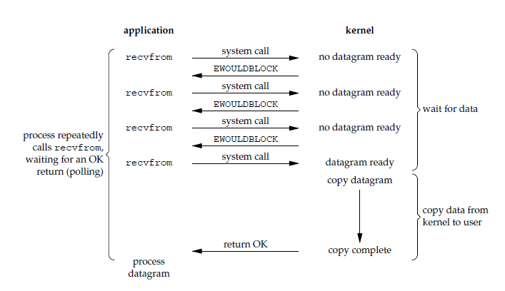
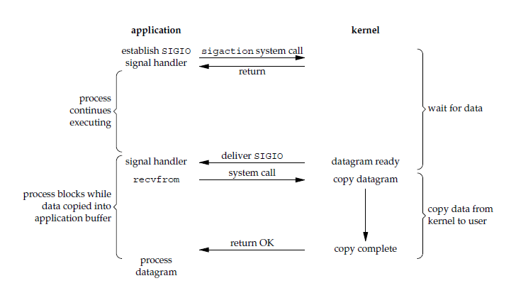

# 一、I/O 模型

一个输入操作通常包括两个阶段：

- 等待数据准备好
- 从内核向进程复制数据

对于一个套接字上的输入操作，第一步通常涉及等待数据从网络中到达。当所等待数据到达时，它被复制到内核中的某个缓冲区。第二步就是把数据从内核缓冲区复制到应用进程缓冲区。

Unix 有五种 I/O 模型：

- 阻塞式 I/O
- 非阻塞式 I/O
- I/O 复用（select 和 poll）
- 信号驱动式 I/O（SIGIO）
- 异步 I/O（AIO）

## 阻塞式 I/O

 进程发起IO系统调用后，进程被阻塞，转到内核空间处理，整个IO处理完毕后返回进程。操作成功则进程获取到数据。

应该注意到，在阻塞的过程中，其它程序还可以执行，因此阻塞不意味着整个操作系统都被阻塞。因为其他程序还可以执行，所以不消耗 CPU 时间，这种模型的 CPU 利用率效率会比较高。

**典型应用**：阻塞socket、Java BIO；

**特点**：

- 进程阻塞挂起不消耗CPU资源，及时响应每个操作；

- 实现难度低、开发应用较容易；

- 适用并发量小的网络应用开发；

- 不适用并发量大的应用：因为一个请求IO会阻塞进程，所以，得为每请求分配一个处理进程（线程）以及时响应，系统开销大。
  

下图中，recvfrom 用于接收 Socket 传来的数据，并复制到应用进程的缓冲区 buf 中。这里把 recvfrom() 当成系统调用。

```c
ssize_t recvfrom(int sockfd, void *buf, size_t len, int flags, struct sockaddr *src_addr, socklen_t *addrlen);
```

<div align="center">  </div><br>

## 非阻塞式 I/O

 进程发起IO系统调用后，如果内核缓冲区没有数据，需要到IO设备中读取，进程返回一个错误而不会被阻塞；进程发起IO系统调用后，如果内核缓冲区有数据，内核就会把数据返回进程。

应用进程执行系统调用之后，内核返回一个错误码。应用进程可以继续执行，但是需要不断的执行系统调用来获知 I/O 是否完成，这种方式称为轮询（polling）。

由于 CPU 要处理更多的系统调用，因此这种模型的 CPU 利用率是比较低的。

**典型应用**：socket是非阻塞的方式（设置为NONBLOCK）

**特点**：

- **进程轮询（重复）调用，消耗CPU的资源**；
- 实现难度低、开发应用相对阻塞IO模式较难； 
- 适用并发量较小、且不需要及时响应的网络应用开发；

<div align="center">  </div><br>

## I/O 复用

 多个的进程的IO可以注册到一个复用器（select）上，然后用一个进程调用该select， select会监听所有注册进来的IO；

如果select没有监听的IO在内核缓冲区都没有可读数据，select调用进程会被阻塞；而当任一IO在内核缓冲区中有可数据时，select调用就会返回；
而后select调用进程可以自己或通知另外的进程（注册进程）来再次发起读取IO，读取内核中准备好的数据。可以看到，多个进程注册IO后，只有另一个select调用进程被阻塞。
**典型应用**：select、poll、epoll三种方案，nginx都可以选择使用这三个方案;Java NIO;

**特点**：

- 专一进程解决多个进程IO的阻塞问题，性能好；Reactor模式;

- 实现、开发应用难度较大；

- 适用高并发服务应用开发：一个进程（线程）响应多个请求；Linux中IO复用的实现方式主要有select、poll和epoll：
  

使用 select 或者 poll 等待数据，并且可以等待多个套接字中的任何一个变为可读。这一过程会被阻塞，当某一个套接字可读时返回，之后再使用 recvfrom 把数据从内核复制到进程中。

它可以让单个进程具有处理多个 I/O 事件的能力。又被称为 Event Driven I/O，即事件驱动 I/O。

如果一个 Web 服务器没有 I/O 复用，那么每一个 Socket 连接都需要创建一个线程去处理。如果同时有几万个连接，那么就需要创建相同数量的线程。相比于多进程和多线程技术，I/O 复用不需要进程线程创建和切换的开销，系统开销更小。

> Select：注册IO、阻塞扫描，监听的IO最大连接数不能多于FD_SIZE；
>
> Poll：原理和Select相似，没有数量限制，但IO数量大扫描线性性能下降；
>
> Epoll ：事件驱动不阻塞，mmap实现内核与用户空间的消息传递，数量很大，Linux2.6后内核支持；

<div align="center">  </div><br>

## 信号驱动 I/O

应用进程使用 sigaction 系统调用，内核立即返回，应用进程可以继续执行，也就是说等待数据阶段应用进程是非阻塞的。内核在数据到达时向应用进程发送 SIGIO 信号，应用进程收到之后在信号处理程序中调用 recvfrom 将数据从内核复制到应用进程中。

相比于非阻塞式 I/O 的轮询方式，信号驱动 I/O 的 CPU 利用率更高。

<div align="center">  </div><br>

## 异步 I/O

应用进程执行 aio_read 系统调用会立即返回，应用进程可以继续执行，不会被阻塞，内核会在所有操作完成之后向应用进程发送信号。

异步 I/O 与信号驱动 I/O 的区别在于，异步 I/O 的信号是通知应用进程 I/O 完成，而信号驱动 I/O 的信号是通知应用进程可以开始 I/O。

<div align="center">  </div><br>


## 五大 I/O 模型比较

- 同步 I/O：将数据从内核缓冲区复制到应用进程缓冲区的阶段，应用进程会阻塞。
- 异步 I/O：不会阻塞。

阻塞式 I/O、非阻塞式 I/O、I/O 复用和信号驱动 I/O 都是同步 I/O，它们的主要区别在第一个阶段。

非阻塞式 I/O 、信号驱动 I/O 和异步 I/O 在第一阶段不会阻塞。

<div align="center">  </div><br>

**阻塞和非阻塞I/O区别？**

- 如果内核缓冲没有数据可读时，read()系统调用会一直等待有数据到来后才从阻塞态中返回，这就是阻塞I/O。
- 非阻塞I/O在遇到上述情况时会立即返回给用户态进程一个返回值，并设置erro为EAGAIN。
- 对于往缓冲区写的操作同理。

**同步和异步区别**？

- 同步I/O指处理I/O操作的进程和处理I/O操作的进程是同一个。
- 异步I/O中I/O操作由操作系统完成，并不由产生I/O的用户进程执行。

**Reactor和Proactor区别？**

- Reactor模式已经是同步I/O，处理I/O操作的依旧是产生I/O的程序；Proactor是异步I/O，产生I/O调用的用户进程不会等待I/O发生，具体I/O操作由操作系统完成。
- 异步I/O需要操作系统支持，Linux异步I/O为AIO，Windows为IOCP。

**epoll和select及poll区别？**

- 文件描述符数量限制：select文件描述符数量受到限制，最大为2048（FD_SETSIZE），可重编内核修改但治标不治本；poll没有最大文件描述符数量限制；epoll没有最大文件描述符数量限制。
- 检查机制：select和poll会以遍历方式（轮询机制）检查每一个文件描述符以确定是否有I/O就绪，每次执行时间会随着连接数量的增加而线性增长；epoll则每次返回后只对活跃的文件描述符队列进行操作（每个描述符都通过回调函数实现，只有活跃的描述符会调用回调函数并添加至队列中）。**当大量连接是非活跃连接时epoll相对于select和poll优势比较大，若大多为活跃连接则效率未必高（设计队列维护及红黑树创建）**
- 数据传递方式：select和poll需要将FD_SET在内核空间和用户空间来回拷贝；epoll则避免了不必要的数据拷贝。

**epoll中ET和LT模式的区别与实现原理？**

- LT：默认工作方式，同时支持阻塞I/O和非阻塞I/O，LT模式下，内核告知某一文件描述符读、写是否就绪了，然后你可以对这个就绪的文件描述符进行I/O操作。如果不作任何操作，内核还是会继续通知。这种模式编程出错误可能性较小但由于重复提醒，效率相对较低。传统的select、poll都是这种模型的代表。
- ET：高速工作方式（因为减少了epoll_wait触发次数），适合高并发，只支持非阻塞I/O，ET模式下，内核告知某一文件描述符读、写是否就绪了，然后他假设已经知道该文件描述符是否已经就绪，内核不会再为这个文件描述符发更多的就绪通知（epoll_wait不会返回），直到某些操作导致文件描述符状态不再就绪。

**ET模式下要注意什么（如何使用ET模式）？**

- 对于读操作，如果read没有一次读完buff数据，下一次将得不到就绪通知（ET特性），造成buff中数据无法读出，除非有新数据到达。
  - 解决方法：将套接字设置为非阻塞，用while循环包住read，只要buff中有数据，就一直读。一直读到产生EAGIN错误。
- 对于写操作主要因为ET模式下非阻塞需要我们考虑如何将用户要求写的数据写完。
  - 解决方法：只要buff还有空间且用户请求写的数据还未写完，就一直写。

- 文件描述符数量限制：select文件描述符数量受到限制，最大为2048（FD_SETSIZE），可重编内核修改但治标不治本；poll没有最大文件描述符数量限制；epoll没有最大文件描述符数量限制。
- 检查机制：select和poll会以遍历方式（轮询机制）检查每一个文件描述符以确定是否有I/O就绪，每次执行时间会随着连接数量的增加而线性增长；epoll则每次返回后只对活跃的文件描述符队列进行操作（每个描述符都通过回调函数实现，只有活跃的描述符会调用回调函数并添加至队列中）。**当大量连接是非活跃连接时epoll相对于select和poll优势比较大，若大多为活跃连接则效率未必高（设计队列维护及红黑树创建）**
- 数据传递方式：select和poll需要将FD_SET在内核空间和用户空间来回拷贝；epoll则避免了不必要的数据拷贝。

# 二、I/O 复用

select/poll/epoll 都是 I/O 多路复用的具体实现，select 出现的最早，之后是 poll，再是 epoll。

## select

```c
int select(int n, fd_set *readfds, fd_set *writefds, fd_set *exceptfds, struct timeval *timeout);
```

有三种类型的描述符类型：readset、writeset、exceptset，分别对应读、写、异常条件的描述符集合。fd_set 使用数组实现，数组大小使用 FD_SETSIZE 定义。

timeout 为超时参数，调用 select 会一直阻塞直到有描述符的事件到达或者等待的时间超过 timeout。

成功调用返回结果大于 0，出错返回结果为 -1，超时返回结果为 0。

```c
fd_set fd_in, fd_out;
struct timeval tv;

// Reset the sets
FD_ZERO( &fd_in );
FD_ZERO( &fd_out );

// Monitor sock1 for input events
FD_SET( sock1, &fd_in );

// Monitor sock2 for output events
FD_SET( sock2, &fd_out );

// Find out which socket has the largest numeric value as select requires it
int largest_sock = sock1 > sock2 ? sock1 : sock2;

// Wait up to 10 seconds
tv.tv_sec = 10;
tv.tv_usec = 0;

// Call the select
int ret = select( largest_sock + 1, &fd_in, &fd_out, NULL, &tv );

// Check if select actually succeed
if ( ret == -1 )
    // report error and abort
else if ( ret == 0 )
    // timeout; no event detected
else
{
    if ( FD_ISSET( sock1, &fd_in ) )
        // input event on sock1

    if ( FD_ISSET( sock2, &fd_out ) )
        // output event on sock2
}
```

## poll

```c
int poll(struct pollfd *fds, unsigned int nfds, int timeout);
```

pollfd 使用链表实现。

```c
// The structure for two events
struct pollfd fds[2];

// Monitor sock1 for input
fds[0].fd = sock1;
fds[0].events = POLLIN;

// Monitor sock2 for output
fds[1].fd = sock2;
fds[1].events = POLLOUT;

// Wait 10 seconds
int ret = poll( &fds, 2, 10000 );
// Check if poll actually succeed
if ( ret == -1 )
    // report error and abort
else if ( ret == 0 )
    // timeout; no event detected
else
{
    // If we detect the event, zero it out so we can reuse the structure
    if ( fds[0].revents & POLLIN )
        fds[0].revents = 0;
        // input event on sock1

    if ( fds[1].revents & POLLOUT )
        fds[1].revents = 0;
        // output event on sock2
}
```

## 比较

### 1. 功能

select 和 poll 的功能基本相同，不过在一些实现细节上有所不同。

- select 会修改描述符，而 poll 不会；
- select 的描述符类型使用数组实现，FD_SETSIZE 大小默认为 1024，因此默认只能监听 1024 个描述符。如果要监听更多描述符的话，需要修改 FD_SETSIZE 之后重新编译；而 poll 的描述符类型使用链表实现，没有描述符数量的限制；
- poll 提供了更多的事件类型，并且对描述符的重复利用上比 select 高。
- 如果一个线程对某个描述符调用了 select 或者 poll，另一个线程关闭了该描述符，会导致调用结果不确定。

### 2. 速度

select 和 poll 速度都比较慢。

- select 和 poll 每次调用都需要将全部描述符从应用进程缓冲区复制到内核缓冲区。
- select 和 poll 的返回结果中没有声明哪些描述符已经准备好，所以如果返回值大于 0 时，应用进程都需要使用轮询的方式来找到 I/O 完成的描述符。

### 3. 可移植性

几乎所有的系统都支持 select，但是只有比较新的系统支持 poll。

## epoll

```c
int epoll_create(int size);
int epoll_ctl(int epfd, int op, int fd, struct epoll_event *event)；
int epoll_wait(int epfd, struct epoll_event * events, int maxevents, int timeout);
```

epoll_ctl() 用于向内核注册新的描述符或者是改变某个文件描述符的状态。已注册的描述符在内核中会被维护在一棵红黑树上，通过回调函数内核会将 I/O 准备好的描述符加入到一个链表中管理，进程调用 epoll_wait() 便可以得到事件完成的描述符。

从上面的描述可以看出，epoll 只需要将描述符从进程缓冲区向内核缓冲区拷贝一次，并且进程不需要通过轮询来获得事件完成的描述符。

epoll 仅适用于 Linux OS。

epoll 比 select 和 poll 更加灵活而且没有描述符数量限制。

epoll 对多线程编程更有友好，一个线程调用了 epoll_wait() 另一个线程关闭了同一个描述符也不会产生像 select 和 poll 的不确定情况。

```c
// Create the epoll descriptor. Only one is needed per app, and is used to monitor all sockets.
// The function argument is ignored (it was not before, but now it is), so put your favorite number here
int pollingfd = epoll_create( 0xCAFE );

if ( pollingfd < 0 )
 // report error

// Initialize the epoll structure in case more members are added in future
struct epoll_event ev = { 0 };

// Associate the connection class instance with the event. You can associate anything
// you want, epoll does not use this information. We store a connection class pointer, pConnection1
ev.data.ptr = pConnection1;

// Monitor for input, and do not automatically rearm the descriptor after the event
ev.events = EPOLLIN | EPOLLONESHOT;
// Add the descriptor into the monitoring list. We can do it even if another thread is
// waiting in epoll_wait - the descriptor will be properly added
if ( epoll_ctl( epollfd, EPOLL_CTL_ADD, pConnection1->getSocket(), &ev ) != 0 )
    // report error

// Wait for up to 20 events (assuming we have added maybe 200 sockets before that it may happen)
struct epoll_event pevents[ 20 ];

// Wait for 10 seconds, and retrieve less than 20 epoll_event and store them into epoll_event array
int ready = epoll_wait( pollingfd, pevents, 20, 10000 );
// Check if epoll actually succeed
if ( ret == -1 )
    // report error and abort
else if ( ret == 0 )
    // timeout; no event detected
else
{
    // Check if any events detected
    for ( int i = 0; i < ret; i++ )
    {
        if ( pevents[i].events & EPOLLIN )
        {
            // Get back our connection pointer
            Connection * c = (Connection*) pevents[i].data.ptr;
            c->handleReadEvent();
         }
    }
}
```


## 工作模式

epoll 的描述符事件有两种触发模式：LT（level trigger）和 ET（edge trigger）。

### 1. LT 模式

当 epoll_wait() 检测到描述符事件到达时，将此事件通知进程，进程可以不立即处理该事件，下次调用 epoll_wait() 会再次通知进程。是默认的一种模式，并且同时支持 Blocking 和 No-Blocking。

### 2. ET 模式

和 LT 模式不同的是，通知之后进程必须立即处理事件，下次再调用 epoll_wait() 时不会再得到事件到达的通知。

很大程度上减少了 epoll 事件被重复触发的次数，因此效率要比 LT 模式高。只支持 No-Blocking，以避免由于一个文件句柄的阻塞读/阻塞写操作把处理多个文件描述符的任务饿死。

## 应用场景

很容易产生一种错觉认为只要用 epoll 就可以了，select 和 poll 都已经过时了，其实它们都有各自的使用场景。

### 1. select 应用场景

select 的 timeout 参数精度为 1ns，而 poll 和 epoll 为 1ms，因此 select 更加适用于实时性要求比较高的场景，比如核反应堆的控制。

select 可移植性更好，几乎被所有主流平台所支持。

### 2. poll 应用场景

poll 没有最大描述符数量的限制，如果平台支持并且对实时性要求不高，应该使用 poll 而不是 select。

### 3. epoll 应用场景

只需要运行在 Linux 平台上，有大量的描述符需要同时轮询，并且这些连接最好是长连接。

需要同时监控小于 1000 个描述符，就没有必要使用 epoll，因为这个应用场景下并不能体现 epoll 的优势。

需要监控的描述符状态变化多，而且都是非常短暂的，也没有必要使用 epoll。因为 epoll 中的所有描述符都存储在内核中，造成每次需要对描述符的状态改变都需要通过 epoll_ctl() 进行系统调用，频繁系统调用降低效率。并且 epoll 的描述符存储在内核，不容易调试。


# 三、详解IO复用

**最基本的socket模型**
要想客户端和服务器能在网络中通信，那必须得使用 Socket  编程，它是进程间通信里比较特别的方式，特别之处在于它是可以跨主机间通信。

Socket  的中文名叫作插口，咋一看还挺迷惑的。事实上，双方要进行网络通信前，各自得创建一个 Socket，这相当于客户端和服务器都开了一个“口子”，双方读取和发送数据的时候，都通过这个“口子”。这样一看，是不是觉得很像弄了一根网线，一头插在客户端，一头插在服务端，然后进行通信。

创建 Socket 的时候，可以指定网络层使用的是 IPv4 还是 IPv6，传输层使用的是 TCP 还是 UDP。

UDP 的 Socket 编程相对简单些，这里我们只介绍基于 TCP 的 Socket 编程。

服务器的程序要先跑起来，然后等待客户端的连接和数据，我们先来看看服务端的 Socket 编程过程是怎样的。

服务端首先调用 `socket()` 函数，创建网络协议为 IPv4，以及传输协议为 TCP 的 Socket ，接着调用 `bind()` 函数，给这个 Socket 绑定一个 **IP 地址和端口**。
**绑定这两个的目的是什么？**

- 绑定端口的目的：当内核收到 TCP 报文，通过 TCP 头里面的端口号，来找到我们的应用程序，然后把数据传递给我们。
- 绑定 IP 地址的目的：一台机器是可以有多个网卡的，每个网卡都有对应的 IP 地址，当绑定一个网卡时，内核在收到该网卡上的包，才会发给我们；

绑定完 IP 地址和端口后，就可以调用 `listen()` 函数进行监听，此时对应 TCP 状态图中的 `listen`，如果我们要判定服务器中一个网络程序有没有启动，可以通过 `netstate` 命令查看对应的端口号是否有被监听。

服务端进入了监听状态后，通过调用 `accept()` 函数，来从内核获取客户端的连接，如果没有客户端连接，则会阻塞等待客户端连接的到来。

**那客户端是怎么发起连接的呢？**

客户端在创建好 Socket 后，调用 `connect()` 函数发起连接，该函数的参数要指明服务端的 IP 地址和端口号，然后万众期待的 TCP 三次握手就开始了。

在  TCP 连接的过程中，服务器的内核实际上为每个 Socket 维护了两个队列：

- 一个是还没完全建立连接的队列，称为 **TCP 半连接队列**，这个队列都是没有完成三次握手的连接，此时服务端处于 `syn_rcvd` 的状态；
- 一个是一件建立连接的队列，称为 **TCP 全连接队列**，这个队列都是完成了三次握手的连接，此时服务端处于 `established` 状态；

当 TCP 全连接队列不为空后，服务端的 `accept()` 函数，就会从内核中的 TCP 全连接队列里拿出一个已经完成连接的  Socket 返回应用程序，后续数据传输都用这个 Socket。

注意，监听的 Socket 和真正用来传数据的 Socket 是两个：

- 一个叫作**监听 Socket**；
- 一个叫作**已连接 Socket**；

连接建立后，客户端和服务端就开始相互传输数据了，双方都可以通过 `read()` 和 `write()` 函数来读写数据。

至此， TCP 协议的 Socket 程序的调用过程就结束了。

>读写 Socket  的方式，好像读写文件一样。基于 Linux 一切皆文件的理念，在内核中 Socket 也是以「文件」的形式存在的，也是有对应的文件描述符。
>
>**文件描述符的作用是什么？**每一个进程都有一个数据结构 `task_struct`，该结构体里有一个指向「文件描述符数组」的成员指针。该数组里列出这个进程打开的所有文件的文件描述符。数组的下标是文件描述符，是一个整数，而数组的内容是一个指针，指向内核中所有打开的文件的列表，也就是说内核可以通过文件描述符找到对应打开的文件。
>
>然后每个文件都有一个 inode，Socket 文件的 inode 指向了内核中的 Socket 结构，在这个结构体里有两个队列，分别是**发送队列**和**接收队列**，这个两个队列里面保存的是一个个 `struct sk_buff`，用链表的组织形式串起来。
>
>sk_buff 可以表示各个层的数据包，在应用层数据包叫 data，在 TCP 层我们称为 segment，在 IP 层我们叫 packet，在数据链路层称为 frame。
>
>**为什么全部数据包只用一个结构体来描述呢？**协议栈采用的是分层结构，上层向下层传递数据时需要增加包头，下层向上层数据时又需要去掉包头，如果每一层都用一个结构体，那在层之间传递数据的时候，就要发生多次拷贝，这将大大降低 CPU 效率。
>
>于是，为了在层级之间传递数据时，不发生拷贝，只用 sk_buff 一个结构体来描述所有的网络包，那它是如何做到的呢？是通过调整 sk_buff 中 `data` 的指针，比如：
>
>- 当接收报文时，从网卡驱动开始，通过协议栈层层往上传送数据报，通过增加 skb->data 的值，来逐步剥离协议首部。
>- 当要发送报文时，创建 sk_buff 结构体，数据缓存区的头部预留足够的空间，用来填充各层首部，在经过各下层协议时，通过减少 skb->data 的值来增加协议首部。

**如何服务更多用户**

前面提到的 TCP Socket 调用流程是最简单、最基本的，它基本只能一对一通信，因为使用的是同步阻塞的方式，当服务端在还没处理完一个客户端的网络 I/O 时，或者 读写操作发生阻塞时，其他客户端是无法与服务端连接的。

可如果我们服务器只能服务一个客户，那这样就太浪费资源了，于是我们要改进这个网络 I/O 模型，以支持更多的客户端。

在改进网络 I/O 模型前，我先来提一个问题，你知道服务器单机理论最大能连接多少个客户端？

相信你知道 TCP 连接是由四元组唯一确认的，这个四元组就是：**本机IP, 本机端口, 对端IP, 对端端口**。

服务器作为服务方，通常会在本地固定监听一个端口，等待客户端的连接。因此服务器的本地 IP 和端口是固定的，于是对于服务端 TCP 连接的四元组只有对端 IP 和端口是会变化的，所以**最大 TCP 连接数 = 客户端 IP 数×客户端端口数**。

对于 IPv4，客户端的 IP 数最多为 2 的 32 次方，客户端的端口数最多为 2 的 16 次方，也就是**服务端单机最大 TCP 连接数约为 2 的 48 次方**。

这个理论值相当“丰满”，但是服务器肯定承载不了那么大的连接数，主要会受两个方面的限制：

- **文件描述符**，Socket 实际上是一个文件，也就会对应一个文件描述符。在 Linux 下，单个进程打开的文件描述符数是有限制的，没有经过修改的值一般都是 1024，不过我们可以通过 ulimit 增大文件描述符的数目；
- **系统内存**，每个 TCP 连接在内核中都有对应的数据结构，意味着每个连接都是会占用一定内存的；

那如果服务器的内存只有 2 GB，网卡是千兆的，能支持并发 1 万请求吗？

并发 1 万请求，也就是经典的 C10K 问题 ，C 是 Client 单词首字母缩写，C10K 就是单机同时处理 1 万个请求的问题。

从硬件资源角度看，对于 2GB 内存千兆网卡的服务器，如果每个请求处理占用不到 200KB 的内存和 100Kbit 的网络带宽就可以满足并发 1 万个请求。

不过，要想真正实现 C10K 的服务器，要考虑的地方在于服务器的网络 I/O 模型，效率低的模型，会加重系统开销，从而会离 C10K 的目标越来越远。

**多进程模型**
基于最原始的阻塞网络 I/O， 如果服务器要支持多个客户端，其中比较传统的方式，就是使用**多进程模型**，也就是为每个客户端分配一个进程来处理请求。

服务器的主进程负责监听客户的连接，一旦与客户端连接完成，accept() 函数就会返回一个「已连接 Socket」，这时就通过 `fork()` 函数创建一个子进程，实际上就把父进程所有相关的东西都**复制**一份，包括文件描述符、内存地址空间、程序计数器、执行的代码等。

这两个进程刚复制完的时候，几乎一摸一样。不过，会根据**返回值**来区分是父进程还是子进程，如果返回值是 0，则是子进程；如果返回值是其他的整数，就是父进程。

正因为子进程会**复制父进程的文件描述符**，于是就可以直接使用「已连接 Socket 」和客户端通信了，

可以发现，子进程不需要关心「监听 Socket」，只需要关心「已连接 Socket」；父进程则相反，将客户服务交给子进程来处理，因此父进程不需要关心「已连接 Socket」，只需要关心「监听 Socket」。

另外，当「子进程」退出时，实际上内核里还会保留该进程的一些信息，也是会占用内存的，如果不做好“回收”工作，就会变成**僵尸进程**，随着僵尸进程越多，会慢慢耗尽我们的系统资源。

因此，父进程要“善后”好自己的孩子，怎么善后呢？那么有两种方式可以在子进程退出后回收资源，分别是调用 `wait()` 和 `waitpid()` 函数。

这种用多个进程来应付多个客户端的方式，在应对 100 个客户端还是可行的，但是当客户端数量高达一万时，肯定扛不住的，因为每产生一个进程，必会占据一定的系统资源，而且进程间上下文切换的“包袱”是很重的，性能会大打折扣。

进程的上下文切换不仅包含了虚拟内存、栈、全局变量等用户空间的资源，还包括了内核堆栈、寄存器等内核空间的资源。

**多线程模型**

既然进程间上下文切换的“包袱”很重，那我们就搞个比较轻量级的模型来应对多用户的请求 —— **多线程模型**。

线程是运行在进程中的一个“逻辑流”，单进程中可以运行多个线程，同进程里的线程可以共享进程的部分资源的，比如文件描述符列表、进程空间、代码、全局数据、堆、共享库等，这些共享些资源在上下文切换时是不需要切换，而只需要切换线程的私有数据、寄存器等不共享的数据，因此同一个进程下的线程上下文切换的开销要比进程小得多。

当服务器与客户端 TCP 完成连接后，通过 `pthread_create()` 函数创建线程，然后将「已连接 Socket」的文件描述符传递给线程函数，接着在线程里和客户端进行通信，从而达到并发处理的目的。

如果每来一个连接就创建一个线程，线程运行完后，还得操作系统还得销毁线程，虽说线程切换的上写文开销不大，但是如果频繁创建和销毁线程，系统开销也是不小的。

那么，我们可以使用**线程池**的方式来避免线程的频繁创建和销毁，所谓的线程池，就是提前创建若干个线程，这样当由新连接建立时，将这个已连接的 Socket 放入到一个队列里，然后线程池里的线程负责从队列中取出已连接 Socket 进程处理。需要注意的是，这个队列是全局的，每个线程都会操作，为了避免多线程竞争，线程在操作这个队列前要加锁。

上面基于进程或者线程模型的，其实还是有问题的。新到来一个 TCP 连接，就需要分配一个进程或者线程，那么如果要达到 C10K，意味着要一台机器维护 1 万个连接，相当于要维护 1 万个进程/线程，操作系统就算死扛也是扛不住的。

**IO多路复用**
既然为每个请求分配一个进程/线程的方式不合适，那有没有可能只使用一个进程来维护多个 Socket 呢？答案是有的，那就是 **I/O 多路复用**技术。一个进程虽然任一时刻只能处理一个请求，但是处理每个请求的事件时，耗时控制在 1 毫秒以内，这样 1 秒内就可以处理上千个请求，把时间拉长来看，多个请求复用了一个进程，这就是多路复用，这种思想很类似一个 CPU 并发多个进程，所以也叫做时分多路复用。

我们熟悉的 select/poll/epoll 内核提供给用户态的多路复用系统调用，**进程可以通过一个系统调用函数从内核中获取多个事件**。

**select/poll/epoll 是如何获取网络事件的呢？**在获取事件时，先把所有连接（文件描述符）传给内核，再由内核返回产生了事件的连接，然后在用户态中再处理这些连接对应的请求即可。

select/poll/epoll 这是三个多路复用接口，都能实现 C10K 吗？接下来，我们分别说说它们。

**select/poll**
select 实现多路复用的方式是，将已连接的 Socket 都放到一个**文件描述符集合**，然后调用 select 函数将文件描述符集合**拷贝**到内核里，让内核来检查是否有网络事件产生，检查的方式很粗暴，就是通过**遍历**文件描述符集合的方式，当检查到有事件产生后，将此 Socket 标记为可读或可写， 接着再把整个文件描述符集合**拷贝**回用户态里，然后用户态还需要再通过**遍历**的方法找到可读或可写的 Socket，然后再对其处理。

所以，对于 select 这种方式，需要进行 **2 次「遍历」文件描述符集合**，一次是在内核态里，一个次是在用户态里 ，而且还会发生 **2 次「拷贝」文件描述符集合**，先从用户空间传入内核空间，由内核修改后，再传出到用户空间中。

select 使用固定长度的 BitsMap，表示文件描述符集合，而且所支持的文件描述符的个数是有限制的，在 Linux 系统中，由内核中的 FD_SETSIZE 限制， 默认最大值为 `1024`，只能监听 0~1023 的文件描述符。

poll 不再用 BitsMap 来存储所关注的文件描述符，取而代之用动态数组，以链表形式来组织，突破了 select 的文件描述符个数限制，当然还会受到系统文件描述符限制。

但是 poll 和 select 并没有太大的本质区别，**都是使用「线性结构」存储进程关注的 Socket 集合，因此都需要遍历文件描述符集合来找到可读或可写的 Socket，时间复杂度为 O(n)，而且也需要在用户态与内核态之间拷贝文件描述符集合**，这种方式随着并发数上来，性能的损耗会呈指数级增长。

**epoll**epoll 通过两个方面，很好解决了 select/poll 的问题。

*第一点*，epoll 在内核里使用**红黑树来跟踪进程所有待检测的文件描述字**，把需要监控的 socket 通过 `epoll_ctl()` 函数加入内核中的红黑树里，红黑树是个高效的数据结构，增删查一般时间复杂度是 `O(logn)`，通过对这棵黑红树进行操作，这样就不需要像 select/poll 每次操作时都传入整个 socket 集合，只需要传入一个待检测的 socket，减少了内核和用户空间大量的数据拷贝和内存分配。

*第二点*， epoll 使用事件驱动的机制，内核里**维护了一个链表来记录就绪事件**，当某个 socket 有事件发生时，通过回调函数内核会将其加入到这个就绪事件列表中，当用户调用 `epoll_wait()` 函数时，只会返回有事件发生的文件描述符的个数，不需要像 select/poll 那样轮询扫描整个 socket 集合，大大提高了检测的效率。epoll 的方式即使监听的 Socket 数量越多的时候，效率不会大幅度降低，能够同时监听的 Socket 的数目也非常的多了，上限就为系统定义的进程打开的最大文件描述符个数。因而，**epoll 被称为解决 C10K 问题的利器**。

插个题外话，网上文章不少说，`epoll_wait` 返回时，对于就绪的事件，epoll使用的是共享内存的方式，即用户态和内核态都指向了就绪链表，所以就避免了内存拷贝消耗。

这是错的！看过 epoll 内核源码的都知道，**压根就没有使用共享内存这个玩意**。你可以从下面这份代码看到， epoll_wait 实现的内核代码中调用了 `__put_user` 函数，这个函数就是将数据从内核拷贝到用户空间。epoll 支持两种事件触发模式，分别是**边缘触发（\*edge-triggered，ET\*）**和**水平触发（\*level-triggered，LT\*）**。

这两个术语还挺抽象的，其实它们的区别还是很好理解的。

- 使用边缘触发模式时，当被监控的 Socket 描述符上有可读事件发生时，**服务器端只会从 epoll_wait 中苏醒一次**，即使进程没有调用 read 函数从内核读取数据，也依然只苏醒一次，因此我们程序要保证一次性将内核缓冲区的数据读取完；
- 使用水平触发模式时，当被监控的 Socket 上有可读事件发生时，**服务器端不断地从 epoll_wait 中苏醒，直到内核缓冲区数据被 read 函数读完才结束**，目的是告诉我们有数据需要读取；

举个例子，你的快递被放到了一个快递箱里，如果快递箱只会通过短信通知你一次，即使你一直没有去取，它也不会再发送第二条短信提醒你，这个方式就是边缘触发；如果快递箱发现你的快递没有被取出，它就会不停地发短信通知你，直到你取出了快递，它才消停，这个就是水平触发的方式。

这就是两者的区别，水平触发的意思是只要满足事件的条件，比如内核中有数据需要读，就一直不断地把这个事件传递给用户；而边缘触发的意思是只有第一次满足条件的时候才触发，之后就不会再传递同样的事件了。

如果使用水平触发模式，当内核通知文件描述符可读写时，接下来还可以继续去检测它的状态，看它是否依然可读或可写。所以在收到通知后，没必要一次执行尽可能多的读写操作。

如果使用边缘触发模式，I/O 事件发生时只会通知一次，而且我们不知道到底能读写多少数据，所以在收到通知后应尽可能地读写数据，以免错失读写的机会。因此，我们会**循环**从文件描述符读写数据，那么如果文件描述符是阻塞的，没有数据可读写时，进程会阻塞在读写函数那里，程序就没办法继续往下执行。所以，**边缘触发模式一般和非阻塞 I/O 搭配使用**，程序会一直执行 I/O 操作，直到系统调用（如 `read` 和 `write`）返回错误，错误类型为 `EAGAIN` 或 `EWOULDBLOCK`。

一般来说，边缘触发的效率比水平触发的效率要高，因为边缘触发可以减少 epoll_wait 的系统调用次数，系统调用也是有一定的开销的的，毕竟也存在上下文的切换。select/poll 只有水平触发模式，epoll 默认的触发模式是水平触发，但是可以根据应用场景设置为边缘触发模式。

**另外，使用 I/O 多路复用时，最好搭配非阻塞 I/O 一起使用。简单点理解，就是多路复用 API 返回的事件并不一定可读写的**，如果使用阻塞 I/O， 那么在调用 read/write 时则会发生程序阻塞，因此最好搭配非阻塞 I/O，以便应对极少数的特殊情况。

**总结**
最基础的 TCP 的 Socket 编程，它是阻塞 I/O 模型，基本上只能一对一通信，那为了服务更多的客户端，我们需要改进网络 I/O 模型。

比较传统的方式是使用多进程/线程模型，每来一个客户端连接，就分配一个进程/线程，然后后续的读写都在对应的进程/线程，这种方式处理 100 个客户端没问题，但是当客户端增大到 10000  个时，10000 个进程/线程的调度、上下文切换以及它们占用的内存，都会成为瓶颈。

为了解决上面这个问题，就出现了 I/O 的多路复用，可以只在一个进程里处理多个文件的  I/O，Linux 下有三种提供 I/O 多路复用的 API，分别是：select、poll、epoll。

select 和 poll 并没有本质区别，它们内部都是使用「线性结构」来存储进程关注的 Socket 集合。

在使用的时候，首先需要把关注的 Socket 集合通过 select/poll 系统调用从用户态拷贝到内核态，然后由内核检测事件，当有网络事件产生时，内核需要遍历进程关注 Socket 集合，找到对应的 Socket，并设置其状态为可读/可写，然后把整个 Socket 集合从内核态拷贝到用户态，用户态还要继续遍历整个 Socket 集合找到可读/可写的 Socket，然后对其处理。

很明显发现，select 和 poll 的缺陷在于，当客户端越多，也就是 Socket 集合越大，Socket 集合的遍历和拷贝会带来很大的开销，因此也很难应对 C10K。

epoll 是解决 C10K 问题的利器，通过两个方面解决了 select/poll 的问题。

- epoll 在内核里使用「红黑树」来关注进程所有待检测的 Socket，红黑树是个高效的数据结构，增删查一般时间复杂度是 O(logn)，通过对这棵黑红树的管理，不需要像 select/poll 在每次操作时都传入整个 Socket 集合，减少了内核和用户空间大量的数据拷贝和内存分配。
- epoll 使用事件驱动的机制，内核里维护了一个「链表」来记录就绪事件，只将有事件发生的 Socket 集合传递给应用程序，不需要像 select/poll 那样轮询扫描整个集合（包含有和无事件的 Socket ），大大提高了检测的效率。

而且，epoll 支持边缘触发和水平触发的方式，而 select/poll 只支持水平触发，一般而言，边缘触发的方式会比水平触发的效率高。

# 四、Linux如何收发网络包

### Linux 接收网络包的流程

网卡是计算机里的一个硬件，专门负责接收和发送网络包，当网卡接收到一个网络包后，会通过 DMA 技术，将网络包放入到 Ring Buffer，这个是一个环形缓冲区，该缓冲区在内核内存中的网卡驱动里。

那接收到网络包后，应该怎么告诉操作系统这个网络包已经到达了呢？

最简单的一种方式就是触发中断，也就是每当网卡收到一个网络包，就触发一个中断告诉操作系统。

但是，这存在一个问题，在高性能网络场景下，网络包的数量会非常多，那么就会触发非常多的中断，要知道当 CPU  收到了中断，就会停下手里的事情，而去处理这些网络包，处理完毕后，才会回去继续其他事情，那么频繁地触发中断，则会导致 CPU 一直没玩没了的处理中断，而导致其他任务可能无法继续前进，从而影响系统的整体效率。

所以为了解决频繁中断带来的性能开销，Linux 内核在 2.6 版本中引入了 **NAPI 机制**，它是混合「中断和轮询」的方式来接收网络包，它的核心概念就是**不采用中断的方式读取数据**，而是首先采用中断唤醒数据接收的服务程序，然后 `poll` 的方法来轮询数据。

比如，当有网络包到达时，网卡发起硬件中断，于是会执行网卡硬件中断处理函数，**中断处理函数处理完需要「暂时屏蔽中断」，然后唤醒「软中断」来轮询处理数据，直到没有新数据时才恢复中断，这样一次中断处理多个网络包**，于是就可以降低网卡中断带来的性能开销。

那软中断是怎么处理网络包的呢？它会从 Ring Buffer 中拷贝数据到内核 struct sk_buff 缓冲区中，从而可以作为一个网络包交给网络协议栈进行逐层处理。

首先，会先进入到网络接口层，在这一层会检查报文的合法性，如果不合法则丢弃，合法则会找出该网络包的上层协议的类型，比如是 IPv4，还是 IPv6，接着再去掉帧头和帧尾，然后交给网络层。

到了网络层，则取出 IP 包，判断网络包下一步的走向，比如是交给上层处理还是转发出去。当确认这个网络包要发送给本机后，就会从 IP 头里看看上一层协议的类型是 TCP 还是 UDP，接着去掉 IP 头，然后交给传输层。

传输层取出 TCP 头或 UDP 头，根据四元组「源 IP、源端口、目的 IP、目的端口」 作为标识，找出对应的 Socket，并把数据拷贝到 Socket 的接收缓冲区。

最后，应用层程序调用 Socket 接口，从内核的 Socket 接收缓冲区读取新到来的数据到应用层。

至此，一个网络包的接收过程就已经结束了，你也可以从下图左边部分看到网络包接收的流程，右边部分刚好反过来，它是网络包发送的流程。

### Linux 发送网络包的流程

发送网络包的流程正好和接收流程相反。

首先，应用程序会调用 Socket 发送数据包的接口，由于这个是系统调用，所以会从用户态陷入到内核态中的 Socket 层，Socket 层会将应用层数据拷贝到 Socket 发送缓冲区中。

接下来，网络协议栈从 Socket 发送缓冲区中取出数据包，并按照 TCP/IP 协议栈从上到下逐层处理。

如果使用的是 TCP 传输协议发送数据，那么会在传输层增加 TCP 包头，然后交给网络层，网络层会给数据包增加 IP 包，然后通过查询路由表确认下一跳的 IP，并按照 MTU 大小进行分片。

分片后的网络包，就会被送到网络接口层，在这里会通过 ARP 协议获得下一跳的 MAC 地址，然后增加帧头和帧尾，放到发包队列中。

这一些准备好后，会触发软中断告诉网卡驱动程序，这里有新的网络包需要发送，最后驱动程序通过 DMA，从发包队列中读取网络包，将其放入到硬件网卡的队列中，随后物理网卡再将它发送出去。

# 参考资料

- Stevens W R, Fenner B, Rudoff A M. UNIX network programming[M]. Addison-Wesley Professional, 2004.
- [Boost application performance using asynchronous I/O](https://www.ibm.com/developerworks/linux/library/l-async/)
- [Synchronous and Asynchronous I/O](https://msdn.microsoft.com/en-us/library/windows/desktop/aa365683(v=vs.85).aspx)
- [Linux IO 模式及 select、poll、epoll 详解](https://segmentfault.com/a/1190000003063859)
- [poll vs select vs event-based](https://daniel.haxx.se/docs/poll-vs-select.html)
- [select / poll / epoll: practical difference for system architects](http://www.ulduzsoft.com/2014/01/select-poll-epoll-practical-difference-for-system-architects/)
- [Browse the source code of userspace/glibc/sysdeps/unix/sysv/linux/ online](https://code.woboq.org/userspace/glibc/sysdeps/unix/sysv/linux/)
