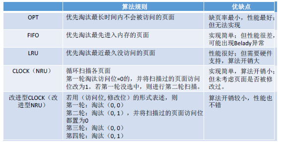
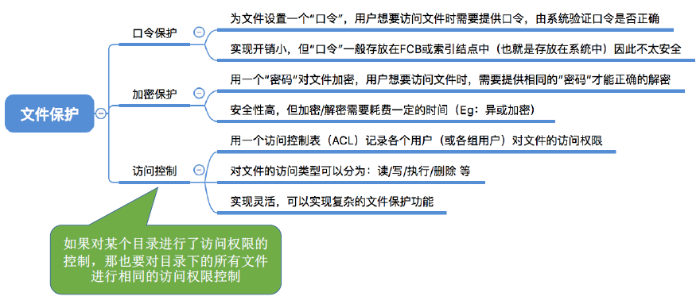

# 一、概述

  
 

### 1.   操作系统的定义

操作系统（Operating System，OS）是指控制和管理整个计算机系统的硬件和软件资源，并合理地组织调度计算机的工作和资源的分配；以提供给用户和其他软件方便的接口和环境；它是计算机系统中最基本的系统软件。

①操作系统是系统资源的管理者；
②是最接近硬件的一层软件；
③向上提供方便易用的服务

### 2. 操作系统的功能和目标

  
 

### 3. 操作系统的特征

  
 

##### 3.1 并发

并发：指两个或多个事件在同一时间间隔内发生。这些事件宏观上是同时发生的，但微观上是交替发生的。
并行：指两个或多个事件在同一时刻同时发生。

单核CPU同一时刻只能执行一个程序，各个程序只能并发地执行
多核CPU同一时刻可以同时执行多个程序，多个程序可以并行地执行

##### 3.2 共享

共享即资源共享，是指系统中的资源可供内存中多个并发执行的进程共同使用。

两者关系：并发和共享互为存在条件，而没有共享和并发就谈不上虚拟和异步，因此并发和共享式操作系统的两个最基本的特征

##### 3.3 虚拟

虚拟是指把一个物理上的实体变为若干个逻辑上的对应物。物理实体（前者）是实际存在的，而逻辑上对应物（后者）是用户感受到的。
①空分复用技术（如虚拟存储器技术）
②时分复用技术（如虚拟处理器）

##### 3.4 异步

异步是指，在多道程序环境下，允许多个程序并发执行，但由于资源有限，进程的执行不是一贯到底的，而是走走停停，以不可预知的速度向前推进，这就是进程的异步性。

由于并发运行的程序会争抢着使用系统资源，而系统中的资源有限，因此进程的执行不是一贯到底的，而是走走停停的，以不可预知的速度向前推进；如果失去了并发性，即系统只能串行地运行各个程序，那么每个程序的执行会一贯到底。只有系统拥有并发性，才有可能导致异步性。

### 4.  操作系统的运行 机制和体系结构

  
 

**程序运行的过程**其实就是CPU执行一条一条的机器指令的过程。

##### 4.1 两种指令

非特权指令：应用程序只能使用“非特权指令”，如：加法指令、减法指令等
特特权指令：操作系统内核作为“管理者”，有时会让CPU执行一些“特权指令”，如：内存清零指令。这些指令影响重大，只允许“管理者”——即操作系统内核来使用。

在CPU设计和生产的时候就划分了特权指令和非特权指令，因此CPU执行一条指令前就能判断出其类型。

##### 4.2  处理器的两种状态

CPU 有两种状态，“**内核态**”和“**用户态**”
处于内核态时，说明此时正在运行的是内核程序，此时可以执行特权指令
处于用户态时，说明此时正在运行的是应用程序，此时只能执行非特权指令

CPU 中有一个寄存器叫**程序状态字寄存器（PSW）**，其中有个二进制位，1表示“内核态”，0表示“用户态”。
内核态=核心态=管态；用户态=目态

内核态和用户态的切换：
内核态——>用户态：**执行一条特权指令**——修改PSW的标志位为“用户态”，这个动作意味着操作系统将主动让出CPU使用权
用户态——>内核态：由“**中断**”引发，硬件自动完成变态过程，触发中断信号意味着操作系统将强行夺回CPU的使用权

##### 4.3 内核

内核是计算机上配置的底层软件，是操作系统最基本、最核心的部分。实现操作系统内核功能的那些程序就是内核程序。

  
 

##### 4.4 体系结构

  
 

  
 

  
 

典型的大内核/宏内核/单内核操作系统： Linux、UNIX
典型的微内核操作系统： Windows NT

### 5.中断和异常

  
 

##### 5.1 中断的作用

CPU 上会运行两种程序，一种是操作系统内核程序，一种是应用程序，“中断”会使CPU由用
户态变为内核态，使操作系统重新夺回对CPU的控制权。
**“中断”是让操作系统内核夺回CPU使用权的唯一途径**，如果没有“中断”机制，那么一旦应用程序上CPU运行，CPU就会一直运行这个应用程序。

##### 5.2 中断的类型

- 内中断：与当前执行的指令有关，中断信号来源于CPU内部
- 外中断：与当前执行的指令无关，中断信号来源于CPU外部

**每一条指令执行结束时，CPU都会例行检查是否有外中断信号**

  
 

##### 5.3 中断机制的基本原理

不同的中断信号，需要用不同的中断处理程序来处理。当CPU检测到中断信号后，会根据中断信号的类型去查询“中断向量表”，以此来找到相应的中断处理程序在内存中的存放位置。

  
 

### 6.  系统调用

##### 6.1 系统调用是什么

操作系统作为用户和计算机硬件之间的接口，需要向上提供一些简单易用的服务。主要包括命令接口和程序接口。其中，程序接口由一组系统调用组成。
“系统调用”是操作系统提供给应用程序（程序员/编程人员）使用的接口，可以理解为一种可供应用程序调用的特殊函数，**应用程序可以通过系统调用来请求获得操作系统内核的服务**。

与库函数的区别：

  
 

##### 6.2 什么功能会用到系统调用

应用程序通过系统调用请求操作系统的服务。而系统中的各种共享资源都由操作系统内核统一掌管，因此**凡是与共享资源有关的操作（如存储分配、I/O操作、文件管理等），都必须通过系统调用的方式向操作系统内核提出服务请求**，由操作系统内核代为完成。这样可以**保证系统的稳定性和安全性**，防止用户进行非法操作。

  
 

##### 6.3  系统调用的过程

  
 

  
 

**传递系统调用参数——>执行陷入指令（用户态）——>执行相应的内请求核程序处理系统调用（核心态）——> 返回应用程序**
注意：
陷入指令是在用户态执行的，执行陷入指令之后立即引发一个内中断，使CPU进入核心态;
发出系统调用请求是在用户态，而对系统调用的相应处理在核心态下进行。

*fork*系统调用用于从已存在进程中创建一个新进程，新进程称为子进程，而原进程称为父进程。*fork*调用一次，返回两次，这两个返回分别带回它们各自的返回值，其中在父进程中的返回值是子进程的进程号，而子进程中的返回值则返回 *0*。因此，可以通过返回值来判定该进程是父进程还是子进程。使用*fork*函数得到的子进程是父进程的一个复制品，它从父进程处继承了整个进程的地址空间，包括进程上下文、进程堆栈、内存信息、打开的文件描述符、信号控制设定、进程优先级、进程组号、当前工作目录、根目录、资源限制、控制终端等，而子进程所独有的只有它的进程号、计时器等。因此可以看出，使用*fork*系统调用的代价是很大的，它复制了父进程中的数据段和堆栈段里的绝大部分内容，使得*fork*系统调用的执行速度并不很快。

*fork*的返回值这样设计是有原因的，*fork*在子进程中返回*0*，子进程仍可以调用*getpid*函数得到自己的进程*ID*，也可以调用*getppid*函数得到父进程的进程*ID*。在父进程中使用*getpid*函数可以得到自己的进程*ID*，然而要想得到子进程的进程*ID*，只有将*fork*的返回值记录下来，别无它法。

*fork*的另一个特性是所有由父进程打开的文件描述符都被复制到子进程中。父、子进程中相同编号的文件描述符在内核中指向同一个*file*结构体，也就是说，*file*结构体的引用计数要增加。

# 二、进程管理

### 1. 进程的概念、组成、特征

##### 1.1 进程的概念

程序：是静态的，就是个存放在磁盘里的可执行文件，就是一系列的指令集合。
进程（Process）：是动态的，是程序的一次执行过程。

##### 1.2 进程的组成

操作系统要记录PID、进程所属用户ID（UID）
还要记录给进程分配了哪些资源（如：分配了多少内存、正在使用哪些I/O设备、正在使用哪些文件）
还要记录进程的运行情况（如：CPU使用时间、磁盘使用情况、网络流量使用情况等）
这些信息都被保存在一个数据结构**PCB** （Process Control Block）中，即**进程控制块**
操作系统需要对各个并发运行的进程进行管理，**但凡管理时所需要的信息，都会被放在PCB中**

  
 

PCB 是给操作系统用的。  程序段、数据段是给进程自己用的。

进程控制块

  
 

一个进程实体（进程映像）由PCB、程序段、数据段组成。**进程是动态的**，**进程实体（进程映像）是静态的**。进程实体反应了进程在某一时刻的状态（如：x++后，x=2）

程序运行过程：

  
 

##### 1.3  进程的特征

  
 

##### 1.4  进程的组织

在一个系统中，通常有数十、数百乃至数千个PCB。为了能对他们加以有效的管理，应该用适当的方式把这些PCB组织起来。

  
 

链接方式：

  
 

索引方式：

  
 

### 2.  进程的状态与转换

  
 

##### 2.1 进程的状态

  
 

① 进程正在被创建时，它的状态是“**创建态**”，在这个阶段操作系统会为进程分配资源、初始化PCB；
② 当进程创建完成后，便进入“**就绪态**”，处于就绪态的进程已经具备运行条件，但由于没有空闲CPU，就暂时不能运行。
③ 如果一个进程此时在CPU上运行，那么这个进程处于“**运行态**”。CPU会执行该进程对应的程序（执行指令序列）
④ 在进程运行的过程中，可能会请求等待某个事件的发生（如等待某种系统资源的分配，或者等待其他进程的响应）。在这个事件发生之前，进程无法继续往下执行，此时操作系统会让这个进程下CPU，并让它进入“**阻塞态**”当CPU空闲时，又会选择另一个“就绪态”进程上CPU运行。
⑤ 一个进程可以执行exit 系统调用，请求操作系统终止该进程。此时该进程会进入“**终止态**”，操作系统会让该进程下CPU，并回收内存空间等资源，最后还要回收该进程的PCB。当终止进程的工作完成之后，这个进程就彻底消失了。

##### 2.2 进程的状态转换

  
 

### 3.  进程的控制

  
 

##### 3.1 进程控制的作用

进程控制的主要功能是对系统中的所有进程实施有效的管理，它具有创建新进程、撤销已有进程、**实现进程状态转换**等功能。

##### 3.2 进程控制的相关原语

进程控制是用原语实现的

  
 

无论哪个进程控制原语，要做的无非三类事情：
①更新PCB中的信息
	a. 所有的进程控制原语一定都会修改进程状态标志
	b. 剥夺当前运行进程的CPU使用权必然需要保存其运行环境
	c. 某进程开始运行前必然要恢复期运行环境
②将PCB插入合适的队列
③分配/回收资源

##### 3.3 实现进程控制的过程

  
 

### 4.  进程通信

进程通信就是指进程之间的信息交换。**进程是分配系统资源的单位**（包括内存地址空间），因此各进程拥有的内存地址空间相互独立。为了保证安全，一个进程不能直接访问另
一个进程的地址空间。但是进程之间的信息交换又是必须实现的。为了保证进程间的安全通信，操作系统提供了一些方法。

  
 

##### 4.1 共享存储

  
 

两个进程对共享空间的访问必须是互斥的（互斥访问通过操作系统提供的工具实现）。
操作系统只负责提供共享空间和同步互斥工具（如P、V操作）

**基于数据结构的共享**：比如共享空间里只能放一个长度为10的数组。这种共享方式速度慢、
限制多，是一种低级通信方式
**基于存储区的共享**：在内存中画出一块共享存储区，数据的形式、存放位置都由进程控制，
而不是操作系统。相比之下，这种共享方式速度更快，是一种高级通信方式。

##### 4.2 管道通信

  
 

① 管道只能采用半双工通信，某一时间段内只能实现单向的传输。如果要实现双向同时通信，则需要设置两个管道。
②各进程要互斥地访问管道。
③ 数据以字符流的形式写入管道，当管道写满时，写进程的write()系统调用将被阻塞，等待读进程将数据取走。当读进程将数据全部取走后，管道变空，此时读进程的read()系统调用将被阻塞。
④ 如果没写满，就不允许读。如果没读空，就不允许写。
⑤ 数据一旦被读出，就从管道中被抛弃，这就意味着读进程最多只能有一个，否则可能会有读错数据的情
况。

##### 4.3 消息传递

进程间的数据交换以格式化的消息（Message）为单位。进程通过操作系统提供的“发送消息/接收消息”两个原语进行数据交换。

  
 

### 5.  线程的概念与特点

##### 5.1 什么是线程

传统的进程是程序执行流的最小单位，有的进程可能需要“同时”做很多事，而传统的进程只能串行地执行一系列程序。为此，引入了“线程”，来增加并发度。引入线程后，线程成为了程序执行流的最小单位。

可以把线程理解为“**轻量级进程**”。
线程是一个**基本的CPU执行单元**，也是**程序执行流的最小单位**。引入线程之后，不仅是进程之间可以并发，进程内的各线程之间也可以并发，从而进一步提升了系统的并发度，使得一个进程内也可以并发处理各种任务（如QQ视频、文字聊天、传文件）引入线程后，进程只作为除CPU之外的系统资源的分配单元（如打印机、内存地址空间等都是分配给进程的）。
线程则作为处理机的分配单元。

##### 5.2 引入线程机制后的变化

  
 

##### 5.3 线程的属性

  
 

### 6. 线程的实现方式与多线程模型

  
 

##### 6.1 线程的实现方式

**用户级线程**

早期的“线程”的操作系统只支持进程，不支持线程，当时的“线程”由线程库实现，即一种代码逻辑上的实现：

  
 

①用户级线程由应用程序通过线程库实现，所有的线程管理工作都由应用程序负责（包括线程切换）
②用户级线程中，线程切换可以在用户态下即可完成，无需操作系统干预。
③在用户看来，是有多个线程。但是在操作系统内核看来，并意识不到线程的存在。“用户级线程”就是“从用户视角看能看到的线程”
优缺点
④优点：用户级线程的切换在用户空间即可完成，不需要切换到核心态，线程管理的系统开销小，效率高
缺点：当一个用户级线程被阻塞后，整个进程都会被阻塞，并发度不高。多个线程不可在多核处理机上并行运行。

**内核级线程**

内核级线程（Kernel-Level Thread, KLT, 又称“内核支持的线程”），是由操作系统支持的线程。

  
 

大多数现代操作系统都实现了内核级线程，如Windows、Linux

① 内核级线程的管理工作由操作系统内核完成。
② 线程调度、切换等工作都由内核负责，因此内核级线程的切换必然需要在核心态下才
能完成。
③ 操作系统会为每个内核级线程建立相应的TCB（Thread Control Block，线程控制块），通过TCB对线程进行管理。“内核级线程”就是“从操作系统内核视角看能看到的线程”
④ 优缺点
优点：当一个线程被阻塞后，别的线程还可以继续执行，并发能力强。多线程可在多核处理机上并行执行。
缺点：一个用户进程会占用多个内核级线程，线程切换由操作系统内核完成，需要切换到核心态，因此线程管理的成本高，开销大。

##### 6.2 多线程模型

在支持内核级线程的系统中，根据用户级线程和内核级线程的映射关系，可以划分为几种多线程模型。

**一对一模型**

  
 

一对一模型：一个用户级线程映射到一个内核级线程。每个用户进程有与用户级线程同数量的内核级线程。
优点：当一个线程被阻塞后，别的线程还可以继续执行，并发能力强。多线程可在多核处理机上并行执行。
缺点：一个用户进程会占用多个内核级线程，线程切换由操作系统内核完成，需要切换到核心态，因此线程管理的成本高，开销大。

**多对一模型**

  
 

多对一模型：多个用户级线程映射到一个内核级线程。且一个进程只被分配一个内核级线程。
优点：用户级线程的切换在用户空间即可完成，不需要切换到核心态，线程管理的系统开销小，效率高
缺点：当一个用户级线程被阻塞后，整个进程都会被阻塞，并发度不高。多个线程不可在多核处理机上并行运行
**操作系统只“看得见”内核级线程，因此只有内核级线程才是处理机分配的单位。**

**多对多模型**

  
 

多对多模型：n 用户及线程映射到m 个内核级线程（n >= m）。每个用户进程对应m 个内核
级线程。
克服了多对一模型并发度不高的缺点（一个阻塞全体阻塞），又克服了一对一模型中一个用
户线程库 进程占用太多内核级线程，开销太大的缺点。
可以这么理解：
**用户级线程是“代码逻辑”的载体**
**内核级线程是“运行机会”的载体**
内核级线程才是处理机分配的单位。例如：多核CPU环境下，左边这个进程最多能被分配两个核。
一段“代码逻辑”只有获得了“运行机会”才能被CPU执行。
内核级线程中可以运行任意一个有映射关系的用户级线程代码，只有两个内核级线程中正在运行的代码逻辑都阻塞时，这个进程才会阻塞。

### 7. CPU调度

##### 7.1 CPU调度的概念及层次

  
 

当有一堆任务要处理，但由于资源有限，这些事情没法同时处理。这就需要确定某种规则来决定处理这些任务的顺序，这就是“调度”研究的问题。

① 高级调度（作业调度）
作业：一个具体的任务，用户向系统提交一个作业≈用户让操作系统启动一个程序（来处理一个具体的任务）
高级调度（作业调度）—— 按一定的原则从外存的作业后备队列中挑选一个作业调入内存，并创建进程。每个作业只调入一次，调出一次。作业调入时会建立PCB，调出时才撤销PCB。

简化理解：好几个程序需要启动，到底先启动哪个。

② 中级调度（内存调度）
内存不够时，可将某些进程的数据调出外存。等内存空闲或者进程需要运行时再重新调入内存。
暂时调到外存等待的进程状态为挂起状态。被挂起的进程PCB会被组织成挂起队列。
中级调度（内存调度）—— 按照某种策略决定将哪个处于挂起状态的进程重新调入内存。
一个进程可能会被多次调出、调入内存，因此中级调度发生的频率要比高级调度更高。

③ 低级调度（进程调度）
低级调度（进程调度/处理机调度）——按照某种策略从就绪队列中选取一个进程，将处理机分配给它。
进程调度是操作系统中最基本的一种调度，在一般的操作系统中都必须配置进程调度。
进程调度的频率很高，一般几十毫秒一次。

  
 

三种调度的对比：

  
 

##### 7.2 进程调度的时机、切换过程及方式

  
 

“狭义的进程调度”与“进程切换”的区别：
狭义的进程调度指的是从就绪队列中选中一个要运行的进程。（这个进程可以是刚刚被暂停执行的进程，也可能是另一个进程，后一种情况就需要进程切换）
进程切换是指一个进程让出处理机，由另一个进程占用处理机的过程。

广义的进程调度包含了选择一个进程和进程切换两个步骤。
进程切换的过程主要完成了：
对原来运行进程各种数据的保存
对新的进程各种数据的恢复（如：程序计数器、程序状态字、各种数据寄存器等处理机现场信息，这些信息一般保存在进程控制块）
注意：进程切换是有代价的，因此如果过于频繁的进行进程调度、切换，必然会使整个系统的效率降低，使系统大部分时间都花在了进程切换上，而真正用于执行进程的时间减少。

##### 7.3 调度算法

 调度算法的评价指标

  
 

① 先来先服务 （FCFS, First Come First Serve）
先来先服务调度算法：按照到达的先后顺序调度，事实上就是等待时间越久的越优先得到服务。

  
 

② 短作业优先（SJF, Shortest Job First）
短作业/进程优先调度算法（SJF / SPF）：每次调度时选择当前已到达且运行时间最短的作业/进程。
最短剩余时间优先算法 (SRTN) ：每当有进程加入就绪队列改变时就需要调度，如果新到达的进程剩余时间比当前运行的进程剩余时间更短，则由新进程抢占处理机，当前运行进程重新回到就绪队列。另外，当一个进程完成时也需要调度。

  
 

③ 高响应比优先（HRRN, Highest Response Ratio Next）
高响应比优先算法：非抢占式的调度算法，只有当前运行的进程主动放弃CPU时（正常/异常完成，或主动阻塞），才需要进行调度，调度时计算所有就绪进程的响应比，选响应比最高的进程上处理机。

  
 

上面这几种算法主要关心对用户的公平性、平均周转时间、平均等待时间等评价系统整体性能的指标，但是不关心“响应时间”，也并不区分任务的紧急程度，因此对于用户来说，交互性很糟糕。因此这三种算法一般适合用于**早期的批处理系统**，当然，FCFS算法也常结合其他的算法使用，在现在也扮演着很重要的角色。

④ 时间片轮转（RR, Round-Robin）
时间片轮转调度算法：轮流让就绪队列中的进程依次执行一个时间片（每次选择的都是排在就绪队列队头的进程）
常用于分时操作系统，更注重“响应时间”，因而此处不计算周转时间

  
 

如果时间片太大，使得每个进程都可以在一个时间片内就完成，则时间片轮转调度算法退化为先来先服务调度算法，并且会增大进程响应时间。因此时间片不能太大。
另一方面，进程调度、切换是有时间代价的（保存、恢复运行环境），因此如果时间片太小，会导致进程切换过于频繁，系统会花大量的时间来处理进程切换，从而导致实际用于进程执行的时间比。

⑤ 优先级调度算法
非抢占式的优先级调度算法：每次调度时选择当前已到达且优先级最高的进程。当前进程主动放弃处理机时发生调度。
抢占式的优先级调度算法：每次调度时选择当前已到达且优先级最高的进程。当前进程主动放弃处理机时发生调度。另外，当就绪队列发生改变时也需要检查是会发生抢占。

  
 

⑥ 多级反馈队列调度算法
设置多级就绪队列，各级队列优先级从高到低，时间片从小到大
新进程到达时先进入第1级队列，按FCFS原则排队等待被分配时间片。若用完时间片进程还
未结束，则进程进入下一级队列队尾。如果此时已经在最下级的队列，则重新放回最下级队列队尾。

  
 

### 8. 进程同步与进程互斥

##### 8.1 进程同步与进程互斥的基本概念

  
 

##### 8.2 进程互斥的软件实现方法与硬件实现方法

① 软件实现

  
 

**单标志法**：两个进程在访问完临界区后会把使用临界区的权限转交给另一个进程。也就是说每个进程进入临界区的权限只能被另一个进程赋予。
**双标值先检查法**：设置一个布尔型数组flag[]，数组中各个元素用来标记各进程想进入临界区的意愿，比如“flag[0] = ture”意味着0 号进程P0 现在想要进入临界区。每个进程在进入临界区之前先检查当前有没有别的进程想进入临界区，如果没有，则把自身对应的标志flag[i] 设为true，之后开始访问临界区。
**双标志后检查法**：双标志先检查法的改版。前一个算法的问题是先“检查”后“上锁”，但是这两个操作又无法一气呵成，因此导致了两个进程同时进入临界区的问题。因此，人们又想到先“上锁”后“检查”的方法，来避免上述问题。
**Peterson算法**：结合双标志法、单标志法的思想。如果双方都争着想进入临界区，那可以让进程尝试“孔融让梨”（谦让）。做一个有礼貌的进程。
Peterson 算法用软件方法解决了进程互斥问题，**遵循了空闲让进、忙则等待、有限等待三个原则**，但是依然**未遵循让权等待的原则**。Peterson 算法相较于之前三种软件解决方案来说，是最好的，但依然不够好。

② 硬件实现

  
 

中断屏蔽：利用”开关中断实现“，与原语的实现思想相同，即在某进程开始访问临界区到结束访问为止都不允许被中断，也就不能发生进程切换，因此也不可能发生两个同时访问临界区的情况。

TestAndSet指令，简称TS指令，也有地方称为TestAndSetLock指令，或TSL指令，TSL指令是用硬件实现的，被执行的过程不允许被中断，只能一气呵成。

Swap指令，也叫Exchange（XCHG）指令，Swap指令是用硬件实现的，执行的过程不允许被中断。

##### 8.3 信号量机制

用户进程可以通过使用操作系统提供的一对原语来对信号量进行操作，从而很方便的实现了进程互斥、进程同步。
**信号量其实就是一个变量**，可以用一个信号量来表示系统中**某种资源的数量**，比如：系统中只有一台打印机，就可以设置一个初值为1 的信号量。
**原语是一种特殊的程序段**，其执行只能一气呵成，不可被中断。**原语是由关中断/开中断指令实现的**。软件解决方案的主要问题是由“进入区的各种操作无法一气呵成”，因此如果能把进入区、退出区的操作都用“原语”实现，使这些操作能“一气呵成”就能避免问题。
一对原语：**wait(S) 原语和signal(S) 原语**，可以把原语理解为我们自己写的函数，函数名分别为wait和signal，括号里的信号量S 其实就是函数调用时传入的一个参数。wait、signal 原语常简称为**P、V操作**（来自荷兰语proberen 和verhogen）。因此，常把wait(S)、signal(S) 两个操作分别写为P(S)、V(S)。

  
 

使用信号量机制实现进程的同步、互斥、前驱关系

  
 

##### 8.4  管程

  
 

引入管程的目的无非就是更方便地实现进程互斥和同步

  
 

程序员可以用某种特殊的语法定义一个管程( momitor ），之后其他程序员就可以使用这个管程提供的特定的“入口”，很方便的使用是实现进程同步和互斥。一种封装的思想，如Java 
synchronized等。

### 9. 死锁

##### 9.1 死锁的概念

  
 

##### 9.2 死锁处理策略

① 死锁预防

  
 

② 死锁避免
**安全序列：**指如果系统按照这种序列分配资源，则每个进程都能顺利完成，只要能找出一个安全序列，系统就是安全的，当然，安全序列可能有多个。
如果分配了资源后，系统找不出任何一个安全序列，系统就进入了不安全状态。意味着之后可能所有进程都无法顺利进行下去。当然，如果有进程提前归还了器械资源，那系统也有可能重新回到安全状态。

如果系统处于安全状态，就一定不会发生死锁，如果系统进入不安全的状态，未必会发生死锁，但发生死锁就一定是在不安全状态。
因此，可以在资源分配之前，预先判断这次分配时候会导致系统进入不安全状态，以此决定是答应资源的分配请求。这也是**银行家算法**的核心思想。

银行家算法：

  
 

③ 死锁检测与解除

  
 

# 三、内存管理

### 1. 内存的基础知识

  
 

##### 1.1 内存的定义、作用

内存可存放数据。程序执行前需要先放到内存中才能被CPU处理——**缓和CPU与硬盘之间的速度矛盾**
内存地址从0开始，每个地址对应一个存储单元。如果计算机“按字节编址”，则每个存储单元大小为1字节，即1B，即8个二进制位；如果字长为16位的计算机“按字编址”，则每个存
储单元大小为1个字；每个字的大小为16 个二进制位。

##### 1.2 程序运行的基本原理

指令的工作原理：
指令的工作基于“地址”。每个地址对应一个数据的存储单元，程序经过编译、链接后生成的指令中指明的是逻辑地址（相对地址），即：相对于进程的起始地址而言的地址

  
 

**绝对装入**：绝对装入：在编译时，如果知道程序将放到内存中的哪个位置，编译程序将产生绝对地址的目标代码。装入程序按照装入模块中的地址，将程序和数据装入内存。绝对装入只适用于单道程序环境。
**静态重定位**：又称可重定位装入。编译、链接后的装入模块的地址都是从0开始的，指令中使用的地址、数据存放的地址都是相对于起始地址而言的逻辑地址。可根据内存的当前情况，将装入模块装入到内存的适当位置。装入时对地址进行“重定位”，将逻辑地址变换为物理地址（地址变换是在装入时一次完成的）
**动态重定位**：又称动态运行时装入。编译、链接后的装入模块的地址都是从0开始的。装入程序把装入模块装入内存后，并不会立即把逻辑地址转换为物理地址，而是把地址转换推迟到程序真正要执行时才进行。因此装入内存后所有的地址依然是逻辑地址。这种方式需要一个重定位寄存器的支持。

从编程到运行：

  
 

链接的三种方式：
**静态链接**：在程序运行之前，先将各目标模块及它们所需的库函数连接成一个完整的可执行文件（装入模块），之后不再拆开。
**装入时动态链接**：将各目标模块装入内存时，边装入边链接的链接方式。
**运行时动态链接**：在程序执行中需要该目标模块时，才对它进行链接。其优点是便于修改和更新，便于实现对目标模块的共享。

##### 1.3  内存管理的基本概念

  
 

### 2. 内存空间的扩充技术

  
 

##### 2.1  覆盖技术

覆盖技术的思想：将程序分为多个段（多个模块）。常用的段常驻内存，不常用的段在需要时调入内存。内存中分为一个“固定区”和若干个“覆盖区”。需要常驻内存的段放在“固定区”中，调入后就不再调出（除非运行结束）不常用的段放在“覆盖区”，需要用到时调入内存，用不到时调出内存。

##### 2.2 交换技术

交换（对换）技术的设计思想：内存空间紧张时，系统将内存中某些进程暂时换出外存，把外存中某些已具备运行条件的进程换入内存（进程在内存与磁盘间动态调度）。
中级调度（内存调度），就是要决定将哪个处于挂起状态的进程重新调入内存。

① 具有对换功能的操作系统中，通常把磁盘空间分为文件区和对换区两部分。文件区主要用于存放文件，主要追求存储空间的利用率，因此对文件区空间的管理采用离散分配方式；对换区空间只占磁盘空间的小部分，被换出的进程数据就存放在对换区。由于对换的速度直接影响到系统的整体速度，因此对换区空间的管理主要追求换入换出速度，因此通常对换区采用连续分配方式。总之，对换区的I/O速度比文件区的更快。

② 交换通常在许多进程运行且内存吃紧时进行，而系统负荷降低就暂停。例如：在发现许多进程运行时经常发生缺页，就说明内存紧张，此时可以换出一些进程；如果缺页率明显下降，就可以暂停换出。

③ 可优先换出阻塞进程；可换出优先级低的进程；为了防止优先级低的进程在被调入内存后很快又被换出，有的系统还会考虑进程在内存的驻留时间…
（注意：**PCB 会常驻内存，不会被换出外存**）

##### 2.3  虚拟存储技术

  
 

请求分页式存储管理

**请求分页存储管理与基本分页存储管理（下文）的主要区别：**
在程序执行过程中，当所访问的信息不在内存时，由操作系统负责将所需信息从外存调入内存，然后继续执行程序。若内存空间不够，由操作系统负责将内存中暂时用不到的信息换出到外存。

  
 

① 只有“写指令”才需要修改“修改位”。并且，一般来说只需修改快表中的数据，只有要将
快表项删除时才需要写回内存中的慢表。这样可以减少访存次数。
② 和普通的中断处理一样，缺页中断处理依然需要保留CPU现场。
③ 需要用某种“页面置换算法”
来决定一个换出页面（下节内容）
④ 换入/换出页面都需要启动慢速的I/O操作，可见，如果换入/换出太频繁，会有很大的开销。
⑤ 页面调入内存后，需要修改慢表，同时也需要将表项复制到快表中。

在具有快表机构的请求分页系统中，访问一个逻辑地址时，若发生缺页，则地址变换步骤是：查快表(未命中)——查慢表(发现未调入内存)——调页(调入的页面对应的表项会直接加入快表)——查快表(命中)——访问目标内存单元

页面置换算法：

  
 

页面分配策略：

  
 

### 3.内存空间的分配与回收

##### 3.1 连续分配管理方式

连续分配：指为用户进程分配的必须是一个连续的内存空间。

  
 

- 单一连续分配

  在单一连续分配方式中，内存被分为系统区和用户区。系统区通常位于内存的低地址部分，用于存放操作系统相关数据；用户区用于存放用户进程相关数据。内存中只能有一道用户程序，用户程序独占整个用户区空间。
  优点：实现简单；无外部碎片；可以采用覆盖技术扩充
  内存；不一定需要采取内存保护（eg：早期的PC 操作
  系统MS-DOS）。
  缺点：只能用于单用户、单任务的操作系统中；有内部
  碎片；存储器利用率极低。

- 固定分区分配

  分区大小相等：缺乏灵活性，但是很适合用于用一台计算机控制多个相同对象的场合（比如：钢铁厂有n个相同的炼钢炉，就可把内存分为n个大小相等的区域存放n个炼钢炉控制程序）
  分区大小不等：增加了灵活性，可以满足不同大小的进程需求。根据常在系统中运行的作业大小情况进行划分（比如：划分多个小分区、适量中等分区、少量大分区）

- 动态分区分配

  动态分区分配又称为可变分区分配。这种分配方式不会预先划分内存分区，而是在进程装入内存时，根据进程的大小动态地建立分区，并使分区的大小正好适合进程的需要。因此系统分区的大小和数目是可变的。

动态分区分配算法：

  
 

#####  

##### 3.2  分页存储管理 —— 非连续分配管理方式

非连续分配：为用户进程分配的必须是一个连续的内存空间。

  
 

分页存储：

- 将**内存空间**分为一个个大小相等的分区（比如：每个分区4KB），每个分区就是一个“**页框**”（页框=页帧=内存块=物理块=物理页面）。每个页框有一个编号，即“页框号”（页框号=页帧号=内存块号=物理块号=物理页号），页框号从0开始。
- 将**进程的逻辑地址空间**也分为与页框大小相等的一个个部分，每个部分称为一个“**页**”或“页面” 。每个页面也有一个编号，即“页号”，页号也是从0开始。
- 操作系统**以页框为单位**为各个进程分配内存空间。进程的每个页面分别放入一个页框中。也就是说，进程的页面与内存的页框有一一对应的关系。各个页面不必连续存放，可以放到不相邻的各个页框中。
- 进程的最后一个页面可能没有一个页框那么大。也就是说，**分页存储有可能产生内部碎片**，因此页框不能太大，否则可能产生过大的内部碎片造成浪费。

- **为了能知道进程的每个页面在内存中存放的位置**，操作系统要为每个进程建立一张**页表**。**页表通常存在PCB（进程控制块）中**。

  一个进程对应一张页表；

  进程的每个页面对应一个页表项；

  每个页表项由“页号”和“块号”组成；

  页表记录进程页面和实际存放的内存块之间的映射关系；

  每个页表项的长度是相同的。

- 地址的转换：

  
  
 

  虽然进程的各个页面是离散存放的，但是页面内部是连续存放的
  如果要访问逻辑地址A，则：
  ① 确定逻辑地址A 对应的“页号”P；
  ② 找到P号页面在内存中的起始地址（需要查页表）；
  ③ 确定逻辑地址A 的“页内偏移量”W。
  逻辑地址A 对应的物理地址= P号页面在内存中的起始地址+页内偏移量W

  页号= 逻辑地址/ 页面长度（取除法的整数部分）
  页内偏移量= 逻辑地址% 页面长度（取除法的余数部分）

- 页面大小刚好是2 的整数幂有什么好处？
  ① 逻辑地址的拆分更加迅速——如果每个页面大小为2KB，用二进制数表示逻辑地址，则末尾K 位，即为页内偏移量，其余部分就是页号。因此，如果让每个页面的大小为2 的整数幂，计算机硬件就可以很方便地得出一个逻辑地址对应的页号和页内偏移量，而无需进行除法运算，从而提升了运行速度。
  ② 物理地址的计算更加迅速——根据逻辑地址得到页号，根据页号查询页表从而找到页面存放的内
  存块号，将二进制表示的内存块号和页内偏移量拼接起来，就可以得到最终的物理地址。

  

- 基本地址变换机构

  
  
 

  基本地址变换机构可以借助进程的页表将逻辑地址转换为物理地址。通常会在系统中设置一个页表寄存器（PTR），存放页表在内存中的起始地址F 和页表长度M。进程未执行时，页表的始址和页表长度放在进程控制块（PCB）中，当进程被调度时，操作系统内核会把它们放到页表寄存器中。

  地址变换过程：

  
  
 

  

- 具有快表的地址转换机构

  快表，又称联想寄存器（TLB， translation lookaside buffer ），是一种访问速度比内存快很多的高速缓存（TLB不是内存！），用来存放最近访问的页表项的副本，可以加速地址变换的速度。与此对应，内存中的页表常称为慢表。

  

  引入快表后，地址变换过程：
  ① CPU给出逻辑地址，由某个硬件算得页号、页内偏移量，将页号与快表中的所有页号进行比较。
  ② 如果找到匹配的页号，说明要访问的页表项在快表中有副本，则直接从中取出该页对应的内存块
  号，再将内存块号与页内偏移量拼接形成物理地址，最后，访问该物理地址对应的内存单元。因此，若快表命中，则访问某个逻辑地址仅需一次访存即可。
  ③ 如果没有找到匹配的页号，则需要访问内存中的页表，找到对应页表项，得到页面存放的内存块号，再将内存块号与页内偏移量拼接形成物理地址，最后，访问该物理地址对应的内存单元。因此，若快表未命中，则访问某个逻辑地址需要两次访存（注意：在找到页表项后，应同时将其存入快表，以便后面可能的再次访问。但若快表已满，则必须按照一定的算法对旧的页表项进行替换）

  由于查询快表的速度比查询页表的速度快很多，因此只要快表命中，就可以节省很多时间。因为**局部性原理**，一般来说快表的命中率可以达到90% 以上。

  

  **局部性原理：**

  时间局部性：如果执行了程序中的某条指令，那么不久后这条指令很有可能再次执行；如果某个数据被访问过，不久之后该数据很可能再次被访问。（因为程序中存在大量的循环）。
  空间局部性：一旦程序访问了某个存储单元，在不久之后，其附近的存储单元也很有可能被访问。（因为很多数据在内存中都是连续存放的）

  每次要访问一个逻辑地址，都需要查询内存中的页表。由于局部性原理，可能连续很多次查到的都是同一个页表项。

  

  对比：

  
  
 

- 两级页表
  

  
 
  
  两级页表原理：
  把页表再分页并离散存储，然后再建立一张页表记录页表各个部分的存放位置，称为页目录表，或称外层页表，或称顶层页表。

##### 3.3  分段存储管理方式 —— 非连续管理方式

基本分段存储管理：

  
 

进程的地址空间：按照程序自身的逻辑关系划分为若干个段，每个段都有一个段名（在低级语言中，程序员使用段名来编程），每段从0开始编址内存分配规则：以段为单位进行分配，每个段在内存中占据连续空间，但各段之间可以不相邻。

段号的位数决定了每个进程最多可以分几个段
段内地址位数决定了每个段的最大长度是多少

页是信息的物理单位。分页的主要目的是为了实现离散分配，提高内存利用率。分页仅仅是系统管理上的需要，完全是系统行为，对用户是不可见的。
段是信息的逻辑单位。分页的主要目的是更好地满足用户需求。一个段通常包含着一组属于一个逻辑模块的信息。分段对用户是可见的，用户编程时需要显式地给出段名。

页的大小固定且由系统决定。段的长度却不固定，决定于用户编写的程序。分页的用户进程地址空间是一维的，程序员只需给出一个记忆符即可表示一个地址。
分段的用户进程地址空间是二维的，程序员在标识一个地址时，既要给出段名，也要给出段内地址。
分段比分页更容易实现信息的共享和保护。不能被修改的代码称为纯代码或可重入代码（不属于临界资源），这样的代码是可以共享的。可修改的代码是不能共享的

访问一个逻辑地址需要几次访存？
分页（单级页表）：第一次访存——查内存中的页表，第二次访存——访问目标内存单元。总共两次访存
分段：第一次访存——查内存中的段表，第二次访存——访问目标内存单元。总共两次访存
与分页系统类似，分段系统中也可以引入快表机构，将近期访问过的段表项放到快表中，这样可以少一次访问，加快地址变换速度。

##### 3.4 段页式管理方式

  
 

  
 

分段 + 分页 = 段页式管理

  
 

段号的位数决定了每个进程最多可以分几个段
页号位数决定了每个段最大有多少页
页内偏移量决定了页面大小、内存块大小是多少

地址转换过程：

  
 

# 四、文件管理

### 1. 文件管理基本内容

  
 

### 2.文件的逻辑结构

  
 

### 3. 文件目录

  
 

### 4.文件的物理结构（文件的分配方式）

  
 

### 5.文件的基本操作

  
 

### 6.文件存储空间管理

### 7.文件共享与文件保护

  
 

### 8.文件系统的层次结构

  
 

### 9.磁盘

##### 9.1 磁盘结构

  
 

##### 9.2 磁盘调度算法

  
 

##### 9.3 减少磁盘延迟的方法

  
 

##### 9.4 磁盘的管理

  
 

# 五、I/O

### 1.  I/O设备的基本概念及分类

  
 

##### 2. I/O控制器与控制方式

##### 2.1 I/O控制器

  
 

##### 2.2 I/O控制方式

  
 

### 3.  I/O软件层次结构

  
 

### 4.  设备的分匹配与回收

  
 

### 5.  缓冲区管理

  
 

