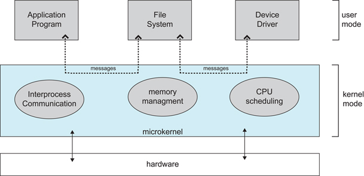

# 1.硬件
## 1.1 程序的基本执行过程是怎样的
第一步，CPU 读取「程序计数器」的值，这个值是指令的内存地址，然后 CPU 的「控制单元」操作「地址总线」指定需要访问的内存地址，接着通知内存设备准备数据，数据准备好后通过「数据总线」将指令数据传给 CPU，CPU 收到内存传来的数据后，将这个指令数据存入到「指令寄存器」。

第二步，「程序计数器」的值自增，表示指向下一条指令。这个自增的大小，由 CPU 的位宽决定，比如 32 位的 CPU，指令是 4 个字节，需要 4 个内存地址存放，因此「程序计数器」的值会自增 4；

第三步，CPU 分析「指令寄存器」中的指令，确定指令的类型和参数，如果是计算类型的指令，就把指令交给「逻辑运算单元」运算；如果是存储类型的指令，则交由「控制单元」执行；

简单总结一下就是，一个程序执行的时候，CPU 会根据程序计数器里的内存地址，从内存里面把需要执行的指令读取到指令寄存器里面执行，然后根据指令长度自增，开始顺序读取下一条指令。

CPU 从程序计数器读取指令、到执行、再到下一条指令，这个过程会不断循环，直到程序执行结束，这个不断循环的过程被称为 CPU 的指令周期

## 1.2 64 位相比 32 位 CPU 的优势在哪吗？64 位 CPU 的计算性能一定比 32 位 CPU 高很多吗？
64 位 CPU 可以一次计算超过 32 位的数字，而 32 位 CPU 如果要计算超过 32 位的数字，要分多步骤进行计算，效率就没那么高，但是大部分应用程序很少会计算那么大的数字，所以只有运算大数字的时候，64 位 CPU 的优势才能体现出来，否则和 32 位 CPU 的计算性能相差不大。
通常来说 64 位 CPU 的地址总线是 48 位，而 32 位 CPU 的地址总线是 32 位，所以 64 位 CPU 可以寻址更大的物理内存空间。如果一个 32 位 CPU 的地址总线是 32 位，那么该 CPU 最大寻址能力是 4G，即使你加了 8G 大小的物理内存，也还是只能寻址到 4G 大小的地址，而如果一个 64 位 CPU 的地址总线是 48 位，那么该 CPU 最大寻址能力是 2^48，远超于 32 位 CPU 最大寻址能力。

## 1.3 你知道软件的 32 位和 64 位之间的区别吗？再来 32 位的操作系统可以运行在 64 位的电脑上吗？64 位的操作系统可以运行在 32 位的电脑上吗？如果不行，原因是什么？
64 位和 32 位软件，实际上代表指令是 64 位还是 32 位的：

如果 32 位指令在 64 位机器上执行，需要一套兼容机制，就可以做到兼容运行了。但是如果 64 位指令在 32 位机器上执行，就比较困难了，因为 32 位的寄存器存不下 64 位的指令；
操作系统其实也是一种程序，我们也会看到操作系统会分成 32 位操作系统、64 位操作系统，其代表意义就是操作系统中程序的指令是多少位，比如 64 位操作系统，指令也就是 64 位，因此不能装在 32 位机器上。

总之，硬件的 64 位和 32 位指的是 CPU 的位宽，软件的 64 位和 32 位指的是指令的位宽。

## 1.4 如何写出让CPU 跑得更快的程序
存储器的层次结构：寄存器、CPU Cache，到内存、硬盘

L1 Cache 通常会分为「数据缓存」和「指令缓存」，这意味着数据和指令在 L1 Cache 这一层是分开缓存的，上图中的 index0 也就是数据缓存，而 index1 则是指令缓存，它两的大小通常是一样的。

另外，你也会注意到，L3 Cache 比 L1 Cache 和 L2 Cache 大很多，这是因为 L1 Cache 和 L2 Cache 都是每个 CPU 核心独有的，而 L3 Cache 是多个 CPU 核心共享的。

程序执行时，会先将内存中的数据加载到共享的 L3 Cache 中，再加载到每个核心独有的 L2 Cache，最后进入到最快的 L1 Cache，之后才会被 CPU 读取。

我们知道 CPU 访问内存的速度，比访问 CPU Cache 的速度慢了 100 多倍，所以如果 CPU 所要操作的数据在 CPU Cache 中的话，这样将会带来很大的性能提升。访问的数据在 CPU Cache 中的话，意味着缓存命中，缓存命中率越高的话，代码的性能就会越好，CPU 也就跑的越快。

于是，「如何写出让 CPU 跑得更快的代码？」这个问题，可以改成「如何写出 CPU 缓存命中率高的代码？」。

在前面我也提到， L1 Cache 通常分为「数据缓存」和「指令缓存」，这是因为 CPU 会分别处理数据和指令，比如 1+1=2 这个运算，+ 就是指令，会被放在「指令缓存」中，而输入数字 1 则会被放在「数据缓存」里。

因此，我们要分开来看「数据缓存」和「指令缓存」的缓存命中率。

要想写出让 CPU 跑得更快的代码，就需要写出缓存命中率高的代码，CPU L1 Cache 分为数据缓存和指令缓存，因而需要分别提高它们的缓存命中率：

对于数据缓存，我们在遍历数据的时候，应该按照内存布局的顺序操作，这是因为 CPU Cache 是根据 CPU Cache Line 批量操作数据的，所以顺序地操作连续内存数据时，性能能得到有效的提升；

对于指令缓存，有规律的条件分支语句能够让 CPU 的分支预测器发挥作用，进一步提高执行的效率；

另外，对于多核 CPU 系统，线程可能在不同 CPU 核心来回切换，这样各个核心的缓存命中率就会受到影响，于是要想提高线程的缓存命中率，可以考虑把线程绑定 CPU 到某一个 CPU 核心

## 1.5 缓存一致性
### 1.5.1 CPU Cache 的写入
CPU Cache 通常分为三级缓存：L1 Cache、L2 Cache、L3 Cache，级别越低的离 CPU 核心越近，访问速度也快，但是存储容量相对就会越小。其中，在多核心的 CPU 里，每个核心都有各自的 L1/L2 Cache，而 L3 Cache 是所有核心共享使用的。


# 2.概述

## 2.1基本特征

### 2.1.1 并发

并发是指宏观上在一段时间内能同时运行多个程序，而并行则指同一时刻能运行多个指令。

并行需要硬件支持，如多流水线、多核处理器或者分布式计算系统。

操作系统通过引入进程和线程，使得程序能够并发运行。

### 2.1.2 共享

共享是指系统中的资源可以被多个并发进程共同使用。

有两种共享方式：互斥共享和同时共享。

互斥共享的资源称为临界资源，例如打印机等，在同一时间只允许一个进程访问，需要用同步机制来实现对临界资源的访问。

### 2.1.3 虚拟

虚拟技术把一个物理实体转换为多个逻辑实体。

主要有两种虚拟技术：时分复用技术和空分复用技术。

多个进程能在同一个处理器上并发执行使用了时分复用技术，让每个进程轮流占有处理器，每次只执行一小个时间片并快速切换。

虚拟内存使用了空分复用技术，它将物理内存抽象为地址空间，每个进程都有各自的地址空间。地址空间的页被映射到物理内存，地址空间的页并不需要全部在物理内存中，当使用到一个没有在物理内存的页时，执行页面置换算法，将该页置换到内存中。

### 2.1.4 异步

异步指进程不是一次性执行完毕，而是走走停停，以不可知的速度向前推进。

## 2.2 基本功能

### 2.2.1 进程管理

进程控制、进程同步、进程通信、死锁处理、处理机调度等。

### 2.2.2 内存管理

内存分配、地址映射、内存保护与共享、虚拟内存等。

### 2.2.3 文件管理

文件存储空间的管理、目录管理、文件读写管理和保护等。

### 2.2.4 设备管理

完成用户的 I/O 请求，方便用户使用各种设备，并提高设备的利用率。

主要包括缓冲管理、设备分配、设备处理、虛拟设备等。

## 2.3 系统调用

如果一个进程在用户态需要使用内核态的功能，就进行系统调用从而陷入内核，由操作系统代为完成。

Linux 的系统调用主要有以下这些：

| Task | Commands |
| :---: | --- |
| 进程控制 | fork(); exit(); wait(); |
| 进程通信 | pipe(); shmget(); mmap(); |
| 文件操作 | open(); read(); write(); |
| 设备操作 | ioctl(); read(); write(); |
| 信息维护 | getpid(); alarm(); sleep(); |
| 安全 | chmod(); umask(); chown(); |

## 2.4 大内核和微内核

### 2.4.1 大内核

大内核是将操作系统功能作为一个紧密结合的整体放到内核。

由于各模块共享信息，因此有很高的性能。

### 2.4.2 微内核

由于操作系统不断复杂，因此将一部分操作系统功能移出内核，从而降低内核的复杂性。移出的部分根据分层的原则划分成若干服务，相互独立。

在微内核结构下，操作系统被划分成小的、定义良好的模块，只有微内核这一个模块运行在内核态，其余模块运行在用户态。

因为需要频繁地在用户态和核心态之间进行切换，所以会有一定的性能损失。

<div align="center">  </div><br>

## 2.5 中断分类

### 2.5.1 外中断

由 CPU 执行指令以外的事件引起，如 I/O 完成中断，表示设备输入/输出处理已经完成，处理器能够发送下一个输入/输出请求。此外还有时钟中断、控制台中断等。

### 2.5.2 异常

由 CPU 执行指令的内部事件引起，如非法操作码、地址越界、算术溢出等。

### 2.5.3 陷入

在用户程序中使用系统调用。

# 3.进程管理
## 3.1 什么是进程
我们编写的代码是存放在磁盘上的静态文件，通过编译后就可以生成可执行的二进制文件，当我们去运行这个可执行的二进制文件的时候，他会被装载到内存中，接着CPU 会执行程序中的指令，
这个运行中的程序就是一个进程。进程是资源分配的基本单位，它拥有独立的内存空间，在操作系统中，通过PCB 来描述进程，PCB 包含了进程分配的资源、CPU中各个寄存器中的值、进程状
态、进程优先级等信息。PCB 之间通常是通过链表的方式进行组织，把具有相同状态的进程链在一起，组成各种队列。各个进程之间是共享 CPU 资源的，在不同的时候进程之间需要切换，让
不同的进程可以在 CPU 执行，那么这个一个进程切换到另一个进程运行，称为进程的上下文切换。进程的上下文切换不仅包含了虚拟内存、栈、全局变量等用户空间的资源，还包括了内核堆栈、
寄存器等内核空间的资源。

## 3.2 什么是线程
进程拥有太多的资源，进程的创建、切换、销毁，都会占用很长的时间，CPU 虽然利用起来了，但如果进程过多，CPU 有很大的一部分都被用来进行进程调度了。为了提高CPU 的利用率，所以
就有了线程。线程是进程里的一条执行流程，它是操作系统调度的基本单位。同一个进程内多个线程之间可以共享代码段、数据段、打开的文件等资源，但每个线程各自都有一套独立的寄存器和栈，
这样可以确保线程的控制流是相对独立的。

## 3.3 什么是协程
对于 Linux 操作系统来讲，cpu 对进程的态度和线程的态度是一样的。操作系统调度切换的是进程或线程，但实际上多线程开发设计会变得更加复杂，要考虑很多同步竞争等问题，如锁、竞争
冲突等。并且为每个任务都创建一个线程是不现实的，因为会消耗大量的内存 (进程虚拟内存会占用 4GB [32 位操作系统], 而线程也要大约 4MB)。所以为了降低多线程编程的难度、减少内存占用，以及进一步压榨CPU性能，就出现了协程。协程也被称作轻量级的用户态线程，协程间的调度切换在用户态进行切换，无需陷入内核态，能够有效地利用CPU，并且协程跟线程是有区别的，线程由 CPU 调度是抢占式的，协程由用户态调度是协作式的，一个协程让出 CPU 后，才执行下一个协程。 goroutine 就是协程的一种实现，它是指运行在一组线程之上一组可复用的函数，它的调度通过
go 语言自己的GMP模型进行调度。

## 3.4 进程间的通信方式
每个进程的用户地址空间都是独立的，一般而言是不能互相访问的，但内核空间是每个进程都共享的，所以进程之间要通信必须通过内核。
Linux 提供的进程间通信方式主要有几种：管道、消息队列、共享内存、信号量、信号、socket

### 3.4.1 管道
管道的话主要有两种，一种是匿名管道，另外一种是命名管道。

- 匿名管道

我们使用的 linux 命令中 ```|``` （竖线）就是匿名管道，它底层是调用pipe 命令创建的，这个函数会返回两个文件描述符，一个是读描述符，一个是写描述符，不过这个匿名管道是特殊的文件，只存在于内存，不存于文件系统中。所谓的管道，就是内核里面的一串缓存。从管道的一段写入的数据，实际上是缓存在内核中的，另一端读取，也就是从内核中读取这段数据。另外，管道传输的数据是无格式的流且大小受限。

看到这，你可能会有疑问了，这两个描述符都是在一个进程里面，并没有起到进程间通信的作用，怎么样才能使得管道是跨过两个进程的呢？

我们可以使用 fork 创建子进程，创建的子进程会复制父进程的文件描述符，这样就做到了两个进程各有两个「 fd[0] 与 fd[1]」，两个进程就可以通过各自的 fd 写入和读取同一个管道文件实现跨进程通信了。

所以匿名管道只能在具有父子关系之间的进程通信，因为管道没有实体，也就是没有管道文件，只能通过 fork 来复制父进程 fd 文件描述符，来达到通信的目的。

（shell 中， A|B， 是以shell 为父进程，创建了两个子进程并进行通信的）


- 命名管道

使用 ```mkfifo xxx``` 创建命名管道， 它是以文件形式存在的，这个文件的类型是 p，对于命名管道，它可以在不相关的进程间也能相互通信。因为命令管道，提前创建了一个类型为管道的设备文件，在进程里只要使用这个设备文件，就可以相互通信。


管道这种通信方式效率低，不适合进程间频繁地交换数据。当然，它的好处，自然就是简单，同时也我们很容易得知管道里的数据已经被另一个进程读取了。
不管是匿名管道还是命名管道，进程写入的数据都是缓存在内核中，另一个进程读取数据时候自然也是从内核中获取，同时通信数据都遵循先进先出原则。

### 3.4.2 消息队列
管道的通信方式是效率低的，因此管道不适合进程间频繁地交换数据。

对于这个问题，消息队列的通信模式就可以解决。比如，A 进程要给 B 进程发送消息，A 进程把数据放在对应的消息队列后就可以正常返回了，B 进程需要的时候再去读取数据就可以了。同理，B 进程要给 A 进程发送消息也是如此。
消息队列是保存在内核中的消息链表，在发送数据时，会分成一个一个独立的数据单元，也就是消息体（数据块），消息体是用户自定义的数据类型，消息的发送方和接收方要约定好消息体的数据类型，所以每个消息体都是固定大小的存储块，不像管道是无格式的字节流数据。如果进程从消息队列中读取了消息体，内核就会把这个消息体删除。

消息队列生命周期随内核，如果没有释放消息队列或者没有关闭操作系统，消息队列会一直存在，而前面提到的匿名管道的生命周期，是随进程的创建而建立，随进程的结束而销毁。

**缺点**

**消息队列不适合比较大数据的传输**，因为在内核中每个消息体都有一个最大长度的限制，同时所有队列所包含的全部消息体的总长度也是有上限。在 Linux 内核中，会有两个宏定义 MSGMAX 和 MSGMNB，它们以字节为单位，分别定义了一条消息的最大长度和一个队列的最大长度。

**消息队列通信过程中，存在用户态与内核态之间的数据拷贝开销**，因为进程写入数据到内核中的消息队列时，会发生从用户态拷贝数据到内核态的过程，同理另一进程读取内核中的消息数据时，会发生从内核态拷贝数据到用户态的过程。

### 3.4.3 共享内存
消息队列的读取和写入的过程，都会有发生用户态与内核态之间的消息拷贝过程。那共享内存的方式，就很好的解决了这一问题。

现代操作系统，对于内存管理，采用的是虚拟内存技术，也就是每个进程都有自己独立的虚拟内存空间，不同进程的虚拟内存映射到不同的物理内存中。所以，即使进程 A 和 进程 B 的虚拟地址是一样的，其实访问的是不同的物理内存地址，对于数据的增删查改互不影响。

共享内存的机制，就是拿出一块虚拟地址空间来，映射到相同的物理内存中。这样这个进程写入的东西，另外一个进程马上就能看到了，都不需要拷贝来拷贝去，传来传去，大大提高了进程间通信的速度。

### 3.4.4 信号量
用了共享内存通信方式，带来新的问题，那就是如果多个进程同时修改同一个共享内存，很有可能就冲突了。例如两个进程都同时写一个地址，那先写的那个进程会发现内容被别人覆盖了。

为了防止多进程竞争共享资源，而造成的数据错乱，所以需要保护机制，使得共享的资源，在任意时刻只能被一个进程访问。正好，信号量就实现了这一保护机制。

信号量其实是一个整型的计数器，主要用于实现进程间的互斥与同步，而不是用于缓存进程间通信的数据。

### 3.4.5 信号
在 Linux 操作系统中， 为了响应各种各样的事件，提供了几十种信号，分别代表不同的意义。我们可以通过 kill -l 命令，查看所有的信号

信号是进程间通信机制中唯一的异步通信机制，因为可以在任何时候发送信号给某一进程，一旦有信号产生，我们就有下面这几种，用户进程对信号的处理方式。

信号事件的来源主要有硬件来源（如键盘 Cltr+C ）和软件来源（如 kill 命令）。

### 3.4.6 Socket
前面提到的管道、消息队列、共享内存、信号量和信号都是在同一台主机上进行进程间通信，那要想跨网络与不同主机上的进程之间通信，就需要 Socket 通信了。

实际上，Socket 通信不仅可以跨网络与不同主机的进程间通信，还可以在同主机上进程间通信。

创建 socket 的系统调用：```int socket(int domain, int type, int protocal)```

三个参数分别代表：

domain 参数用来指定协议族，比如 AF_INET 用于 IPV4、AF_INET6 用于 IPV6、AF_LOCAL/AF_UNIX 用于本机；

type 参数用来指定通信特性，比如 SOCK_STREAM 表示的是字节流，对应 TCP、SOCK_DGRAM 表示的是数据报，对应 UDP、SOCK_RAW 表示的是原始套接字；

protocal 参数原本是用来指定通信协议的，但现在基本废弃。因为协议已经通过前面两个参数指定完成，protocol 目前一般写成 0 即可；

根据创建 socket 类型的不同，通信的方式也就不同：

实现 TCP 字节流通信： socket 类型是 AF_INET 和 SOCK_STREAM；

实现 UDP 数据报通信：socket 类型是 AF_INET 和 SOCK_DGRAM；

实现本地进程间通信： 「本地字节流 socket 」类型是 AF_LOCAL 和 SOCK_STREAM，「本地数据报 socket 」类型是 AF_LOCAL 和 SOCK_DGRAM。另外，AF_UNIX 和 AF_LOCAL 是等价的，所以 AF_UNIX 也属于本地 socket；

针对tcp 协议的socket 编程：

- 服务端和客户端初始化 socket，得到文件描述符；
- 服务端调用 bind，将绑定在 IP 地址和端口;
- 服务端调用 listen，进行监听；
- 服务端调用 accept，等待客户端连接；
- 客户端调用 connect，向服务器端的地址和端口发起连接请求；
- 服务端 accept 返回用于传输的 socket 的文件描述符；
- 客户端调用 write 写入数据；服务端调用 read 读取数据；
- 客户端断开连接时，会调用 close，那么服务端 read 读取数据的时候，就会读取到了 EOF，待处理完数据后，服务端调用 close，表示连接关闭。

这里需要注意的是，服务端调用 accept 时，连接成功了会返回一个已完成连接的 socket，后续用来传输数据。

所以，监听的 socket 和真正用来传送数据的 socket，是「两个」 socket，一个叫作监听 socket，一个叫作已完成连接 socket。

成功连接建立之后，双方开始通过 read 和 write 函数来读写数据，就像往一个文件流里面写东西一样。


## 3.5 进程线程协程区别

### 3.5.1 线程与进程的比较

- 进程是资源（包括内存、打开的文件等）分配的单位，线程是 CPU 调度的单位；
- 进程拥有一个完整的资源平台，而线程只独享必不可少的资源，如寄存器和栈；
- 线程同样具有就绪、阻塞、执行三种基本状态，同样具有状态之间的转换关系；
- 线程能减少并发执行的时间和空间开销；

对于，线程相比进程能减少开销，体现在：

- 线程的创建时间比进程快，因为进程在创建的过程中，还需要资源管理信息，比如内存管理信息、文件管理信息，而线程在创建的过程中，不会涉及这些资源管理信息，而是共享它们；
- 线程的终止时间比进程快，因为线程释放的资源相比进程少很多；
- 同一个进程内的线程切换比进程切换快，因为线程具有相同的地址空间（虚拟内存共享），这意味着同一个进程的线程都具有同一个页表，那么在切换的时候不需要切换页表。而对于进程之间的切换，切换的时候要把页表给切换掉，而页表的切换过程开销是比较大的；
- 由于同一进程的各线程间共享内存和文件资源，那么在线程之间数据传递的时候，就不需要经过内核了，这就使得线程之间的数据交互效率更高了；

所以，线程比进程不管是时间效率，还是空间效率都要高。

### 3.5.2 进程线程以及协程
进程、线程和协程是操作系统和编程语言中用于并发和并行执行任务的三种基本概念。它们之间的主要区别在于资源分配、调度和执行方式。

1. 进程：进程是操作系统分配资源（如内存、文件描述符等）和调度执行的基本单位。每个进程都有自己独立的地址空间和资源，进程之间的通信需要通过进程间通信（IPC）机制，如管道、消息队列、共享内存等。进程的创建和销毁开销较大，因为操作系统需要为每个进程分配和回收资源。

2. 线程：线程是进程内的一个执行单元，也是CPU调度和分派的基本单位。一个进程可以包含多个线程，这些线程共享进程的地址空间和资源。因此，线程之间的通信相对简单，可以直接通过共享内存进行。相比进程，线程的创建和销毁开销较小，但仍然需要操作系统进行调度和管理。

3. 协程：协程（Coroutine）是一种用户级别的轻量级线程，也称为微线程。协程的调度和管理完全由程序自身控制，而不依赖于操作系统。协程之间可以通过简单的函数调用和返回进行切换，而无需操作系统的干预。协程的创建和销毁开销非常小，因为它们不需要单独的内存空间和系统资源。

协程之所以更加轻量，主要有以下原因：

1. 调度开销小：协程的调度和切换完全由程序自身控制，不需要操作系统的干预。这使得协程的上下文切换开销远小于进程和线程。

2. 内存占用少：协程不需要单独的内存空间和系统资源，因此它们的内存占用通常比线程和进程更小。

3. 通信简单：协程之间可以通过简单的函数调用和返回进行切换和通信，而无需复杂的进程间通信（IPC）机制。

4. 易于编程：协程可以使用简单的编程模型实现复杂的并发任务，如异步I/O、事件驱动等。这使得协程在编写高性能、高并发的网络应用程序时具有很大的优势。

需要注意的是，协程并不适用于所有场景。在需要充分利用多核CPU并行计算能力的场景下，线程和进程可能是更好的选择。然而，在I/O密集型任务和高并发场景下，协程可以提供更高的性能和更简洁的编程模型。

## 3.6 同一进程间的线程究竟共享哪些资源呢，而又各自独享哪些资源呢？

共享的资源有

a. 堆  由于堆是在进程空间中开辟出来的，所以它是理所当然地被共享的；因此new出来的都是共享的（16位平台上分全局堆和局部堆，局部堆是独享的）

b. 全局变量 它是与具体某一函数无关的，所以也与特定线程无关；因此也是共享的

c. 静态变量 虽然对于局部变量来说，它在代码中是“放”在某一函数中的，但是其存放位置和全局变量一样，存于堆中开辟的.bss和.data段，是共享的

d. 文件等公用资源  这个是共享的，使用这些公共资源的线程必须同步。Win32 提供了几种同步资源的方式，包括信号、临界区、事件和互斥体。

独享的资源有

a. 栈 栈是独享的

b. 寄存器  这个可能会误解，因为电脑的寄存器是物理的，每个线程去取值难道不一样吗？其实线程里存放的是副本，包括程序计数器PC

线程共享的环境包括：进程代码段、进程的公有数据(利用这些共享的数据，线程很容易的实现相互之间的通讯)、进程打开的文件描述符、信号的处理器、进程的当前目录和进程用户ID与进程组ID。

进程拥有这许多共性的同时，还拥有自己的个性。有了这些个性，线程才能实现并发性。这些个性包括： 
  
1.线程ID
   
每个线程都有自己的线程ID，这个ID在本进程中是唯一的。进程用此来标识线程。

2.寄存器组的值
   
由于线程间是并发运行的，每个线程有自己不同的运行线索，当从一个线程切换到另一个线程上 时，必须将原有的线程的寄存器集合的状态保存，以便将来该线程在被重新切换到时能得以恢复。

3.程的堆栈
   
堆栈是保证线程独立运行所必须的。 线程函数可以调用函数，而被调用函数中又是可以层层嵌套的，所以线程 必须拥有自己的函数堆栈， 使得函数调用可以正常执行，不受其他线程的影响。

4.错误返回码

由于同一个进程中有很多个线程在同时运行，可能某个线程进行系统调用后设置了errno值，而在该 线程还没有处理这个错误，另外一个线程就在此时 被调度器投入运行，这样错误值就有可能被修改所以，不同的线程应该拥有自己的错误返回码变量。
  
5.线程的信号屏蔽码
   由于每个线程所感兴趣的信号不同，所以线程的信号屏蔽码应该由线程自己管理。但所有的线程都 共享同样的信号处理器。

6.线程的优先级
   由于线程需要像进程那样能够被调度，那么就必须要有可供调度使用的参数，这个参数就是线程的 优先级。

## 3.7 线程切换的内核发生什么？

Linux下的线程实质上是轻量级进程(light weighted process),线程生成时会生成对应的进程控制结构，只是该结构与父线程的进程控制结构共享了同一个进程内存空间。 同时新线程的进程控制结构将从父线程（进程）处复制得到同样的进程信息，如打开文件列表和信号阻塞掩码等。创建线程比创建新进程成本低，因为新创建的线程使用的是当前进程的地址空间。相对于在进程之间切换，在线程之间进行切换所需的时间更少，因为后者不包括地址空间之间的切换。

线程切换上下文切换的原理与此类似，只是线程在同一地址空间中，不需要MMU等切换，只需要切换必要的CPU寄存器，因此，线程切换比进程切换快的多。


## 2. 孤儿进程

一个父进程退出，而它的一个或多个子进程还在运行，那么这些子进程将成为孤儿进程。

孤儿进程将被 init 进程（进程号为 1）所收养，并由 init 进程对它们完成状态收集工作。

由于孤儿进程会被 init 进程收养，所以孤儿进程不会对系统造成危害。

## 3. 僵尸进程

一个子进程的进程描述符在子进程退出时不会释放，只有当父进程通过 wait() 或 waitpid() 获取了子进程信息后才会释放。如果子进程退出，而父进程并没有调用 wait() 或 waitpid()，那么子进程的进程描述符仍然保存在系统中，这种进程称之为僵尸进程。

僵尸进程通过 ps 命令显示出来的状态为 Z（zombie）。

系统所能使用的进程号是有限的，如果产生大量僵尸进程，将因为没有可用的进程号而导致系统不能产生新的进程。

要消灭系统中大量的僵尸进程，只需要将其父进程杀死，此时僵尸进程就会变成孤儿进程，从而被 init 所收养，这样 init 就会释放所有的僵尸进程所占有的资源，从而结束僵尸进程。

### fork系统调用

使用fork函数得到的子进程从父进程的继承了整个进程的地址空间，包括：**进程上下文、进程堆栈、内存信息、打开的文件描述符、信号控制设置、进程优先级、进程组号、当前工作目录、根目录、资源限制、控制终端等。**

子进程与父进程的区别在于：

1、父进程设置的锁，子进程不继承（因为如果是排它锁，被继承的话，矛盾了）

2、各自的进程ID和父进程ID不同

3、子进程的未决告警被清除；

4、子进程的未决信号集设置为空集。
函数原型

pid_t fork(void);  //一次调用两次返回值，是在各自的地址空间返回，意味着现在有两个基本一样的进程在执行

参数：无参数。

返回值:

如果成功创建一个子进程，对于父进程来说返回子进程ID
如果成功创建一个子进程，对于子进程来说返回值为0
如果为-1表示创建失败
父进程调用fork（）系统调用，然后陷入内核，进行进程复制，如果成功：

1，则对调用进程即父进程来说返回值为刚产生的子进程pid，因为进程PCB没有子进程信息，父进程只能通过这样获得。

2，对子进程（刚产生的新进程），则返回0，

这时就有两个进程在接着向下执行

如果失败，则返回0，调用进程继续向下执行

注：fork英文意思：分支，fork系统调用复制产生的子进程与父进程（调用进程）基本一样：代码段+数据段+堆栈段+PCB，当前的运行环境基本一样，所以子进程在fork之后开始向下执行，而不会从头开始执行。

**写时复制**
linux系统为了提高系统性能和资源利用率，在fork出一个新进程时，系统并没有真正复制一个副本。

如果多个进程要读取它们自己的那部分资源的副本，那么复制是不必要的。

每个进程只要保存一个指向这个资源的指针就可以了。

如果一个进程要修改自己的那份资源的“副本”，那么就会复制那份资源。这就是写时复制的含义


## 4. 进程状态的切换

<div align="center">  </div><br>

- 就绪状态（ready）：等待被调度
- 运行状态（running）
- 阻塞状态（waiting）：等待资源

应该注意以下内容：

- 只有就绪态和运行态可以相互转换，其它的都是单向转换。就绪状态的进程通过调度算法从而获得 CPU 时间，转为运行状态；而运行状态的进程，在分配给它的 CPU 时间片用完之后就会转为就绪状态，等待下一次调度。
- 阻塞状态是缺少需要的资源从而由运行状态转换而来，但是该资源不包括 CPU 时间，缺少 CPU 时间会从运行态转换为就绪态。


## 5. 进程上下文切换

各个进程之间是共享 CPU 资源的，在不同的时候进程之间需要切换，让不同的进程可以在 CPU 执行，那么这个**一个进程切换到另一个进程运行，称为进程的上下文切换**。

### 5.1 CPU的上下文切换

大多数操作系统都是多任务，通常支持大于 CPU 数量的任务同时运行。实际上，这些任务并不是同时运行的，只是因为系统在很短的时间内，让各个任务分别在 CPU 运行，于是就造成同时运行的错觉。

任务是交给 CPU 运行的，那么在每个任务运行前，CPU 需要知道任务从哪里加载，又从哪里开始运行。

所以，操作系统需要事先帮 CPU 设置好 **CPU 寄存器和程序计数器**。

CPU 寄存器是 CPU 内部一个容量小，但是速度极快的内存（缓存）。我举个例子，寄存器像是你的口袋，内存像你的书包，硬盘则是你家里的柜子，如果你的东西存放到口袋，那肯定是比你从书包或家里柜子取出来要快的多。

再来，程序计数器则是用来存储 CPU 正在执行的指令位置、或者即将执行的下一条指令位置。

所以说，CPU 寄存器和程序计数是 CPU 在运行任何任务前，所必须依赖的环境，这些环境就叫做 **CPU 上下文**。

既然知道了什么是 CPU 上下文，那理解 CPU 上下文切换就不难了。

CPU 上下文切换就是先把前一个任务的 CPU 上下文（CPU 寄存器和程序计数器）保存起来，然后加载新任务的上下文到这些寄存器和程序计数器，最后再跳转到程序计数器所指的新位置，运行新任务。

系统内核会存储保持下来的上下文信息，当此任务再次被分配给 CPU 运行时，CPU 会重新加载这些上下文，这样就能保证任务原来的状态不受影响，让任务看起来还是连续运行。

上面说到所谓的「任务」，主要包含进程、线程和中断。所以，可以根据任务的不同，把 CPU 上下文切换分成：**进程上下文切换、线程上下文切换和中断上下文切换**。

### 5.2 进程的上下文切换

进程是由内核管理和调度的，所以进程的切换只能发生在内核态。

所以，**进程的上下文切换不仅包含了虚拟内存、栈、全局变量等用户空间的资源，还包括了内核堆栈、寄存器等内核空间的资源。**

通常，会把交换的信息保存在进程的 PCB，当要运行另外一个进程的时候，我们需要从这个进程的 PCB 取出上下文，然后恢复到 CPU 中，这使得这个进程可以继续执行。

### 5.3 进程切换的场景

- 为了保证所有进程可以得到公平调度，CPU 时间被划分为一段段的时间片，这些时间片再被轮流分配给各个进程。这样，当某个进程的时间片耗尽了，就会被系统挂起，切换到其它正在等待 CPU 的进程运行；
- 进程在系统资源不足（比如内存不足）时，要等到资源满足后才可以运行，这个时候进程也会被挂起，并由系统调度其他进程运行；
- 当进程通过睡眠函数 sleep 这样的方法将自己主动挂起时，自然也会重新调度；
- 当有优先级更高的进程运行时，为了保证高优先级进程的运行，当前进程会被挂起，由高优先级进程来运行；
- 发生硬件中断时，CPU 上的进程会被中断挂起，转而执行内核中的中断服务程序；

以上，就是发生进程上下文切换的常见场景了。


## 6. 进程调度算法

不同环境的调度算法目标不同，因此需要针对不同环境来讨论调度算法。

### 1. 批处理系统

批处理系统没有太多的用户操作，在该系统中，调度算法目标是保证吞吐量和周转时间（从提交到终止的时间）。

**1.1 先来先服务 first-come first-serverd（FCFS）** 

按照请求的顺序进行调度。

有利于长作业，但不利于短作业，因为短作业必须一直等待前面的长作业执行完毕才能执行，而长作业又需要执行很长时间，造成了短作业等待时间过长。

**1.2 短作业优先 shortest job first（SJF）** 

按估计运行时间最短的顺序进行调度。

长作业有可能会饿死，处于一直等待短作业执行完毕的状态。因为如果一直有短作业到来，那么长作业永远得不到调度。

**1.3 最短剩余时间优先 shortest remaining time next（SRTN）** 

按估计剩余时间最短的顺序进行调度。

### 2. 交互式系统

交互式系统有大量的用户交互操作，在该系统中调度算法的目标是快速地进行响应。

**2.1 时间片轮转** 

将所有就绪进程按 FCFS 的原则排成一个队列，每次调度时，把 CPU 时间分配给队首进程，该进程可以执行一个时间片。当时间片用完时，由计时器发出时钟中断，调度程序便停止该进程的执行，并将它送往就绪队列的末尾，同时继续把 CPU 时间分配给队首的进程。

时间片轮转算法的效率和时间片的大小有很大关系：

- 因为进程切换都要保存进程的信息并且载入新进程的信息，如果时间片太小，会导致进程切换得太频繁，在进程切换上就会花过多时间。
- 而如果时间片过长，那么实时性就不能得到保证。

<div align="center">  </div><br>

**2.2 优先级调度** 

为每个进程分配一个优先级，按优先级进行调度。

为了防止低优先级的进程永远等不到调度，可以随着时间的推移增加等待进程的优先级。

**2.3 多级反馈队列** 

一个进程需要执行 100 个时间片，如果采用时间片轮转调度算法，那么需要交换 100 次。

多级队列是为这种需要连续执行多个时间片的进程考虑，它设置了多个队列，每个队列时间片大小都不同，例如 1,2,4,8,..。进程在第一个队列没执行完，就会被移到下一个队列。这种方式下，之前的进程只需要交换 7 次。

每个队列优先权也不同，最上面的优先权最高。因此只有上一个队列没有进程在排队，才能调度当前队列上的进程。

可以将这种调度算法看成是时间片轮转调度算法和优先级调度算法的结合。

<div align="center">  </div><br>

### 3. 实时系统

实时系统要求一个请求在一个确定时间内得到响应。

分为硬实时和软实时，前者必须满足绝对的截止时间，后者可以容忍一定的超时。


## 7. 进程同步

### 1. 临界区

对临界资源进行访问的那段代码称为临界区。

为了互斥访问临界资源，每个进程在进入临界区之前，需要先进行检查。

```html
// entry section
// critical section;
// exit section
```

### 2. 同步与互斥

- 同步：多个进程按一定顺序执行；
- 互斥：多个进程在同一时刻只有一个进程能进入临界区。

### 3. 信号量

信号量（Semaphore）是一个整型变量，可以对其执行 down 和 up 操作，也就是常见的 P 和 V 操作。

-  **down**  : 如果信号量大于 0 ，执行 -1 操作；如果信号量等于 0，进程睡眠，等待信号量大于 0；
-  **up** ：对信号量执行 +1 操作，唤醒睡眠的进程让其完成 down 操作。

down 和 up 操作需要被设计成原语，不可分割，通常的做法是在执行这些操作的时候屏蔽中断。

如果信号量的取值只能为 0 或者 1，那么就成为了  **互斥量（Mutex）** ，0 表示临界区已经加锁，1 表示临界区解锁。

```c
typedef int semaphore;
semaphore mutex = 1;
void P1() {
    down(&mutex);
    // 临界区
    up(&mutex);
}

void P2() {
    down(&mutex);
    // 临界区
    up(&mutex);
}
```

<font size=3>  **使用信号量实现生产者-消费者问题**  </font> </br>

问题描述：使用一个缓冲区来保存物品，只有缓冲区没有满，生产者才可以放入物品；只有缓冲区不为空，消费者才可以拿走物品。

因为缓冲区属于临界资源，因此需要使用一个互斥量 mutex 来控制对缓冲区的互斥访问。

为了同步生产者和消费者的行为，需要记录缓冲区中物品的数量。数量可以使用信号量来进行统计，这里需要使用两个信号量：empty 记录空缓冲区的数量，full 记录满缓冲区的数量。其中，empty 信号量是在生产者进程中使用，当 empty 不为 0 时，生产者才可以放入物品；full 信号量是在消费者进程中使用，当 full 信号量不为 0 时，消费者才可以取走物品。

注意，不能先对缓冲区进行加锁，再测试信号量。也就是说，不能先执行 down(mutex) 再执行 down(empty)。如果这么做了，那么可能会出现这种情况：生产者对缓冲区加锁后，执行 down(empty) 操作，发现 empty = 0，此时生产者睡眠。消费者不能进入临界区，因为生产者对缓冲区加锁了，消费者就无法执行 up(empty) 操作，empty 永远都为 0，导致生产者永远等待下，不会释放锁，消费者因此也会永远等待下去。

```c
#define N 100
typedef int semaphore;
semaphore mutex = 1;
semaphore empty = N;
semaphore full = 0;

void producer() {
    while(TRUE) {
        int item = produce_item();
        down(&empty);
        down(&mutex);
        insert_item(item);
        up(&mutex);
        up(&full);
    }
}

void consumer() {
    while(TRUE) {
        down(&full);
        down(&mutex);
        int item = remove_item();
        consume_item(item);
        up(&mutex);
        up(&empty);
    }
}
```

### 4. 管程

使用信号量机制实现的生产者消费者问题需要客户端代码做很多控制，而管程把控制的代码独立出来，不仅不容易出错，也使得客户端代码调用更容易。

c 语言不支持管程，下面的示例代码使用了类 Pascal 语言来描述管程。示例代码的管程提供了 insert() 和 remove() 方法，客户端代码通过调用这两个方法来解决生产者-消费者问题。

```pascal
monitor ProducerConsumer
    integer i;
    condition c;

    procedure insert();
    begin
        // ...
    end;

    procedure remove();
    begin
        // ...
    end;
end monitor;
```

管程有一个重要特性：在一个时刻只能有一个进程使用管程。进程在无法继续执行的时候不能一直占用管程，否者其它进程永远不能使用管程。

管程引入了  **条件变量**  以及相关的操作：**wait()** 和 **signal()** 来实现同步操作。对条件变量执行 wait() 操作会导致调用进程阻塞，把管程让出来给另一个进程持有。signal() 操作用于唤醒被阻塞的进程。

<font size=3> **使用管程实现生产者-消费者问题** </font><br>

```pascal
// 管程
monitor ProducerConsumer
    condition full, empty;
    integer count := 0;
    condition c;

    procedure insert(item: integer);
    begin
        if count = N then wait(full);
        insert_item(item);
        count := count + 1;
        if count = 1 then signal(empty);
    end;

    function remove: integer;
    begin
        if count = 0 then wait(empty);
        remove = remove_item;
        count := count - 1;
        if count = N -1 then signal(full);
    end;
end monitor;

// 生产者客户端
procedure producer
begin
    while true do
    begin
        item = produce_item;
        ProducerConsumer.insert(item);
    end
end;

// 消费者客户端
procedure consumer
begin
    while true do
    begin
        item = ProducerConsumer.remove;
        consume_item(item);
    end
end;
```

## 8. 经典同步问题

生产者和消费者问题前面已经讨论过了。

### 1. 读者-写者问题

允许多个进程同时对数据进行读操作，但是不允许读和写以及写和写操作同时发生。

一个整型变量 count 记录在对数据进行读操作的进程数量，一个互斥量 count_mutex 用于对 count 加锁，一个互斥量 data_mutex 用于对读写的数据加锁。

```c
typedef int semaphore;
semaphore count_mutex = 1;
semaphore data_mutex = 1;
int count = 0;

void reader() {
    while(TRUE) {
        down(&count_mutex);
        count++;
        if(count == 1) down(&data_mutex); // 第一个读者需要对数据进行加锁，防止写进程访问
        up(&count_mutex);
        read();
        down(&count_mutex);
        count--;
        if(count == 0) up(&data_mutex);
        up(&count_mutex);
    }
}

void writer() {
    while(TRUE) {
        down(&data_mutex);
        write();
        up(&data_mutex);
    }
}
```

以下内容由 [@Bandi Yugandhar](https://github.com/yugandharbandi) 提供。

The first case may result Writer to starve. This case favous Writers i.e no writer, once added to the queue, shall be kept waiting longer than absolutely necessary(only when there are readers that entered the queue before the writer).

```source-c
int readcount, writecount;                   //(initial value = 0)
semaphore rmutex, wmutex, readLock, resource; //(initial value = 1)

//READER
void reader() {
<ENTRY Section>
 down(&readLock);                 //  reader is trying to enter
 down(&rmutex);                  //   lock to increase readcount
  readcount++;                 
  if (readcount == 1)          
   down(&resource);              //if you are the first reader then lock  the resource
 up(&rmutex);                  //release  for other readers
 up(&readLock);                 //Done with trying to access the resource

<CRITICAL Section>
//reading is performed

<EXIT Section>
 down(&rmutex);                  //reserve exit section - avoids race condition with readers
 readcount--;                       //indicate you're leaving
  if (readcount == 0)          //checks if you are last reader leaving
   up(&resource);              //if last, you must release the locked resource
 up(&rmutex);                  //release exit section for other readers
}

//WRITER
void writer() {
  <ENTRY Section>
  down(&wmutex);                  //reserve entry section for writers - avoids race conditions
  writecount++;                //report yourself as a writer entering
  if (writecount == 1)         //checks if you're first writer
   down(&readLock);               //if you're first, then you must lock the readers out. Prevent them from trying to enter CS
  up(&wmutex);                  //release entry section

<CRITICAL Section>
 down(&resource);                //reserve the resource for yourself - prevents other writers from simultaneously editing the shared resource
  //writing is performed
 up(&resource);                //release file

<EXIT Section>
  down(&wmutex);                  //reserve exit section
  writecount--;                //indicate you're leaving
  if (writecount == 0)         //checks if you're the last writer
   up(&readLock);               //if you're last writer, you must unlock the readers. Allows them to try enter CS for reading
  up(&wmutex);                  //release exit section
}
```

We can observe that every reader is forced to acquire ReadLock. On the otherhand, writers doesn’t need to lock individually. Once the first writer locks the ReadLock, it will be released only when there is no writer left in the queue.

From the both cases we observed that either reader or writer has to starve. Below solutionadds the constraint that no thread shall be allowed to starve; that is, the operation of obtaining a lock on the shared data will always terminate in a bounded amount of time.

```source-c
int readCount;                  // init to 0; number of readers currently accessing resource

// all semaphores initialised to 1
Semaphore resourceAccess;       // controls access (read/write) to the resource
Semaphore readCountAccess;      // for syncing changes to shared variable readCount
Semaphore serviceQueue;         // FAIRNESS: preserves ordering of requests (signaling must be FIFO)

void writer()
{ 
    down(&serviceQueue);           // wait in line to be servicexs
    // <ENTER>
    down(&resourceAccess);         // request exclusive access to resource
    // </ENTER>
    up(&serviceQueue);           // let next in line be serviced

    // <WRITE>
    writeResource();            // writing is performed
    // </WRITE>

    // <EXIT>
    up(&resourceAccess);         // release resource access for next reader/writer
    // </EXIT>
}

void reader()
{ 
    down(&serviceQueue);           // wait in line to be serviced
    down(&readCountAccess);        // request exclusive access to readCount
    // <ENTER>
    if (readCount == 0)         // if there are no readers already reading:
        down(&resourceAccess);     // request resource access for readers (writers blocked)
    readCount++;                // update count of active readers
    // </ENTER>
    up(&serviceQueue);           // let next in line be serviced
    up(&readCountAccess);        // release access to readCount

    // <READ>
    readResource();             // reading is performed
    // </READ>

    down(&readCountAccess);        // request exclusive access to readCount
    // <EXIT>
    readCount--;                // update count of active readers
    if (readCount == 0)         // if there are no readers left:
        up(&resourceAccess);     // release resource access for all
    // </EXIT>
    up(&readCountAccess);        // release access to readCount
}

```


### 2. 哲学家进餐问题

<div align="center">  </div><br>

五个哲学家围着一张圆桌，每个哲学家面前放着食物。哲学家的生活有两种交替活动：吃饭以及思考。当一个哲学家吃饭时，需要先拿起自己左右两边的两根筷子，并且一次只能拿起一根筷子。

下面是一种错误的解法，考虑到如果所有哲学家同时拿起左手边的筷子，那么就无法拿起右手边的筷子，造成死锁。

```c
#define N 5

void philosopher(int i) {
    while(TRUE) {
        think();
        take(i);       // 拿起左边的筷子
        take((i+1)%N); // 拿起右边的筷子
        eat();
        put(i);
        put((i+1)%N);
    }
}
```

为了防止死锁的发生，可以设置两个条件：

- 必须同时拿起左右两根筷子；
- 只有在两个邻居都没有进餐的情况下才允许进餐。

```c
#define N 5
#define LEFT (i + N - 1) % N // 左邻居
#define RIGHT (i + 1) % N    // 右邻居
#define THINKING 0
#define HUNGRY   1
#define EATING   2
typedef int semaphore;
int state[N];                // 跟踪每个哲学家的状态
semaphore mutex = 1;         // 临界区的互斥
semaphore s[N];              // 每个哲学家一个信号量

void philosopher(int i) {
    while(TRUE) {
        think();
        take_two(i);
        eat();
        put_two(i);
    }
}

void take_two(int i) {
    down(&mutex);
    state[i] = HUNGRY;
    test(i);
    up(&mutex);
    down(&s[i]);
}

void put_two(i) {
    down(&mutex);
    state[i] = THINKING;
    test(LEFT);
    test(RIGHT);
    up(&mutex);
}

void test(i) {         // 尝试拿起两把筷子
    if(state[i] == HUNGRY && state[LEFT] != EATING && state[RIGHT] !=EATING) {
        state[i] = EATING;
        up(&s[i]);
    }
}
```

## 9. 进程通信

进程同步与进程通信很容易混淆，它们的区别在于：

- 进程同步：控制多个进程按一定顺序执行；
- 进程通信：进程间传输信息。

进程通信是一种手段，而进程同步是一种目的。也可以说，为了能够达到进程同步的目的，需要让进程进行通信，传输一些进程同步所需要的信息。


### 9.1 Linux下的进程通信

Linux 内核提供了不少进程间通信的方式，其中最简单的方式就是管道，管道分为「匿名管道」和「命名管道」。

- 匿名管道顾名思义，它没有名字标识，匿名管道是特殊文件只存在于内存，没有存在于文件系统中，shell 命令中的「|」竖线就是匿名管道，通信的数据是无格式的流并且大小受限，通信的方式是单向的，数据只能在一个方向上流动，如果要双向通信，需要创建两个管道，再来匿名管道是只能用于存在父子关系的进程间通信，匿名管道的生命周期随着进程创建而建立，随着进程终止而消失。

- 命名管道突破了匿名管道只能在亲缘关系进程间的通信限制，因为使用命名管道的前提，需要在文件系统创建一个类型为 p 的设备文件，那么毫无关系的进程就可以通过这个设备文件进行通信。另外，不管是匿名管道还是命名管道，进程写入的数据都是缓存在内核中，另一个进程读取数据时候自然也是从内核中获取，同时通信数据都遵循先进先出原则，不支持 lseek 之类的文件定位操作。

- 消息队列克服了管道通信的数据是无格式的字节流的问题，消息队列实际上是保存在内核的「消息链表」，消息队列的消息体是可以用户自定义的数据类型，发送数据时，会被分成一个一个独立的消息体，当然接收数据时，也要与发送方发送的消息体的数据类型保持一致，这样才能保证读取的数据是正确的。消息队列通信的速度不是最及时的，毕竟每次数据的写入和读取都需要经过用户态与内核态之间的拷贝过程。

- 共享内存可以解决消息队列通信中用户态与内核态之间数据拷贝过程带来的开销，它直接分配一个共享空间，每个进程都可以直接访问，就像访问进程自己的空间一样快捷方便，不需要陷入内核态或者系统调用，大大提高了通信的速度，享有最快的进程间通信方式之名。但是便捷高效的共享内存通信，带来新的问题，多进程竞争同个共享资源会造成数据的错乱。

- 那么，就需要信号量来保护共享资源，以确保任何时刻只能有一个进程访问共享资源，这种方式就是互斥访问。信号量不仅可以实现访问的互斥性，还可以实现进程间的同步，信号量其实是一个计数器，表示的是资源个数，其值可以通过两个原子操作来控制，分别是 P 操作和 V 操作。

- 与信号量名字很相似的叫信号，它俩名字虽然相似，但功能一点儿都不一样。信号是异步通信机制，信号可以在应用进程和内核之间直接交互，内核也可以利用信号来通知用户空间的进程发生了哪些系统事件，信号事件的来源主要有硬件来源（如键盘 Cltr+C ）和软件来源（如 kill 命令），一旦有信号发生，进程有三种方式响应信号 1. 执行默认操作、2. 捕捉信号、3. 忽略信号。有两个信号是应用进程无法捕捉和忽略的，即 SIGKILL 和 SIGSTOP，这是为了方便我们能在任何时候结束或停止某个进程。

- 前面说到的通信机制，都是工作于同一台主机，如果要与不同主机的进程间通信，那么就需要 Socket 通信了。Socket 实际上不仅用于不同的主机进程间通信，还可以用于本地主机进程间通信，可根据创建 Socket 的类型不同，分为三种常见的通信方式，一个是基于 TCP 协议的通信方式，一个是基于 UDP 协议的通信方式，一个是本地进程间通信方式。

### 9.2 Linux 下的线程通信方式
同个进程下的线程之间都是共享进程的资源，只要是共享变量都可以做到线程间通信，比如全局变量，所以对于线程间关注的不是通信方式，而是关注多线程竞争共享资源的问题，信号量也同样可以在线程间实现互斥与同步：

互斥的方式，可保证任意时刻只有一个线程访问共享资源；
同步的方式，可保证线程 A 应在线程 B 之前执行；

### 9.3 Linux下的同步方式

- POSIX信号量：可用于进程同步，也可用于线程同步。
- POSIX互斥锁 + 条件变量：只能用于线程同步。

# 4.死锁

## 必要条件

<div align="center">  </div><br>

- 互斥：每个资源要么已经分配给了一个进程，要么就是可用的。
- 占有和等待：已经得到了某个资源的进程可以再请求新的资源。
- 不可抢占：已经分配给一个进程的资源不能强制性地被抢占，它只能被占有它的进程显式地释放。
- 环路等待：有两个或者两个以上的进程组成一条环路，该环路中的每个进程都在等待下一个进程所占有的资源。

## 处理方法

主要有以下四种方法：

- 鸵鸟策略
- 死锁检测与死锁恢复
- 死锁预防
- 死锁避免

## 鸵鸟策略

把头埋在沙子里，假装根本没发生问题。

因为解决死锁问题的代价很高，因此鸵鸟策略这种不采取任务措施的方案会获得更高的性能。

当发生死锁时不会对用户造成多大影响，或发生死锁的概率很低，可以采用鸵鸟策略。

大多数操作系统，包括 Unix，Linux 和 Windows，处理死锁问题的办法仅仅是忽略它。

## 死锁检测与死锁恢复

不试图阻止死锁，而是当检测到死锁发生时，采取措施进行恢复。

### 1. 每种类型一个资源的死锁检测

<div align="center">  </div><br>

上图为资源分配图，其中方框表示资源，圆圈表示进程。资源指向进程表示该资源已经分配给该进程，进程指向资源表示进程请求获取该资源。

图 a 可以抽取出环，如图 b，它满足了环路等待条件，因此会发生死锁。

每种类型一个资源的死锁检测算法是通过检测有向图是否存在环来实现，从一个节点出发进行深度优先搜索，对访问过的节点进行标记，如果访问了已经标记的节点，就表示有向图存在环，也就是检测到死锁的发生。

### 2. 每种类型多个资源的死锁检测

<div align="center">  </div><br>

上图中，有三个进程四个资源，每个数据代表的含义如下：

- E 向量：资源总量
- A 向量：资源剩余量
- C 矩阵：每个进程所拥有的资源数量，每一行都代表一个进程拥有资源的数量
- R 矩阵：每个进程请求的资源数量

进程 P<sub>1</sub> 和 P<sub>2</sub> 所请求的资源都得不到满足，只有进程 P<sub>3</sub> 可以，让 P<sub>3</sub> 执行，之后释放 P<sub>3</sub> 拥有的资源，此时 A = (2 2 2 0)。P<sub>2</sub> 可以执行，执行后释放 P<sub>2</sub> 拥有的资源，A = (4 2 2 1) 。P<sub>1</sub> 也可以执行。所有进程都可以顺利执行，没有死锁。

算法总结如下：

每个进程最开始时都不被标记，执行过程有可能被标记。当算法结束时，任何没有被标记的进程都是死锁进程。

1. 寻找一个没有标记的进程 P<sub>i</sub>，它所请求的资源小于等于 A。
2. 如果找到了这样一个进程，那么将 C 矩阵的第 i 行向量加到 A 中，标记该进程，并转回 1。
3. 如果没有这样一个进程，算法终止。

### 3. 死锁恢复

- 利用抢占恢复
- 利用回滚恢复
- 通过杀死进程恢复

## 死锁预防

在程序运行之前预防发生死锁。

### 1. 破坏互斥条件

例如假脱机打印机技术允许若干个进程同时输出，唯一真正请求物理打印机的进程是打印机守护进程。

### 2. 破坏占有和等待条件

一种实现方式是规定所有进程在开始执行前请求所需要的全部资源。

### 3. 破坏不可抢占条件

### 4. 破坏环路等待

给资源统一编号，进程只能按编号顺序来请求资源。

## 死锁避免

在程序运行时避免发生死锁。

### 1. 安全状态

<div align="center">  </div><br>

图 a 的第二列 Has 表示已拥有的资源数，第三列 Max 表示总共需要的资源数，Free 表示还有可以使用的资源数。从图 a 开始出发，先让 B 拥有所需的所有资源（图 b），运行结束后释放 B，此时 Free 变为 5（图 c）；接着以同样的方式运行 C 和 A，使得所有进程都能成功运行，因此可以称图 a 所示的状态时安全的。

定义：如果没有死锁发生，并且即使所有进程突然请求对资源的最大需求，也仍然存在某种调度次序能够使得每一个进程运行完毕，则称该状态是安全的。

安全状态的检测与死锁的检测类似，因为安全状态必须要求不能发生死锁。下面的银行家算法与死锁检测算法非常类似，可以结合着做参考对比。

### 2. 单个资源的银行家算法

一个小城镇的银行家，他向一群客户分别承诺了一定的贷款额度，算法要做的是判断对请求的满足是否会进入不安全状态，如果是，就拒绝请求；否则予以分配。

<div align="center">  </div><br>

上图 c 为不安全状态，因此算法会拒绝之前的请求，从而避免进入图 c 中的状态。

### 3. 多个资源的银行家算法

<div align="center">  </div><br>

上图中有五个进程，四个资源。左边的图表示已经分配的资源，右边的图表示还需要分配的资源。最右边的 E、P 以及 A 分别表示：总资源、已分配资源以及可用资源，注意这三个为向量，而不是具体数值，例如 A=(1020)，表示 4 个资源分别还剩下 1/0/2/0。

检查一个状态是否安全的算法如下：

- 查找右边的矩阵是否存在一行小于等于向量 A。如果不存在这样的行，那么系统将会发生死锁，状态是不安全的。
- 假若找到这样一行，将该进程标记为终止，并将其已分配资源加到 A 中。
- 重复以上两步，直到所有进程都标记为终止，则状态时安全的。

如果一个状态不是安全的，需要拒绝进入这个状态。

# 5 内存管理

## 5.1 为什么要有虚拟内存

虚拟内存地址是基于物理内存地址之上凭空而造的一个新的逻辑地址，而操作系统暴露给用户进程的只是虚拟内存地址，操作系统内部会对虚拟内存地址和真实的物理内存地址做映射关系，来管理地址的分配，从而使物理内存的利用率提高。

这样用户程序（进程）只能使用虚拟的内存地址来获取数据，系统会将这个虚拟地址翻译成实际的物理地址。这里面每一个程序统一使用一套连续虚拟地址，比如 0x 0000 0000 ~ 0x ffff ffff。从程序的角度来看，它觉得自己独享了一整块内存，且不用考虑访问冲突的问题。系统会将虚拟地址翻译成物理地址，从内存上加载数据。

但如果仅仅把虚拟内存直接理解为地址的映射关系，那就是过于低估虚拟内存的作用了。

虚拟内存的目的是为了解决以下几件事：

（1）物理内存无法被最大化利用。

（2）程序逻辑内存空间使用独立。

（3）内存不够，继续虚拟磁盘空间。


为了在多进程环境下，使得进程之间的内存地址不受影响，相互隔离，于是操作系统就为每个进程独立分配一套虚拟地址空间，每个程序只关心自己的虚拟地址就可以，实际上大家的虚拟地址都是一样的，但分布到物理地址内存是不一样的。作为程序，也不用关心物理地址的事情。

每个进程都有自己的虚拟空间，而物理内存只有一个，所以当启用了大量的进程，物理内存必然会很紧张，于是操作系统会通过内存交换技术，把不常使用的内存暂时存放到硬盘（换出），在需要的时候再装载回物理内存（换入）。

那既然有了虚拟地址空间，那必然要把虚拟地址「映射」到物理地址，这个事情通常由操作系统来维护。

那么对于虚拟地址与物理地址的映射关系，可以有分段和分页的方式，同时两者结合都是可以的。

内存分段是根据程序的逻辑角度，分成了栈段、堆段、数据段、代码段等，这样可以分离出不同属性的段，同时是一块连续的空间。但是每个段的大小都不是统一的，这就会导致外部内存碎片和内存交换效率低的问题。

于是，就出现了内存分页，把虚拟空间和物理空间分成大小固定的页，如在 Linux 系统中，每一页的大小为 4KB。由于分了页后，就不会产生细小的内存碎片，解决了内存分段的外部内存碎片问题。同时在内存交换的时候，写入硬盘也就一个页或几个页，这就大大提高了内存交换的效率。

再来，为了解决简单分页产生的页表过大的问题，就有了多级页表，它解决了空间上的问题，但这就会导致 CPU 在寻址的过程中，需要有很多层表参与，加大了时间上的开销。于是根据程序的局部性原理，在 CPU 芯片中加入了 TLB，负责缓存最近常被访问的页表项，大大提高了地址的转换速度。

>Linux系统主要采用了分页管理，但是由于 Intel 处理器的发展史，Linux 系统无法避免分段管理。于是 Linux 就把所有段的基地址设为 0，也就意味着所有程序的地址空间都是线性地址空间（虚拟地址），相当于屏蔽了 CPU 逻辑地址的概念，所以段只被用于访问控制和内存保护。
另外，Linux 系统中虚拟空间分布可分为用户态和内核态两部分，其中用户态的分布：代码段、全局变量、BSS、函数栈、堆内存、映射区。


总结一下, 虚拟内存的作用包括：
- 第一，虚拟内存可以使得进程对运行内存超过物理内存大小，因为程序运行符合局部性原理，CPU 访问内存会有很明显的重复访问的倾向性，对于那些没有被经常使用到的内存，我们可以把它换出到物理内存之外，比如硬盘上的 swap 区域。
- 第二，由于每个进程都有自己的页表，所以每个进程的虚拟内存空间就是相互独立的。进程也没有办法访问其他进程的页表，所以这些页表是私有的，这就解决了多进程之间地址冲突的问题。
- 第三，页表里的页表项中除了物理地址之外，还有一些标记属性的比特，比如控制一个页的读写权限，标记该页是否存在等。在内存访问方面，操作系统提供了更好的安全性。

## 5.2 分页系统地址映射

内存管理单元（MMU）管理着地址空间和物理内存的转换，其中的页表（Page table）存储着页（程序地址空间）和页框（物理内存空间）的映射表。

一个虚拟地址分成两个部分，一部分存储页面号，一部分存储偏移量。


## 5.3 页面置换算法

在程序运行过程中，如果要访问的页面不在内存中，就发生缺页中断从而将该页调入内存中。此时如果内存已无空闲空间，系统必须从内存中调出一个页面到磁盘对换区中来腾出空间。

页面置换算法和缓存淘汰策略类似，可以将内存看成磁盘的缓存。在缓存系统中，缓存的大小有限，当有新的缓存到达时，需要淘汰一部分已经存在的缓存，这样才有空间存放新的缓存数据。

页面置换算法的主要目标是使页面置换频率最低（也可以说缺页率最低）。

### 5.3.1  最佳

> OPT, Optimal replacement algorithm

所选择的被换出的页面将是最长时间内不再被访问，通常可以保证获得最低的缺页率。

是一种理论上的算法，因为无法知道一个页面多长时间不再被访问。

### 5.3.2 最近最久未使用

> LRU, Least Recently Used

虽然无法知道将来要使用的页面情况，但是可以知道过去使用页面的情况。LRU 将最近最久未使用的页面换出。

为了实现 LRU，需要在内存中维护一个所有页面的链表。当一个页面被访问时，将这个页面移到链表表头。这样就能保证链表表尾的页面是最近最久未访问的。

因为每次访问都需要更新链表，因此这种方式实现的 LRU 代价很高。

### 5.3.3 最近未使用

> NRU, Not Recently Used

每个页面都有两个状态位：R 与 M，当页面被访问时设置页面的 R=1，当页面被修改时设置 M=1。其中 R 位会定时被清零。可以将页面分成以下四类：

- R=0，M=0
- R=0，M=1
- R=1，M=0
- R=1，M=1

当发生缺页中断时，NRU 算法随机地从类编号最小的非空类中挑选一个页面将它换出。

NRU 优先换出已经被修改的脏页面（R=0，M=1），而不是被频繁使用的干净页面（R=1，M=0）。

### 5.3.4 先进先出

> FIFO, First In First Out

选择换出的页面是最先进入的页面。

该算法会将那些经常被访问的页面也被换出，从而使缺页率升高。

### 5.5.5 第二次机会算法

FIFO 算法可能会把经常使用的页面置换出去，为了避免这一问题，对该算法做一个简单的修改：

当页面被访问 (读或写) 时设置该页面的 R 位为 1。需要替换的时候，检查最老页面的 R 位。如果 R 位是 0，那么这个页面既老又没有被使用，可以立刻置换掉；如果是 1，就将 R 位清 0，并把该页面放到链表的尾端，修改它的装入时间使它就像刚装入的一样，然后继续从链表的头部开始搜索。

<div align="center">  </div><br>

### 5.3.6 时钟

> Clock

第二次机会算法需要在链表中移动页面，降低了效率。时钟算法使用环形链表将页面连接起来，再使用一个指针指向最老的页面。

## 5.4 分段

虚拟内存采用的是分页技术，也就是将地址空间划分成固定大小的页，每一页再与内存进行映射。

分段的做法是把每个表分成段，一个段构成一个独立的地址空间。每个段的长度可以不同，并且可以动态增长。


## 5.5 段页式

程序的地址空间划分成多个拥有独立地址空间的段，每个段上的地址空间划分成大小相同的页。这样既拥有分段系统的共享和保护，又拥有分页系统的虚拟内存功能。

## 5.6 分页与分段的比较

- 对程序员的透明性：分页透明，但是分段需要程序员显示划分每个段。

- 地址空间的维度：分页是一维地址空间，分段是二维的。

- 大小是否可以改变：页的大小不可变，段的大小可以动态改变。

- 出现的原因：分页主要用于实现虚拟内存，从而获得更大的地址空间；分段主要是为了使程序和数据可以被划分为逻辑上独立的地址空间并且有助于共享和保护。


## 5.7 Linux 的内存管理以及内存分配
Linux内存管理采用了一种称为虚拟内存管理的技术。虚拟内存管理允许程序员和操作系统将物理内存视为一个连续的地址空间，从而简化内存分配和管理。
Linux内存管理的主要组成部分包括：页式内存管理、缓存和缓冲区、内存分配器和交换空间。
- 页式内存管理：Linux将物理内存划分为固定大小的块，称为页。页的大小通常为4KB。页表用于将虚拟地址映射到物理地址。这种映射允许操作系统在需要时将内存页从磁盘交换到物理内存，从而实现虚拟内存管理。
- 缓存和缓冲区：Linux使用缓存和缓冲区来提高内存访问速度。缓存用于存储经常访问的数据，而缓冲区用于存储即将写入磁盘的数据。这两者都可以减少对磁盘的访问次数，从而提高系统性能。
- 内存分配器：Linux内核使用内存分配器（如slab分配器、slub分配器等）来管理内存。内存分配器负责分配和回收内存，以满足进程的需求。内存分配器通过将内存划分为不同大小的块来实现内存分配。这些块被称为内存池，可以根据需要进行分配和回收。
- 交换空间：当物理内存不足时，Linux会使用交换空间（swap space）来扩展可用内存。交换空间是磁盘上的一部分，用于存储不常用的内存页。当物理内存不足时，操作系统会将不常用的内存页交换到磁盘上，从而为其他进程腾出空间。


Linux内存分配的流程如下：

当一个进程需要分配内存时，它会向内核发出请求。

内核会检查可用的内存池，以确定是否有足够的空闲内存来满足请求。

如果有足够的空闲内存，内核会将内存分配给请求进程，并更新页表以反映新的内存分配。

如果没有足够的空闲内存，内核会尝试回收一些不常用的内存页，将它们交换到磁盘上，从而为新的内存分配腾出空间。

如果回收内存页仍然无法满足请求，内核可能会拒绝分配内存，导致进程失败。

## 5.8 Linux malloc 是如何分配内存的？
### 5.8.1 Linux 进程的内存分布长什么样？
在 Linux 操作系统中，虚拟地址空间的内部又被分为内核空间和用户空间两部分，不同位数的系统，地址空间的范围也不同。比如最常见的 32 位和 64 位系统

32 位系统的内核空间占用 1G，位于最高处，剩下的 3G 是用户空间；

64 位系统的内核空间和用户空间都是 128T，分别占据整个内存空间的最高和最低处，剩下的中间部分是未定义的。

再来说说，内核空间与用户空间的区别：

进程在用户态时，只能访问用户空间内存；

只有进入内核态后，才可以访问内核空间的内存；

虽然每个进程都各自有独立的虚拟内存，但是每个虚拟内存中的内核地址，其实关联的都是相同的物理内存。这样，进程切换到内核态后，就可以很方便地访问内核空间内存。

用户空间内存从低到高分别是 6 种不同的内存段：
- 代码段，包括二进制可执行代码；
- 数据段，包括已初始化的静态常量和全局变量；
- BSS 段，包括未初始化的静态变量和全局变量；
- 堆段，包括动态分配的内存，从低地址开始向上增长；
- 文件映射段，包括动态库、共享内存等，从低地址开始向上增长（跟硬件和内核版本有关 (opens new window)）；
- 栈段，包括局部变量和函数调用的上下文等。栈的大小是固定的，一般是 8 MB。当然系统也提供了参数，以便我们自定义大小；

在这 6 个内存段中，**堆和文件映射段的内存是动态分配**的。比如说，使用 C 标准库的 malloc() 或者 mmap() ，就可以分别在堆和文件映射段动态分配内存。

### 5.8.2 malloc 是如何分配内存的？
实际上，malloc() 并不是系统调用，而是 C 库里的函数，用于动态分配内存。

malloc 申请内存的时候，会有两种方式向操作系统申请堆内存。

方式一：通过 brk() 系统调用从堆分配内存

方式二：通过 mmap() 系统调用在文件映射区域分配内存；

方式一实现的方式很简单，就是通过 brk() 函数将「堆顶」指针向高地址移动，获得新的内存空间。

方式二通过 mmap() 系统调用中「私有匿名映射」的方式，在文件映射区分配一块内存，也就是从文件映射区“偷”了一块内存。

### 5.8.3 什么场景下 malloc() 会通过 brk() 分配内存？又是什么场景下通过 mmap() 分配内存？
malloc() 源码里默认定义了一个阈值：

如果用户分配的内存小于 128 KB，则通过 brk() 申请内存；

如果用户分配的内存大于 128 KB，则通过 mmap() 申请内存；

注意，不同的 glibc 版本定义的阈值也是不同的。

### 5.8.4 malloc() 分配的是物理内存吗？
不是的，malloc() 分配的是虚拟内存。

如果分配后的虚拟内存没有被访问的话，虚拟内存是不会映射到物理内存的，这样就不会占用物理内存了。

只有在访问已分配的虚拟地址空间的时候，操作系统通过查找页表，发现虚拟内存对应的页没有在物理内存中，就会触发缺页中断，然后操作系统会建立虚拟内存和物理内存之间的映射关系。

### 5.8.5 malloc(1) 会分配多大的虚拟内存？
malloc() 在分配内存的时候，并不是老老实实按用户预期申请的字节数来分配内存空间大小，而是会预分配更大的空间作为内存池。
具体会预分配多大的空间，跟 malloc 使用的内存管理器有关系，我们就以 malloc 默认的内存管理器（Ptmalloc2）来分析。

### 5.8.6 free 释放内存，会归还给操作系统吗？
使用brk() 分配的，通过 free 释放内存后，堆内存还是存在的，并没有归还给操作系统。
这是因为与其把这 1 字节释放给操作系统，不如先缓存着放进 malloc 的内存池里，当进程再次申请 1 字节的内存时就可以直接复用，这样速度快了很多。
当然，当进程退出后，操作系统就会回收进程的所有资源。

如果 malloc 通过 mmap 方式申请的内存，free 释放内存后就会归归还给操作系统。


- malloc 通过 brk() 方式申请的内存，free 释放内存的时候，并不会把内存归还给操作系统，而是缓存在 malloc 的内存池中，待下次使用；
- malloc 通过 mmap() 方式申请的内存，free 释放内存的时候，会把内存归还给操作系统，内存得到真正的释放。

### 5.8.7 为什么不全部使用 mmap 来分配内存？
因为向操作系统申请内存，是要通过系统调用的，执行系统调用是要进入内核态的，然后在回到用户态，运行态的切换会耗费不少时间。

所以，申请内存的操作应该避免频繁的系统调用，如果都用 mmap 来分配内存，等于每次都要执行系统调用。

另外，因为 mmap 分配的内存每次释放的时候，都会归还给操作系统，于是每次 mmap 分配的虚拟地址都是缺页状态的，然后在第一次访问该虚拟地址的时候，就会触发缺页中断。

也就是说，频繁通过 mmap 分配的内存话，不仅每次都会发生运行态的切换，还会发生缺页中断（在第一次访问虚拟地址后），这样会导致 CPU 消耗较大。

为了改进这两个问题，malloc 通过 brk() 系统调用在堆空间申请内存的时候，由于堆空间是连续的，所以直接预分配更大的内存来作为内存池，当内存释放的时候，就缓存在内存池中。

等下次在申请内存的时候，就直接从内存池取出对应的内存块就行了，而且可能这个内存块的虚拟地址与物理地址的映射关系还存在，这样不仅减少了系统调用的次数，也减少了缺页中断的次数，这将大大降低 CPU 的消耗。

### 5.8.8 既然 brk 那么牛逼，为什么不全部使用 brk 来分配？
通过 brk 从堆空间分配的内存，并不会归还给操作系统，那么我们那考虑这样一个场景。
如果我们连续申请了 10k，20k，30k 这三片内存，如果 10k 和 20k 这两片释放了，变为了空闲内存空间，如果下次申请的内存小于 30k，那么就可以重用这个空闲内存空间。

但是如果下次申请的内存大于 30k，没有可用的空闲内存空间，必须向 OS 申请，实际使用内存继续增大。

因此，随着系统频繁地 malloc 和 free ，尤其对于小块内存，堆内将产生越来越多不可用的碎片，导致“内存泄露”。而这种“泄露”现象使用 valgrind 是无法检测出来的。

所以，malloc 实现中，充分考虑了 brk 和 mmap 行为上的差异及优缺点，默认分配大块内存 (128KB) 才使用 mmap 分配内存空间。

### 5.8.9 free() 函数只传入一个内存地址，为什么能知道要释放多大的内存？
malloc 返回给用户态的内存起始地址比进程的堆空间起始地址多了 16 字节,
这个多出来的 16 字节就是保存了该内存块的描述信息，比如有该内存块的大小。
这样当执行 free() 函数时，free 会对传入进来的内存地址向左偏移 16 字节，然后从这个 16 字节的分析出当前的内存块的大小，自然就知道要释放多大的内存了。

## 5.9 内存满了，会发生什么
应用程序通过 malloc 函数申请内存的时候，实际上申请的是虚拟内存，此时并不会分配物理内存。
当应用程序读写了这块虚拟内存，CPU 就会去访问这个虚拟内存， 这时会发现这个虚拟内存没有映射到物理内存， CPU 就会产生缺页中断，进程会从用户态切换到内核态，并将缺页中断交给内核的 Page Fault Handler （缺页中断函数）处理。
缺页中断处理函数会看是否有空闲的物理内存，如果有，就直接分配物理内存，并建立虚拟内存与物理内存之间的映射关系。

如果没有空闲的物理内存，那么内核就会开始进行回收内存的工作，主要有两种方式：

- 后台内存回收：在物理内存紧张的时候，会唤醒 kswapd 内核线程来回收内存，这个回收内存的过程异步的，不会阻塞进程的执行。
- 直接内存回收：如果后台异步回收跟不上进程内存申请的速度，就会开始直接回收，这个回收内存的过程是同步的，会阻塞进程的执行。

**可被回收的内存类型有文件页和匿名页**：

- 文件页的回收：对于干净页是直接释放内存，这个操作不会影响性能，而对于脏页会先写回到磁盘再释放内存，这个操作会发生磁盘 I/O 的，这个操作是会影响系统性能的。
- 匿名页的回收：如果开启了 Swap 机制，那么 Swap 机制会将不常访问的匿名页换出到磁盘中，下次访问时，再从磁盘换入到内存中，这个操作是会影响系统性能的。
文件页和匿名页的回收都是基于 LRU 算法，也就是优先回收不常访问的内存。回收内存的操作基本都会发生磁盘 I/O 的，如果回收内存的操作很频繁，意味着磁盘 I/O 次数会很多，这个过程势必会影响系统的性能。

**针对回收内存导致的性能影响，常见的解决方式。**

- 设置 /proc/sys/vm/swappiness，调整文件页和匿名页的回收倾向，尽量倾向于回收文件页；
- 设置 /proc/sys/vm/min_free_kbytes，调整 kswapd 内核线程异步回收内存的时机；
- 设置 /proc/sys/vm/zone_reclaim_mode，调整 NUMA 架构下内存回收策略，建议设置为 0，这样在回收本地内存之前，会在其他 Node 寻找空闲内存，从而避免在系统还有很多空闲内存的情况下，因本地 Node 的本地内存不足，发生频繁直接内存回收导致性能下降的问题；
在经历完直接内存回收后，空闲的物理内存大小依然不够，那么就会触发 OOM 机制，OOM killer 就会根据每个进程的内存占用情况和 oom_score_adj 的值进行打分，得分最高的进程就会被首先杀掉。

我们可以通过调整进程的 /proc/[pid]/oom_score_adj 值，来降低被 OOM killer 杀掉的概率。

# 6. 设备管理

## 磁盘结构

- 盘面（Platter）：一个磁盘有多个盘面；
- 磁道（Track）：盘面上的圆形带状区域，一个盘面可以有多个磁道；
- 扇区（Track Sector）：磁道上的一个弧段，一个磁道可以有多个扇区，它是最小的物理储存单位，目前主要有 512 bytes 与 4 K 两种大小；
- 磁头（Head）：与盘面非常接近，能够将盘面上的磁场转换为电信号（读），或者将电信号转换为盘面的磁场（写）；
- 制动手臂（Actuator arm）：用于在磁道之间移动磁头；
- 主轴（Spindle）：使整个盘面转动。

## 磁盘调度算法

读写一个磁盘块的时间的影响因素有：

- 旋转时间（主轴转动盘面，使得磁头移动到适当的扇区上）
- 寻道时间（制动手臂移动，使得磁头移动到适当的磁道上）
- 实际的数据传输时间

其中，寻道时间最长，因此磁盘调度的主要目标是使磁盘的平均寻道时间最短。

### 1. 先来先服务

> FCFS, First Come First Served

按照磁盘请求的顺序进行调度。

优点是公平和简单。缺点也很明显，因为未对寻道做任何优化，使平均寻道时间可能较长。

### 2. 最短寻道时间优先

> SSTF, Shortest Seek Time First

优先调度与当前磁头所在磁道距离最近的磁道。

虽然平均寻道时间比较低，但是不够公平。如果新到达的磁道请求总是比一个在等待的磁道请求近，那么在等待的磁道请求会一直等待下去，也就是出现饥饿现象。具体来说，两端的磁道请求更容易出现饥饿现象。

<div align="center">  </div><br>

### 3. 电梯算法

> SCAN

电梯总是保持一个方向运行，直到该方向没有请求为止，然后改变运行方向。

电梯算法（扫描算法）和电梯的运行过程类似，总是按一个方向来进行磁盘调度，直到该方向上没有未完成的磁盘请求，然后改变方向。

因为考虑了移动方向，因此所有的磁盘请求都会被满足，解决了 SSTF 的饥饿问题。

<div align="center">  </div><br>

# 7. 链接

## 编译系统

以下是一个 hello.c 程序：

```c
#include <stdio.h>

int main()
{
    printf("hello, world\n");
    return 0;
}
```

在 Unix 系统上，由编译器把源文件转换为目标文件。

```bash
gcc -o hello hello.c
```

这个过程大致如下：

<div align="center">  </div><br>

- 预处理阶段：处理以 # 开头的预处理命令；
- 编译阶段：翻译成汇编文件；
- 汇编阶段：将汇编文件翻译成可重定向目标文件；
- 链接阶段：将可重定向目标文件和 printf.o 等单独预编译好的目标文件进行合并，得到最终的可执行目标文件。

## 静态链接

静态链接器以一组可重定向目标文件为输入，生成一个完全链接的可执行目标文件作为输出。链接器主要完成以下两个任务：

- 符号解析：每个符号对应于一个函数、一个全局变量或一个静态变量，符号解析的目的是将每个符号引用与一个符号定义关联起来。
- 重定位：链接器通过把每个符号定义与一个内存位置关联起来，然后修改所有对这些符号的引用，使得它们指向这个内存位置。

<div align="center">  </div><br>

## 目标文件

- 可执行目标文件：可以直接在内存中执行；
- 可重定向目标文件：可与其它可重定向目标文件在链接阶段合并，创建一个可执行目标文件；
- 共享目标文件：这是一种特殊的可重定向目标文件，可以在运行时被动态加载进内存并链接；

## 动态链接

静态库有以下两个问题：

- 当静态库更新时那么整个程序都要重新进行链接；
- 对于 printf 这种标准函数库，如果每个程序都要有代码，这会极大浪费资源。

共享库是为了解决静态库的这两个问题而设计的，在 Linux 系统中通常用 .so 后缀来表示，Windows 系统上它们被称为 DLL。它具有以下特点：

- 在给定的文件系统中一个库只有一个文件，所有引用该库的可执行目标文件都共享这个文件，它不会被复制到引用它的可执行文件中；
- 在内存中，一个共享库的 .text 节（已编译程序的机器代码）的一个副本可以被不同的正在运行的进程共享。

<div align="center">  </div><br>

# 8. 其他重要知识点

## 1. 零拷贝

磁盘可以说是计算机系统最慢的硬件之一，读写速度相差内存 10 倍以上，所以针对优化磁盘的技术非常的多，比如零拷贝、直接 I/O、异步 I/O 等等，这些优化的目的就是为了提高系统的吞吐量，另外操作系统内核中的磁盘高速缓存区，可以有效的减少磁盘的访问次数。

### 1.1 为什么要有DMA

在没有 DMA 技术前，I/O 的过程是这样的：

- CPU 发出对应的指令给磁盘控制器，然后返回；
- 磁盘控制器收到指令后，于是就开始准备数据，会把数据放入到磁盘控制器的内部缓冲区中，然后产生一个**中断**；
- CPU 收到中断信号后，停下手头的工作，接着把磁盘控制器的缓冲区的数据一次一个字节地读进自己的寄存器，然后再把寄存器里的数据写入到内存，而在数据传输的期间 CPU 是无法执行其他任务的。

可以看到，整个数据的传输过程，都要需要 CPU 亲自参与搬运数据的过程，而且这个过程，CPU 是不能做其他事情的。

简单的搬运几个字符数据那没问题，但是如果我们用千兆网卡或者硬盘传输大量数据的时候，都用 CPU 来搬运的话，肯定忙不过来。

计算机科学家们发现了事情的严重性后，于是就发明了 DMA 技术，也就是**直接内存访问（\*Direct Memory Access\*）** 技术。

什么是 DMA 技术？简单理解就是，**在进行 I/O 设备和内存的数据传输的时候，数据搬运的工作全部交给 DMA 控制器，而 CPU 不再参与任何与数据搬运相关的事情，这样 CPU 就可以去处理别的事务**。

那使用 DMA 控制器进行数据传输的过程究竟是什么样的呢？具体过程：

- 用户进程调用 read 方法，向操作系统发出 I/O 请求，请求读取数据到自己的内存缓冲区中，进程进入阻塞状态；
- 操作系统收到请求后，进一步将 I/O 请求发送 DMA，然后让 CPU 执行其他任务；
- DMA 进一步将 I/O 请求发送给磁盘；
- 磁盘收到 DMA 的 I/O 请求，把数据从磁盘读取到磁盘控制器的缓冲区中，当磁盘控制器的缓冲区被读满后，向 DMA 发起中断信号，告知自己缓冲区已满；
- **DMA 收到磁盘的信号，将磁盘控制器缓冲区中的数据拷贝到内核缓冲区中，此时不占用 CPU，CPU 可以执行其他任务**；
- 当 DMA 读取了足够多的数据，就会发送中断信号给 CPU；
- CPU 收到 DMA 的信号，知道数据已经准备好，于是将数据从内核拷贝到用户空间，系统调用返回；

可以看到， 整个数据传输的过程，CPU 不再参与数据搬运的工作，而是全程由 DMA 完成，但是 CPU 在这个过程中也是必不可少的，因为传输什么数据，从哪里传输到哪里，都需要 CPU 来告诉 DMA 控制器。

早期 DMA 只存在在主板上，如今由于 I/O 设备越来越多，数据传输的需求也不尽相同，所以每个 I/O 设备里面都有自己的 DMA 控制器。

### 1.2 传统的文件传输的劣势

如果服务端要提供文件传输的功能，我们能想到的最简单的方式是：将磁盘上的文件读取出来，然后通过网络协议发送给客户端。

传统 I/O 的工作方式是，数据读取和写入是从用户空间到内核空间来回复制，而内核空间的数据是通过操作系统层面的 I/O 接口从磁盘读取或写入。

首先，期间共**发生了 4 次用户态与内核态的上下文切换**，因为发生了两次系统调用，一次是 `read()` ，一次是 `write()`，每次系统调用都得先从用户态切换到内核态，等内核完成任务后，再从内核态切换回用户态。

上下文切换到成本并不小，一次切换需要耗时几十纳秒到几微秒，虽然时间看上去很短，但是在高并发的场景下，这类时间容易被累积和放大，从而影响系统的性能。

其次，还**发生了 4 次数据拷贝**，其中两次是 DMA 的拷贝，另外两次则是通过 CPU 拷贝的，下面说一下这个过程：

- *第一次拷贝*，把磁盘上的数据拷贝到操作系统内核的缓冲区里，这个拷贝的过程是通过 DMA 搬运的。
- *第二次拷贝*，把内核缓冲区的数据拷贝到用户的缓冲区里，于是我们应用程序就可以使用这部分数据了，这个拷贝到过程是由 CPU 完成的。
- *第三次拷贝*，把刚才拷贝到用户的缓冲区里的数据，再拷贝到内核的 socket 的缓冲区里，这个过程依然还是由 CPU 搬运的。
- *第四次拷贝*，把内核的 socket 缓冲区里的数据，拷贝到网卡的缓冲区里，这个过程又是由 DMA 搬运的。

我们回过头看这个文件传输的过程，我们只是搬运一份数据，结果却搬运了 4 次，过多的数据拷贝无疑会消耗 CPU 资源，大大降低了系统性能。

这种简单又传统的文件传输方式，存在冗余的上文切换和数据拷贝，在高并发系统里是非常糟糕的，多了很多不必要的开销，会严重影响系统性能。

所以，**要想提高文件传输的性能，就需要减少「用户态与内核态的上下文切换」和「内存拷贝」的次数**。

### 1.3 如何优化文件传输的性能

> 先来看看，如何减少「用户态与内核态的上下文切换」的次数呢？

读取磁盘数据的时候，之所以要发生上下文切换，这是因为用户空间没有权限操作磁盘或网卡，内核的权限最高，这些操作设备的过程都需要交由操作系统内核来完成，所以一般要通过内核去完成某些任务的时候，就需要使用操作系统提供的系统调用函数。

而一次系统调用必然会发生 2 次上下文切换：首先从用户态切换到内核态，当内核执行完任务后，再切换回用户态交由进程代码执行。

所以，**要想减少上下文切换到次数，就要减少系统调用的次数**。

> 再来看看，如何减少「数据拷贝」的次数？

在前面我们知道了，传统的文件传输方式会历经 4 次数据拷贝，而且这里面，「从内核的读缓冲区拷贝到用户的缓冲区里，再从用户的缓冲区里拷贝到 socket 的缓冲区里」，这个过程是没有必要的。

因为文件传输的应用场景中，在用户空间我们并不会对数据「再加工」，所以数据实际上可以不用搬运到用户空间，因此**用户的缓冲区是没有必要存在的**。

### 1.4 零拷贝怎么实现

零拷贝技术实现的方式通常有 2 种：

- mmap + write
- sendfile

下面就谈一谈，它们是如何减少「上下文切换」和「数据拷贝」的次数。


**mmap + write**

在前面我们知道，`read()` 系统调用的过程中会把内核缓冲区的数据拷贝到用户的缓冲区里，于是为了减少这一步开销，我们可以用 `mmap()` 替换 `read()` 系统调用函数。

```
buf = mmap(file, len);
write(sockfd, buf, len);
```

`mmap()` 系统调用函数会直接把内核缓冲区里的数据「**映射**」到用户空间，这样，操作系统内核与用户空间就不需要再进行任何的数据拷贝操作。

具体过程如下：

- 应用进程调用了 `mmap()` 后，DMA 会把磁盘的数据拷贝到内核的缓冲区里。接着，应用进程跟操作系统内核「共享」这个缓冲区；
- 应用进程再调用 `write()`，操作系统直接将内核缓冲区的数据拷贝到 socket 缓冲区中，这一切都发生在内核态，由 CPU 来搬运数据；
- 最后，把内核的 socket 缓冲区里的数据，拷贝到网卡的缓冲区里，这个过程是由 DMA 搬运的。

我们可以得知，通过使用 `mmap()` 来代替 `read()`， 可以减少一次数据拷贝的过程。

但这还不是最理想的零拷贝，因为仍然需要通过 CPU 把内核缓冲区的数据拷贝到 socket 缓冲区里，而且仍然需要 4 次上下文切换，因为系统调用还是 2 次。


**sendfile**

在 Linux 内核版本 2.1 中，提供了一个专门发送文件的系统调用函数 `sendfile()`，函数形式如下：

```
#include <sys/socket.h>
ssize_t sendfile(int out_fd, int in_fd, off_t *offset, size_t count);
```

它的前两个参数分别是目的端和源端的文件描述符，后面两个参数是源端的偏移量和复制数据的长度，返回值是实际复制数据的长度。

首先，它可以替代前面的 `read()` 和 `write()` 这两个系统调用，这样就可以减少一次系统调用，也就减少了 2 次上下文切换的开销。

其次，该系统调用，可以直接把内核缓冲区里的数据拷贝到 socket 缓冲区里，不再拷贝到用户态，这样就只有 2 次上下文切换，和 3 次数据拷贝。

但是这还不是真正的零拷贝技术，如果网卡支持 SG-DMA（*The Scatter-Gather Direct Memory Access*）技术（和普通的 DMA 有所不同），我们可以进一步减少通过 CPU 把内核缓冲区里的数据拷贝到 socket 缓冲区的过程。

你可以在你的 Linux 系统通过下面这个命令，查看网卡是否支持 scatter-gather 特性：

```
$ ethtool -k eth0 | grep scatter-gather
scatter-gather: on
```

于是，从 Linux 内核 `2.4` 版本开始起，对于支持网卡支持 SG-DMA 技术的情况下， `sendfile()` 系统调用的过程发生了点变化，具体过程如下：

- 第一步，通过 DMA 将磁盘上的数据拷贝到内核缓冲区里；
- 第二步，缓冲区描述符和数据长度传到 socket 缓冲区，这样网卡的 SG-DMA 控制器就可以直接将内核缓存中的数据拷贝到网卡的缓冲区里，此过程不需要将数据从操作系统内核缓冲区拷贝到 socket 缓冲区中，这样就减少了一次数据拷贝；

所以，这个过程之中，只进行了 2 次数据拷贝。

这就是所谓的**零拷贝（\*Zero-copy\*）技术，因为我们没有在内存层面去拷贝数据，也就是说全程没有通过 CPU 来搬运数据，所有的数据都是通过 DMA 来进行传输的。**

零拷贝技术的文件传输方式相比传统文件传输的方式，减少了 2 次上下文切换和数据拷贝次数，**只需要 2 次上下文切换和数据拷贝次数，就可以完成文件的传输，而且 2 次的数据拷贝过程，都不需要通过 CPU，2 次都是由 DMA 来搬运。**

所以，总体来看，**零拷贝技术可以把文件传输的性能提高至少一倍以上**。

### 1.5 使用零拷贝技术的项目

事实上，Kafka 这个开源项目，就利用了「零拷贝」技术，从而大幅提升了 I/O 的吞吐率，这也是 Kafka 在处理海量数据为什么这么快的原因之一。

如果你追溯 Kafka 文件传输的代码，你会发现，最终它调用了 Java NIO 库里的 `transferTo`方法：

```
@Overridepublic 
long transferFrom(FileChannel fileChannel, long position, long count) throws IOException { 
    return fileChannel.transferTo(position, count, socketChannel);
}
```

如果 Linux 系统支持 `sendfile()` 系统调用，那么 `transferTo()` 实际上最后就会使用到 `sendfile()` 系统调用函数。

另外，Nginx 也支持零拷贝技术，一般默认是开启零拷贝技术，这样有利于提高文件传输的效率，是否开启零拷贝技术的配置如下：

```
http {
...
    sendfile on
...
}
```

sendfile 配置的具体意思: 

- 设置为 on 表示，使用零拷贝技术来传输文件：sendfile ，这样只需要 2 次上下文切换，和 2 次数据拷贝。
- 设置为 off 表示，使用传统的文件传输技术：read + write，这时就需要 4 次上下文切换，和 4 次数据拷贝。

当然，要使用 sendfile，Linux 内核版本必须要 2.1 以上的版本。

### 1.6 PageCache 有什么作用？

回顾前面说道文件传输过程，其中第一步都是先需要先把磁盘文件数据拷贝「内核缓冲区」里，这个「内核缓冲区」实际上是**磁盘高速缓存（\*PageCache\*）**。

由于零拷贝使用了 PageCache 技术，可以使得零拷贝进一步提升了性能，我们接下来看看 PageCache 是如何做到这一点的。

读写磁盘相比读写内存的速度慢太多了，所以我们应该想办法把「读写磁盘」替换成「读写内存」。于是，我们会通过 DMA 把磁盘里的数据搬运到内存里，这样就可以用读内存替换读磁盘。

但是，内存空间远比磁盘要小，内存注定只能拷贝磁盘里的一小部分数据。

那问题来了，选择哪些磁盘数据拷贝到内存呢？

我们都知道程序运行的时候，具有「局部性」，所以通常，刚被访问的数据在短时间内再次被访问的概率很高，于是我们可以用 **PageCache 来缓存最近被访问的数据**，当空间不足时淘汰最久未被访问的缓存。

所以，读磁盘数据的时候，优先在 PageCache 找，如果数据存在则可以直接返回；如果没有，则从磁盘中读取，然后缓存 PageCache 中。

还有一点，读取磁盘数据的时候，需要找到数据所在的位置，但是对于机械磁盘来说，就是通过磁头旋转到数据所在的扇区，再开始「顺序」读取数据，但是旋转磁头这个物理动作是非常耗时的，为了降低它的影响，**PageCache 使用了「预读功能」**。

比如，假设 read 方法每次只会读 `32 KB` 的字节，虽然 read 刚开始只会读 0 ～ 32 KB 的字节，但内核会把其后面的 32～64 KB 也读取到 PageCache，这样后面读取 32～64 KB 的成本就很低，如果在 32～64 KB 淘汰出 PageCache 前，进程读取到它了，收益就非常大。

所以，PageCache 的优点主要是两个：

- 缓存最近被访问的数据；
- 预读功能；

这两个做法，将大大提高读写磁盘的性能。

**但是，在传输大文件（GB 级别的文件）的时候，PageCache 会不起作用，那就白白浪费 DMA 多做的一次数据拷贝，造成性能的降低，即使使用了 PageCache 的零拷贝也会损失性能**

这是因为如果你有很多 GB 级别文件需要传输，每当用户访问这些大文件的时候，内核就会把它们载入 PageCache 中，于是 PageCache 空间很快被这些大文件占满。

另外，由于文件太大，可能某些部分的文件数据被再次访问的概率比较低，这样就会带来 2 个问题：

- PageCache 由于长时间被大文件占据，其他「热点」的小文件可能就无法充分使用到 PageCache，于是这样磁盘读写的性能就会下降了；
- PageCache 中的大文件数据，由于没有享受到缓存带来的好处，但却耗费 DMA 多拷贝到 PageCache 一次；

所以，针对大文件的传输，不应该使用 PageCache，也就是说不应该使用零拷贝技术，因为可能由于 PageCache 被大文件占据，而导致「热点」小文件无法利用到 PageCache，这样在高并发的环境下，会带来严重的性能问题。

### 1.7 大文件传输用什么方式实现？

那针对大文件的传输，我们应该使用什么方式呢？

我们先来看看最初的例子，当调用 read 方法读取文件时，进程实际上会阻塞在 read 方法调用，因为要等待磁盘数据的返回具体过程：

- 当调用 read 方法时，会阻塞着，此时内核会向磁盘发起 I/O 请求，磁盘收到请求后，便会寻址，当磁盘数据准备好后，就会向内核发起 I/O 中断，告知内核磁盘数据已经准备好；
- 内核收到 I/O 中断后，就将数据从磁盘控制器缓冲区拷贝到 PageCache 里；
- 最后，内核再把 PageCache 中的数据拷贝到用户缓冲区，于是 read 调用就正常返回了。

对于阻塞的问题，可以用异步 I/O 来解决。

它把读操作分为两部分：

- 前半部分，内核向磁盘发起读请求，但是可以**不等待数据就位就可以返回**，于是进程此时可以处理其他任务；
- 后半部分，当内核将磁盘中的数据拷贝到进程缓冲区后，进程将接收到内核的**通知**，再去处理数据；

而且，我们可以发现，异步 I/O 并没有涉及到 PageCache，所以使用异步 I/O 就意味着要绕开 PageCache。

绕开 PageCache 的 I/O 叫直接 I/O，使用 PageCache 的 I/O 则叫缓存 I/O。通常，对于磁盘，异步 I/O 只支持直接 I/O。

前面也提到，大文件的传输不应该使用 PageCache，因为可能由于 PageCache 被大文件占据，而导致「热点」小文件无法利用到 PageCache。

于是，**在高并发的场景下，针对大文件的传输的方式，应该使用「异步 I/O + 直接 I/O」来替代零拷贝技术**。

直接 I/O 应用场景常见的两种：

- 应用程序已经实现了磁盘数据的缓存，那么可以不需要 PageCache 再次缓存，减少额外的性能损耗。在 MySQL 数据库中，可以通过参数设置开启直接 I/O，默认是不开启；
- 传输大文件的时候，由于大文件难以命中 PageCache 缓存，而且会占满 PageCache 导致「热点」文件无法充分利用缓存，从而增大了性能开销，因此，这时应该使用直接 I/O。

另外，由于直接 I/O 绕过了 PageCache，就无法享受内核的这两点的优化：

- 内核的 I/O 调度算法会缓存尽可能多的 I/O 请求在 PageCache 中，最后「**合并**」成一个更大的 I/O 请求再发给磁盘，这样做是为了减少磁盘的寻址操作；
- 内核也会「**预读**」后续的 I/O 请求放在 PageCache 中，一样是为了减少对磁盘的操作；

于是，传输大文件的时候，使用「异步 I/O + 直接 I/O」了，就可以无阻塞地读取文件了。

所以，传输文件的时候，我们要根据文件的大小来使用不同的方式：

- 传输大文件的时候，使用「异步 I/O + 直接 I/O」；
- 传输小文件的时候，则使用「零拷贝技术」；

### 1.8 总结

早期 I/O 操作，内存与磁盘的数据传输的工作都是由 CPU 完成的，而此时 CPU 不能执行其他任务，会特别浪费 CPU 资源。

于是，为了解决这一问题，DMA 技术就出现了，每个 I/O 设备都有自己的 DMA 控制器，通过这个 DMA 控制器，CPU 只需要告诉 DMA 控制器，我们要传输什么数据，从哪里来，到哪里去，就可以放心离开了。后续的实际数据传输工作，都会由 DMA 控制器来完成，CPU 不需要参与数据传输的工作。

传统 IO 的工作方式，从硬盘读取数据，然后再通过网卡向外发送，我们需要进行 4 上下文切换，和 4 次数据拷贝，其中 2 次数据拷贝发生在内存里的缓冲区和对应的硬件设备之间，这个是由 DMA 完成，另外 2 次则发生在内核态和用户态之间，这个数据搬移工作是由 CPU 完成的。

为了提高文件传输的性能，于是就出现了零拷贝技术，它通过一次系统调用（`sendfile` 方法）合并了磁盘读取与网络发送两个操作，降低了上下文切换次数。另外，拷贝数据都是发生在内核中的，天然就降低了数据拷贝的次数。

Kafka 和 Nginx 都有实现零拷贝技术，这将大大提高文件传输的性能。

零拷贝技术是基于 PageCache 的，PageCache 会缓存最近访问的数据，提升了访问缓存数据的性能，同时，为了解决机械硬盘寻址慢的问题，它还协助 I/O 调度算法实现了 IO 合并与预读，这也是顺序读比随机读性能好的原因。这些优势，进一步提升了零拷贝的性能。

需要注意的是，零拷贝技术是不允许进程对文件内容作进一步的加工的，比如压缩数据再发送。

另外，当传输大文件时，不能使用零拷贝，因为可能由于 PageCache 被大文件占据，而导致「热点」小文件无法利用到 PageCache，并且大文件的缓存命中率不高，这时就需要使用「异步 IO + 直接 IO 」的方式。

在 Nginx 里，可以通过配置，设定一个文件大小阈值，针对大文件使用异步 IO 和直接 IO，而对小文件使用零拷贝。

